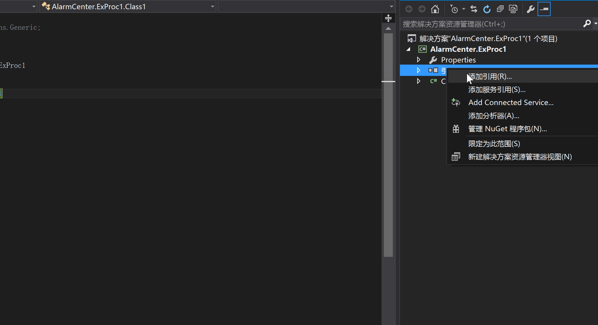
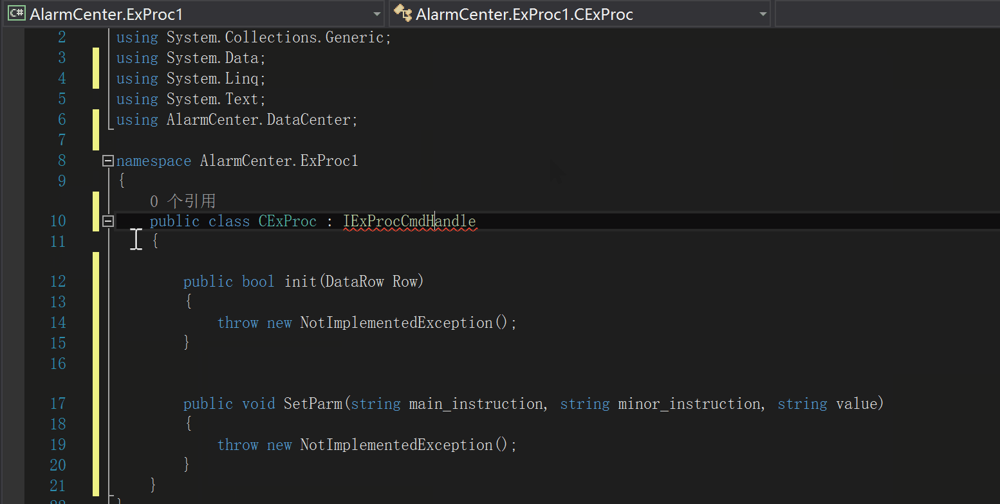
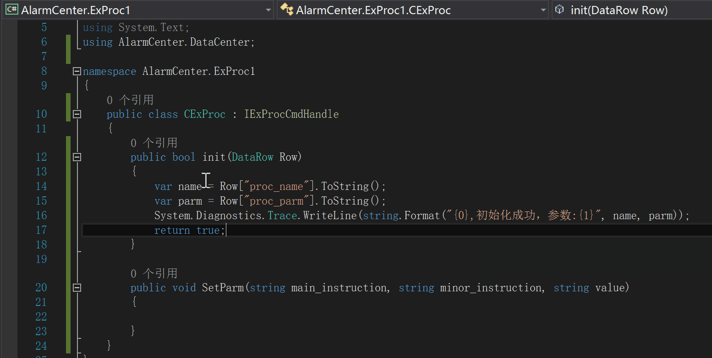

# 1.2.1 扩展动态库开发

**什么是扩展动态库**

扩展动态库是 AlarmCenter 中重要的组成部分，用以实现 AlarmCenter 中自定义功能扩展模块，可由用户自行实现相应功能；常见的应用场景有自定义第三方接口、数据处理服务等。

服务进程启动时，将根据数据库表 GWExProc 的记录，逐项加载扩展动态库；如果你希望你开发的拓展库，能够被 AlarmCenter 调用，则需要在开发完毕后在 GWExProc 表中设置相应的参数。

GWExProc 表必须填写的字段如下：

| 字段名称    | 描述                                    |
| :---------- | :-------------------------------------- |
| Proc_Code   | 编号；主键                              |
| Proc_Module | .NET类库名称；加载路径：AlarmCenter/dll |
| Proc_name   | 扩展动态库名称                          |
| Proc_parm   | 初始化参数                              |

#### (1) 开发前提

**.NET版本**

使用 .NET Standard 2.0 进行开发，或者 .NET 4.6.1 、.NET Core 2.0 以上

**依赖项**

```
AlarmCenter.DataCenter.dll >= 1.0
```


#### (2) 开始

打开 Visual Studio ,新建一个类库项目， 使用  .NET Standard 2.0 。


添加引用 AlarmCenter.DataCenter.dll (存放在 AlarmCenter/bin 目录)，并且设置该类库生成时不复制到本地

添加引用的方法：解决方案资源管理器 -> 项目 -> 引用 ->右 键选择 “添加引用” -> 选择目标文件



引用命名空间 `AlarmCenter.DataCenter`，实现接口 `IExProcCmdHandle`



完成初始化代码



在这里，我们在初始化时输出了扩展动态库的名称及参数，在实际应用中，可自定义参数（proc_parm)格式。

完整代码：

```c#
public class CExProc : IExProcCmdHandle
{
    public bool init(DataRow Row)
    {
        var name = Row["proc_name"].ToString();
        var parm = Row["proc_parm"].ToString();
        System.Diagnostics.Trace.WriteLine(string.Format("{0},初始化成功，参数:{1}", name, parm));
        return true;
    }

    public void SetParm(string main_instruction, string minor_instruction, string value)
    {

    }
}
```

选择 Visual Studio 的菜单栏，点击 **生成** -> **生成解决方案**，若编译过程无错误，将生成我们的扩展动态库AlarmCenter.ExProc1.dll

将生成的扩展动态库拷贝到 AlarmCenter 目录下 dll 文件夹中

填写数据库表 GWExProc 以便服务进程在启动时加载该扩展动态库

| Proc_Code | Proc_Module             | Proc_name      | Proc_parm     |
| :-------- | :---------------------- | :------------- | :------------ |
| 1         | AlarmCenter.ExProc1.dll | 测试扩展动态库 | Hello world！ |