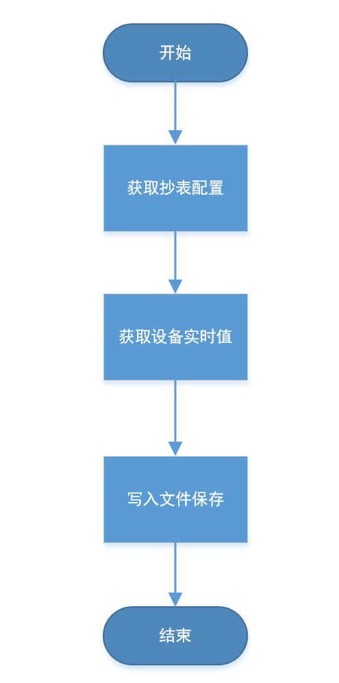
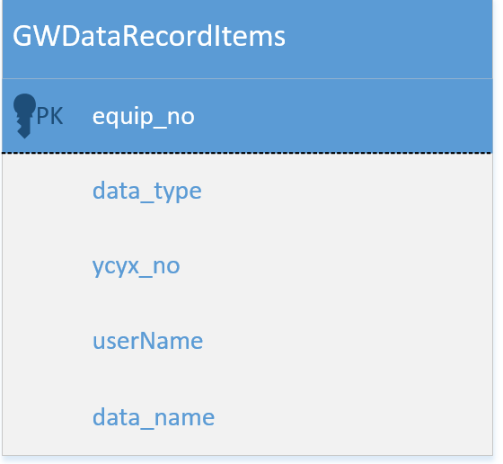

## 1.2.2 拓展动态库进阶

**创建一个扩展动态库实现简单的数据服务接口**

本节中，我们将实现一个简单的 Web 数据服务接口来学习更多扩展动态库的知识。

##### 准备知识

我们需要实现数据接口服务，需要获取 AlarmCenter 服务中的实时数据，以通过 Web Api 提供给第三方调用，在这里我们通过 **AlarmCenter.DataCenter.DataCenter.EquipItemDict** 设备字典来获取设备测试实时数据。

##### 编码实现

引用依赖库

> AlarmCenter.Core.dll >= 1.0
>
> AlarmCenter.DataCenter.dll >= 1.0
>
> System.Net.Http.dll
>
> System.Web.dll
>
> System.Web.Http.dll
>
> System.Web.Http.SelfHost.dll

.NET 版本

> .NET Standard 2.0

在初始化中我们将启动一个web api 服务

```c#
using System.Data;
using AlarmCenter.DataCenter;
using System.Web.Http.SelfHost;
using System.Web.Http;
using System.Web.Http.Dispatcher;


namespace GWExProcWebAPI
{
    public class CExProc : IExProcCmdHandle
    {
        public bool init(DataRow Row)
        {
            //通过proc_parm字段填写web api 地址
            var parm = Row["Proc_parm"].ToString();
            var config = new HttpSelfHostConfiguration(parm);
            config.Routes.MapHttpRoute("default", "api/{controller}/{id}", new { id = RouteParameter.Optional });
            config.Services.Replace(typeof(IHttpControllerSelector), new WebApiControllerSelector(config));

            var server = new HttpSelfHostServer(config);
            var t = server.OpenAsync();
            t.Wait();

            return true;
        }

        public void SetParm(string main_instruction, string minor_instruction, string value)
        {
            
        }
    }
}
```

我们要实现一个 DataController 用于实现 web api 调用操作

```c#
using System.Web.Http;
using AlarmCenter.DataCenter;
using System.Web.Http.Filters;

namespace GWExProcWebAPI
{
    public class CrossSiteAttribute : System.Web.Http.Filters.ActionFilterAttribute
    {
        private const string Origin = "Origin";
        /// <summary>
        /// Access-Control-Allow-Origin是HTML5中定义的一种服务器端返回Response header，用来解决资源（比如字体）的跨域权限问题。
        /// </summary>
        private const string AccessControlAllowOrigin = "Access-Control-Allow-Origin";
        /// <summary>
        ///  originHeaderdefault的值可以使 URL 或 *，如果是 URL 则只会允许来自该 URL 的请求，* 则允许任何域的请求
        /// </summary>
        private const string originHeaderdefault = "*";
        /// <summary>
        /// 该方法允许api支持跨域调用
        /// </summary>
        /// <param name="actionExecutedContext"> 初始化 System.Web.Http.Filters.HttpActionExecutedContext 类的新实例。</param>
        public override void OnActionExecuted(HttpActionExecutedContext actionExecutedContext)
        {
            actionExecutedContext.Response.Headers.Add(AccessControlAllowOrigin, originHeaderdefault);
        }
    }

    class DataController : ApiController
    {
        [CrossSite]
        public string Get(int id)
        {
            if (DataCenter.EquipItemDict.ContainsKey(id))
            {
                return DataCenter.EquipItemDict[id].State.ToString();
            }
            else
            {
                return "设备号不存在";
            }
        }
    }
}
```

自定义web api 选择器

```c#
using System;
using System.Collections.Generic;
using System.Linq;
using System.Text;
using System.Collections.Concurrent;
using System.Net.Http;
using System.Web.Http.Dispatcher;
using System.Web.Http;
using System.Web.Http.Controllers;
using System.Net;

namespace GWExProcWebAPI
{
    public class WebApiControllerSelector : DefaultHttpControllerSelector
    {
        private const string NamespaceRouteVariableName = "Namespace";
        private readonly HttpConfiguration _configuration;
        private readonly Lazy<ConcurrentDictionary<string, Type>> _apiControllerCache;

        public WebApiControllerSelector(HttpConfiguration configuration)
            : base(configuration)
        {
            _configuration = configuration;
            _apiControllerCache = new Lazy<ConcurrentDictionary<string, Type>>(
                new Func<ConcurrentDictionary<string, Type>>(InitializeApiControllerCache));
        }

        private ConcurrentDictionary<string, Type> InitializeApiControllerCache()
        {
            IAssembliesResolver assembliesResolver = this._configuration.Services.GetAssembliesResolver();
            var types = this._configuration.Services.GetHttpControllerTypeResolver()
                .GetControllerTypes(assembliesResolver).ToDictionary(t => t.FullName, t => t);
                //添加我们的控制器
            var dataType = typeof(DataController);

            types.Add(dataType.FullName, dataType);

            return new ConcurrentDictionary<string, Type>(types);
        }

        public IEnumerable<string> GetControllerFullName(HttpRequestMessage request, string controllerName)
        {
            object namespaceName;
            var data = request.GetRouteData();
            IEnumerable<string> keys = _apiControllerCache.Value.ToDictionary<KeyValuePair<string, Type>, string, Type>(t => t.Key,
                    t => t.Value, StringComparer.CurrentCultureIgnoreCase).Keys.ToList();

            if (!data.Values.TryGetValue(NamespaceRouteVariableName, out namespaceName))
            {
                return from k in keys
                       where k.EndsWith(string.Format(".{0}{1}", controllerName,
                       DefaultHttpControllerSelector.ControllerSuffix), StringComparison.CurrentCultureIgnoreCase)
                       select k;
            }

            string[] namespaces = (string[])namespaceName;
            return from n in namespaces
                   join k in keys on string.Format("{0}.{1}{2}", n, controllerName,
                   DefaultHttpControllerSelector.ControllerSuffix).ToLower() equals k.ToLower()
                   select k;
        }

        public override HttpControllerDescriptor SelectController(HttpRequestMessage request)
        {
            Type type;
            if (request == null)
            {
                throw new ArgumentNullException("request");
            }
            string controllerName = this.GetControllerName(request);
            if (string.IsNullOrEmpty(controllerName))
            {
                throw new HttpResponseException(request.CreateErrorResponse(HttpStatusCode.NotFound,
                    string.Format("No route providing a controller name was found to match request URI '{0}'", new object[] { request.RequestUri })));
            }
            IEnumerable<string> fullNames = GetControllerFullName(request, controllerName);
            if (fullNames.Count() == 0)
            {
                throw new HttpResponseException(request.CreateErrorResponse(HttpStatusCode.NotFound,
                        string.Format("No route providing a controller name was found to match request URI '{0}'", new object[] { request.RequestUri })));
            }

            if (this._apiControllerCache.Value.TryGetValue(fullNames.First(), out type))
            {
                return new HttpControllerDescriptor(_configuration, controllerName, type);
            }
            throw new HttpResponseException(request.CreateErrorResponse(HttpStatusCode.NotFound,
                string.Format("No route providing a controller name was found to match request URI '{0}'", new object[] { request.RequestUri })));
        }
    }
}
```


#### 高级功能

##### 数据抄表

在这里我们要实现一个数据抄表的功能，并且通过定时任务来调用它。

##### 功能描述

实现定时抄表功能，在指定时间，将配置好的测点实时值写入到文件中保存，这些数据可以用与数据报表的生成。

##### 知识点

1. 服务端读取数据库记录

   引用类库：AlarmCenter.DataCenter.dll

   命名空间：AlarmCenter.DataCenter

   类型：Database

   ```c#
   var db = new Database();
   string sql = string.Format("Select * From{0} Order by CMD, addr, words", szTable);
   DataTable dt = db.GetDataTableFromSQL(sql);
   ```

   

2. 服务端获取指定设备测点当前实时值

   引用类库：AlarmCenter.DataCenter.dll

   命名空间：AlarmCenter.DataCenter

   ```c#
   //获取设备的实例
    DataCenter.EquipItemDict[设备号]
   //根据属性获取设备状态当前值等
    DataCenter.EquipItemDict[设备号].YCItemDict[遥测号]
   ```

   

**功能实现**



新建一个数据库表用于储存需要抄表的测点，如图



1. 新建一个扩展动态库项目(前面章节有演示如何创建)

2. 编码实现

   ```c#
   using System;
   using System.Linq;
   using System.Data;
   using AlarmCenter.Core;
   using AlarmCenter.DataCenter;
   using System.Xml.Linq;
   using System.IO;
   using ICSharpCode.Core;
   
   namespace AlarmCenter.ExProc.GWDataRecord
   {
       class CExProc : IExProcCmdHandle
       {
           DataTable dtRecordItems;
           Database db = AlarmCenter.DataCenter.StationItem.db;
           public bool init(DataRow Row)
           {
               return true;
           }
   
           public void SetParm(string main_instruction, string minor_instruction, string value)
           {
               try
               {
                   string sql = "Select distinct equip_no,data_type,ycyx_no,data_name from GWDataRecordItems order by equip_no,data_type,ycyx_no";
                   dtRecordItems = db.GetDataTableFromSQL(sql);
               }
               catch (SystemException exc)
               {
                   AlarmCenter.DataCenter.MessageService.AddMessage(MessageLevel.Error, exc.InnerException.Message, 0, false);
                   return;
               }
   
               if (dtRecordItems != null && dtRecordItems.Rows.Count > 0)
               {
                   CreateDataRecordXMLItem();
                   //SaveDataRecordResultToXml();
               }
           }
   
           /// <summary>
           /// 生成定时数据抄表结果的XMLITEM
           /// </summary>
           /// <returns>XElement集合</returns>
           void CreateDataRecordXMLItem()
           {
               object[] objArgs = new object[6];
               string xPath = CreateSavePath();
               int equipNo = -1;
               EquipItem item = null;
               XDocument xdoc = GetXDocument(xPath);
               if (xdoc == null)
               {
                   xPath = string.Empty;
                   return;
               }
   
               DateTime dtime = DateTime.Now;
   
               foreach (DataRow r in dtRecordItems.Rows)
               {
                   equipNo = Convert.ToInt32(r["equip_no"]);
                   string dataType = r["data_type"].ToString().Trim().ToUpper();
                   int ycyxNo = Convert.ToInt32(r["ycyx_no"]);
   
                   // 判断该设备是否存在，若存在则获取设备数据项
                   if (!DataCenter.DataCenter.EquipItemDict.TryGetValue(equipNo, out item))
                   {
                       AddMessageDataItemNotExist(equipNo, dataType, ycyxNo);
                       continue;
                   }
   
                   objArgs[0] = dtime;  //record_time
                   objArgs[1] = equipNo;  //equip_no
                   objArgs[2] = dataType;  //data_type
                   objArgs[3] = ycyxNo;//ycyx_no
                   switch (dataType)
                   {
                       case "E":
                           string equipState = string.Empty;
                           switch (item.State)
                           {
                               case EquipState.CheFang:
                                   equipState = "撤防";
                                   break;
                               case EquipState.CommunicationOK:
                                   equipState = "通讯正常";
                                   break;
                               case EquipState.HaveAlarm:
                                   equipState = "有报警";
                                   break;
                               case EquipState.HaveSetParm:
                                   equipState = "正在设置";
                                   break;
                               case EquipState.Initial:
                                   equipState = "正在初始化";
                                   break;
                               case EquipState.NoCommunication:
                                   equipState = "通讯中断";
                                   break;
                               default:
                                   break;
                           }
                           objArgs[4] = item.Equip_nm + "设备状态";//data_name
                           objArgs[5] = equipState; //data_value
                           break;
                       case "C":
                           // 判断该设备是否存在该测点
                           YCItem ycItem;
                           if (!item.YCItemDict.TryGetValue(ycyxNo, out ycItem))
                           {
                               AddMessageDataItemNotExist(equipNo, dataType, ycyxNo);
                               continue;
                           }
                           objArgs[4] = ycItem.Yc_nm;//data_name
                           objArgs[5] = ycItem.YCValue;//data_value
                           break;
                       case "X":
                           YXItem yxItem;
                           // 判断该设备是否存在该测点
                           if (!item.YXItemDict.TryGetValue(ycyxNo, out yxItem))
                           {
                               AddMessageDataItemNotExist(equipNo, dataType, ycyxNo);
                               continue;
                           }
                           objArgs[4] = yxItem.Yx_nm;//data_name
                           objArgs[5] = yxItem.YXState;//data_value
                           break;
                       default:
                           break;
                   }
                   XElement xele = xdoc.Element("GWDataRecordResult");
                   XElement xmlitem = XElement.Parse(string.Format("<I t=\"{0}\" y=\"{1}\" n=\"{2}\">{3}</I>", objArgs[0],objArgs[2],objArgs[3],objArgs[5]));
                   bool IsAdd = false;
                   try
                   {
                       var queryXML = from xmlLog in xele.Elements("E")
                                      where xmlLog.Attribute("n").Value == equipNo.ToString()
                                      select xmlLog;
                       foreach (var xitem in queryXML)
                       {
                           string sNo = xitem.Attribute("n").Value;
                           if (sNo == equipNo.ToString())
                           {
                               xitem.Add(xmlitem);
                               IsAdd = true;
                           }
                       }
                       if (!IsAdd)
                       {
                           xele.Add(new XElement("E", new XAttribute("n", equipNo), xmlitem));
                       }
                   }
                   catch (System.Exception ex)
                   {
                       xele.Add(new XElement("E", new XAttribute("n", equipNo), xmlitem));
                   }
               }
               if (!string.IsNullOrEmpty(xPath))
               {
                   xdoc.Save(xPath);
               }
           }
   
           /// <summary>
           ///  数据记录测点项不存在于实时数据中心时，输出相关警告信息
           /// </summary>
           /// <param name="equipNo">设备号</param>
           /// <param name="dataType">测点类型：E，C，X</param>
           /// <param name="ycyxNo">测点号</param>
           void AddMessageDataItemNotExist(int equipNo, string dataType, int ycyxNo)
           {
               string msgError = string.Format("数据报表定时抄表：服务端实时数据中心EquipItemDict中不存在设备号为{0}测点类型为{1}测点号为{2}的测点。", equipNo, dataType, ycyxNo);
               AlarmCenter.DataCenter.MessageService.AddMessage(MessageLevel.Warn, msgError, equipNo, false);
           } 
   
           XDocument GetXDocument(string xPath)
           {
               try
               {
                   XDocument xdoc = null;
                   if (!String.IsNullOrEmpty(xPath))
                   {
                       if (System.IO.File.Exists(xPath))
                       {
                           xdoc = XDocument.Load(xPath);
                       }
                       else
                       {
                           xdoc = new XDocument(
                               new XDeclaration("1.0", "utf-8", "yes"),
                               new XElement("GWDataRecordResult"));
                       }
                       return xdoc;
                   }
                   else
                   {
                       return null;
                   }
               }
               catch (SystemException exc)
               {
                   AlarmCenter.DataCenter.MessageService.AddMessage(MessageLevel.Debug, exc.InnerException.Message + "xml path is" + xPath.ToString(), 0, false);
                   return null;
               }
           }
   
           /// <summary>
           /// 创建保存路径
           /// </summary>
           /// <returns></returns>
           string CreateSavePath()
           {
               try
               {
                   string RecordDataProperty = "AlarmCenter.Gui.OptionPanels.RecordDataOptions";
                   string sPath = AlarmCenter.Core.General.GetApplicationRootPath() + "\\RecordData";
                   Properties properties = PropertyService.Get(RecordDataProperty, new Properties());
                   sPath = properties.Get("Hostory_RecordDataPath", sPath);
   
                   //string sPath = AlarmCenter.Core.General.GetApplicationRootPath();;
                   if (!String.IsNullOrEmpty(sPath))
                   {
                       DateTime now = DateTime.Now;
                       sPath = sPath + string.Format("\\{0}\\{1}", now.Year, now.Month);
                       if (!Directory.Exists(sPath))
                       {
                           Directory.CreateDirectory(sPath);
                       }
                       sPath = sPath + string.Format("\\{0}.xml", now.Day);
                       return sPath;
                   }
                   else
                   {
                       return "";
                   }
               }
               catch (System.Exception ex)
               {
                   AlarmCenter.DataCenter.MessageService.AddMessage(MessageLevel.Debug, ex.InnerException.Message, 0, false);
                   return null;
               }
   
           }
       }
   }
   ```

   

#### FAQ

1. 扩展动态库没有加载？

   检查数据库配置是否正确，并且确认生成的扩展动态库已拷贝到AlarmCenterdll 目录中。

2. 抄表动作没有执行？

   检查定时任务配置是否正确或者查看xlog文件确认是否在执行过程中出现错误。