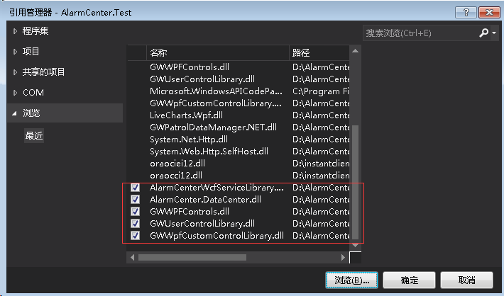

## 2.1.1 创建一个页面插件

AlarmCenter 平台为开发者提供了强大的扩展接口，开发者可以通过创建页面插件来实现所需的功能，页面插件相当于在平台中加入开发者自定义的程序。创建一个页面插件，是所有 AlarmCenter 客户端平台开发的基础。

#### 1.用Visual Studio 2015新建项目

​      **1.1**  首先，打开 VS2015或更高版本，选择“文件”—>“新建”—>“项目”，如图所示。

​    

​    

 **1.2**  选择新建项目之后，此处选择新建的项目为 “WPF用户控件库”，为了便于项目管理，项目名称使用为AlarmCenter 为统一前缀，新建项目的模板选择后将名称填写完毕后点击“确定”按钮创建该项目。如图所示。


​     **1.3**  项目新建完成后需要选择该项目的生成路径，如图所示，右键项目选择“属性”，在属性中左侧选择“生成”。在平台上开发插件需要将项目生成的文件，置于软件管理插件的文件夹中。路径选择 `D:\AlarmCenter\AddIns\AddIns\AlarmCenter` ，为了便于代码管理，在此路径下创建一个文件夹，则生成的文件会在此创建的文件夹中。路径选择完保存即可。

​         


#### 2.添加平台引用

​     **2.1**  在插件开发中需要使用到平台已有封装好的类库，可在项目中添加“引用”，插件开发常用引用可在软件的Bin 目录下找到，常用的 dll 如图所示。在 bin 文件夹中选择下列的 dll 后点击“确定”便可添加平台的dll。 

|             类库名称             | 产品版本 |
| :------------------------------: | :------: |
| AlarmCenterWcfServiceLibrary.dll | 2.6.0.7  |
|    AlarmCenter.DataCenter.dll    | 2.6.1.2  |
|        GWWPFControls.dll         | 8.5.0.1  |
|     GWUserControlLibrary.dll     | 8.5.0.0  |
|  GWWpfCustomControlLibrary.dll   | 8.5.0.0  |

    

  

​      **2.2**  选中下图中选择的引用，右键选择“属性”复制到本地栏将 True 改为 False 。在平台 Bin 目录包含了下图中的类库，在插件运行的时候会自动加载平台的 bin 目录下的类库，如果设置为 True 可能会导致插件生成目录下所引用的类库文件与平台 Bin 目录下所使用的类库文件版本不一致。

​      

​     **2.3**  添加所需引用后，在此项目中添加一个用户控件，或将新建用户控件库自带的 UserControl1.xaml 重命名，控件命名方式必须以 `Page` 结尾，否则页面无法打开，如图所示。此处命名为 LoadPage.xaml 。

​      

​    **2.4**  添加命名空间

```c#
   xmlns:gwccHu="clr-namespace:AlarmCenter.GWWpfCustomControlLibrary;assembly=GWWpfCustomControlLibrary"
```

​       首先需要在页面中的 XMAL 里添加如上命名空间，此命名空间所引用的是平台软件 bin 目录下的GWWpfCustomControlLibrary.dll 自定义控件库，需要继承其程序集命名空间中的 GWPageContentControl 类，打开软件平台会发现其中的按钮等样式，界面风格,标题等都包含在其中。如图所示，可在 “HeaderText” 属性中修改控件的显示标题，若不需要任何标题可将该属性值为空。


​    

​    2.5  后台代码添加下图中三个引用，为了与前台代码保持一致，将原本 UserControl 类改为GWPageContentControl 类。


​                 


#####  

#### 3.添加目录文件

​      **3.1**  在项目下添加一个文本文件，将后缀改成 `.Addin`，添加如下代码到 Addin 文件，按照提示修改其内容。Addin 文件相当于一个反射机制会读取配置项的内容，会把插件加载到所填写的平台目录菜单中。因此需选择Addin 文件单击右键 `属性` 将该文件的 `复制到输出目录` 属性选择如果较新则复制。

```xml
  <AddIn name        = "AlarmCenter.Test"  <!--所开发的插件名称(可填项目名称)-->
       author      = "ljy"  <!--所开发的插件作者(默认)-->
       copyright   = "prj:///doc/copyright.txt"   <!--平台版权申明(默认)-->
       url         = ""
       description = "Display AlarmCenter.Test">  <!--所开发的插件描述(可填项目名称)-->

  <Manifest>
    <Identity name = "AlarmCenter.Test" />  <!--项目名称-->
  </Manifest>

  <!--  AlarmCenter.Test.dll就是本项目编译出来的插件动态库 -->
  <Runtime>
    <Import assembly="AlarmCenter.Test.dll" />
  </Runtime>

  <!--  在“查看”菜单栏添加页面菜单项 -->
  <Path name = "/SharpDevelop/Workbench/MainMenu/System"> <!--插件加载平台目录的路径-->
    <MenuItem id = "AlarmCenter.Test"   <!--项目名称-->
              icon = "Icons.16x16.SharpQuery.View"  <!--插件图标-->
    	          label = "展示"  <!--在“查看”菜单栏添加页面菜单项的名称-->
    	          class = "PageMenuCommand(AlarmCenter.Test.LoadPage)" /> <!--所弹出页面的名称(命名空间+类名)-->
  </Path>
</AddIn>
```

​                         

​    

​     3.2  以上步骤都完成，接下来生成插件展示的目录。

​            

 在上图红色框处的路径表示平台对应的菜单栏路径，对应关系如下：

|                       插件生成的路径                       | 对应的菜单栏 |
| :--------------------------------------------------------: | :----------: |
|  <Path name = "/SharpDevelop/Workbench/MainMenu/System">   |     集成     |
| <Path name = "/SharpDevelop/Workbench/MainMenu/Integrate"> |     系统     |
|  <Path name = "/SharpDevelop/Workbench/MainMenu/Config">   |     配置     |

 


#####  

#### 4.测试结果

​      **4.1** 选中项目重新生成，在D盘 `AlarmCenter` 文件夹中找到存放项目文件夹会出现如下图的内容。

​         

​     

​      **4.2**  打开软件，在存放项目的菜单栏中找到添加的插件名称，如图所示，点击之后跳出插件的内容，插件创建成功。


 