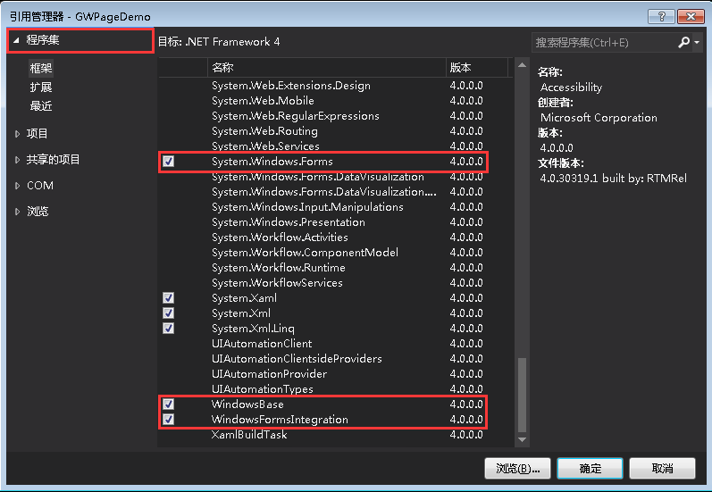
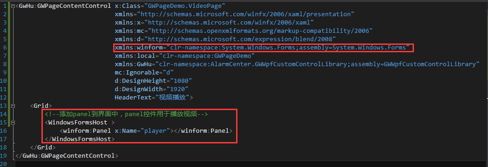

# 本地视频播放

AlarmCenter 提供了多种品牌视频播放工具，但有时候用户需要播放一些定制格式的视频，就需要自己创建一个视频页面插件。我们以海康的 Zplay 为例。

#### 1、创建一个插件项目

具体方法请参照前面创建插件的教程。

#### 2、添加动态库引用

由于播放时，需要视频载体控件的句柄。而用 winform 技术在句柄使用方面更加灵活，所以这里使用 winform 控件播放视频。可在项目中添加“引用”，选择左上角的“程序集”，拉到最下面，选择  `WindowsBase` 、`WindowsFormsIntegration` 和 `System.Windows.Forms` 三项，点击确定。



#### 3、前台代码

添加 winform 标签

```xaml
xmlns:winform="clr-namespace:System.Windows.Forms;assembly=System.Windows.Forms"
```

添加 panel 到界面中

```
<WindowsFormsHost >
    <winform:Panel x:Name="player"></winform:Panel>
</WindowsFormsHost>
```



#### 4、后台代码

新建一个 sdk 类，由于厂家提供了用 C++ 编写的SDK文件，属于非托管 DLL，所以我们需要引用命名空间`System.Runtime.InteropServices`，使用 `DllImport`（引用的程序集dll名称）的方式引用厂家提供的接口。更多关于 `DllImport `的内容，可以点击 [DllImportAttribute 类](https://msdn.microsoft.com/zh-cn/library/system.runtime.interopservices.dllimportattribute(v=vs.110).aspx) ，到微软 msdn 官网查看。

```c#
using System.Runtime.InteropServices;
namespace GWPageDemo.VideoPage
{
    class SDK
    {
        //[DllImport("文件夹名\\引用的程序集dll名称")]        
        [DllImport("ZPlayerSDK\\Play_SDK.dll")]
        public static extern int Play_GetPort(ref int nPort);//获取端口        
        [DllImport("ZPlayerSDK\\Play_SDK.dll")]
        public static extern int Play_OpenFile(int nPort, int hwnd, string sFileName);//打开文件        
        [DllImport("ZPlayerSDK\\Play_SDK.dll")]
        public static extern int Play_Play(int nPort);//开始播放
    }
}
```


再回到 VideoPage ，写一个 PlayVideo 方法播放视频。


```c#
//播放端口
private int m_playPort = -1;
/// <summary>
/// 播放视频
/// </summary>
/// <param name="FileName">视频地址</param>
public void PlayVideo(string FileName)
{
    //获取端口
    SDK.Play_GetPort(ref m_playPort);
    //获取播放句柄
    IntPtr hWnd = player.Handle;
    //打开文件，value等于0则文件打开成功
    int value = SDK.Play_OpenFile(m_playPort, hWnd.ToInt32(), FileName);
    if ( value == 0)
    {
        //开始播放
        SDK.Play_Play(m_playPort);
    }
}
```


再调用这个播放方法，传入视频地址


```c#
public VideoPage()
{
    InitializeComponent();
    //按实际情况，传入视频地址
    PlayVideo(@"D:\1.h264");
}
```

#### 5、生成插件，将厂家提供的SDK文件放在插件目录下

下载 Zplay 动态库，点击下载[ZPlayerSDK.rar](http://ganweisoft.net/ueditor/php/upload/file/20171221/1513836152400281.rar)。解压后，将文件夹放在插件生成的目录下

##### 

#### 6、打开插件，播放视频


点击下载[测试视频.rar](http://ganweisoft.net/ueditor/php/upload/file/20171221/1513836472502611.rar)

