# 报表开发

### 简介

针对 wpf 用户界面架构开发的报表工具，能轻松实现控件所有功能，包括界面更换、查看、打印、导出等功能。本工具通过 AlarmCenter 平台生成数据源，然后使用 Stimulsoft Report 功能强大的报表设计器进行报表编辑和展示。

### Stimulsoft Report

Stimulsoft 是俄罗斯一家报表控件厂商，该商家一直专注于报表控件的研发与创新，是报表控件行业的领导者。经过多年的努力，终于实现了更加简单的设计报表，数据驱动更快的应用程序，更加简便的应用新的技术，极大程序上的减少了开发人员的工作量，提高了工作的效率。Stimulsoft 拥有大量的报表相关工具，比如报表生成器，报表设计器，Reports for .NET、Web、MVC、WPF、Silverlight、Flex、PHP、Java、Mobile、WinRT等。
进一步了解可访问 [Stimulsoft官方网站](https://www.stimulsoft.com/)查看相关文档

------

## 模块结构

本模块由两部分组成，数据源及客户端插件，结构如下图所示

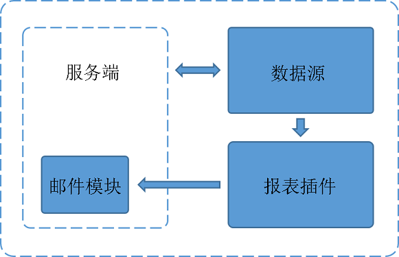

- 数据源

  

  数据源主要用于报表数据处理，从服务中获取报表所需数据，然后传递到插件中。在邮件模块中同样调用数据源获取报表数据，然后渲染报表并发送邮件。

- 报表插件

  

  报表插件主要用于报表的编辑及展示。通过报表设计器对报表进行编辑，然后从数据源中获取真实数据并渲染报表。也可以设置邮件任务，在指定时间发送邮件到相关人员邮箱。

------

## 创建数据源

### 1. 创建项目

打开 "Visual Studio" ，选择菜单中的"文件->新建->项目"，在弹出的“新建项目”框中，选择 `Visual C# -> Windows ->类库`，输入项目名称并点击确定生成项目

**注：新建项目要求.NET4.0或以上版本**


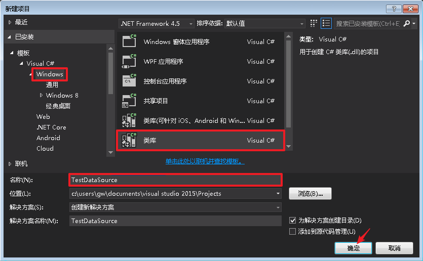


### 2. 引用相关类库

2.1 引用 `.binAlarmCenter.Report.dll` 及 `AlarmCenter`相关类库

更多平台相关类库说明可以查看 **类库说明**。

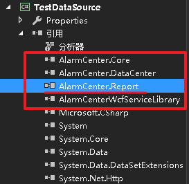

必须引用 `AlarmCenter.Report`，其余类库可根据实际需要添加或移除

2.2 继承 `IDataSource` 接口，并实现接口

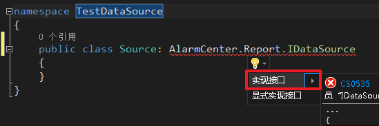

实现接口后，自动生成代码如下：

```c#
public class Source : AlarmCenter.Report.IDataSource
{
    public object GetData(string args = null)
    {
        throw new NotImplementedException();
    }

    public object GetTemplateData()
    {
        throw new NotImplementedException();
    }
}
```

#### IDataSource接口说明

**1. 结构**

```c#
public interface IDataSource
{
    object GetTemplateData();
    object GetData(string args = null);
}
```

- **GetTemplateData**

  获取示例数据，在编辑报表时调用，数据源数据字典的结构由示例数据决定，不能返回空数据，建议返回DataTable或DataSet类型数据。

  

- **GetData**

  获取真实数据，参数默认为空，调用邮件功能时传入json格式字符串。若需要使用邮件功能，必须要对传入数据进行解析，获取对应参数的值,否则引起异常。

  

**2. 数据特征**

- **DataSourceAttribute**

  描述数据源实体类，定义数据源的名称和说明，Describe 属性可以留空，但 DisplayName 属性必须填写。

  

- **EquipFieldAttribute**

  标记属性为设备，在报表参数栏中会生成所有设备的选择框，返回设备号字符串，多选则使用','分割，如返回 "12,15,22" 则表示选择设备号为 12，15，22 的3个设备。

  

- **YcFieldAttribute**

  标记属性为遥测点，在报表参数栏中会生成所有遥测点的选择框，返回设备号和遥测号，设备号和遥测号用'_'分割，多选则使用','分割，如返回 "12_1,15_3,22_2" 则表示选择12号设备1号遥测点，15号设备3号遥测点，22号设备2号遥测点。

  

- **YxFieldAttribute**

  标记属性为遥信点，在报表参数栏中会生成所有遥信点的选择框，返回内容与 YcFieldAttribute 相同。

  

- **CategoryAttribute**

  定义报表参数栏中标题的名称，不写默认显示 "Misc" 。

  

- **DisplayNameAttribute**

  用于定义属性的名称，定义名称会在报表参数栏中显示,不写默认为 "Property" 。

  

- **DescriptionAttribute**

  用于描述属性，对属性的附加说明,选中属性会弹出提示框显示附加说明。

**3. 注意事项**

- `GetTemplateData` 和`GetData` 两个方法要求返回相同结构数据，否则在生成报表时会出现数据不完整或内容不正确的情况。
- 一个类库中可以存在多个继承 `IDataSource`的类，但 `DataSource` 特性定义的名称不能相同,不同类库中可存在名称相同的数据源。
- 如需要特殊类型字段，可以继承 `DataSourceFieldAttribute` 特性，创建新特性，并实现特性的特殊操作，同时在 `GWReport` 项目中的 `PropertyControlFactory`类中，添加对新特性的处理，创建绑定特殊字段的控件。
- 报表有邮件发送部分，类库运行环境为服务端，部分客户端方法无法使用，需要分开处理，如：在数据源中操作数据库，需要判断数据源的运行环境 `AlarmCenter.DataCenter.DataCenter.RunEnvironment`（引用`AlarmCenter.Core.dll`）。如果是服务端，`AlarmCenter.DataCenter.DataCenter.db_proxy` 数据库代理无法使用，需要创建 `AlarmCenter.DataCenter.Database` 的实体来进行数据库操作

### 3. 生成数据源

完成编辑后，生成项目，并将生成动态库及相关类库生成到插件目录 `.ReportFileDataSources`中

例如根目录为 `D:\AlarmCenter\AddIns\AddIns\AlarmCenter\Extention\GWReport`,则将生成类库复制到 `D:\AlarmCenter\AddIns\AddIns\AlarmCenter\Extention\GWReport\ReportFile\DataSources` 中

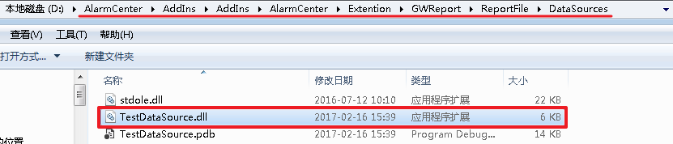

或直接将项目输出路径设置到 `D:\AlarmCenter\AddIns\AddIns\AlarmCenter\Extention\GWReport\ReportFile\DataSources` 目录下

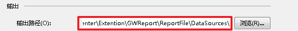

### 4. 示例代码

```c#
namespace TestDataSource
{
    [AlarmCenter.Report.DataSource("示例数据源","这是数据源的描述")]
    public class Souce:AlarmCenter.Report.IDataSource
    {
        [System.ComponentModel.Category("参数栏名称")]

        [System.ComponentModel.DisplayName("属性1")]
        public string Property1 {get;set;}

        [System.ComponentModel.DisplayName("属性2")]
        [System.ComponentModel.Description("这是属性2说明")]
        [AlarmCenter.Report.EquipField]
        public string Equip1 {get;set;}

        public object GetData(string args=null)
        {
            return GetTemplateData();
        }

        public object GetTemplateData()
        {
            var result=new List<DataModel>();
            for(int i=1; i<10; i++)
            {
                result.Add(new DataModel
                {
                    ID = i,
                    Name = "NAME" + i
                });
            }
            return result;
        }
    }

    public class DataModel
    {
        public int ID {get;set;}
        public string Name {get;set;}
    }
}
```

------

## 报表编辑

### 1. 打开插件工具

登录 AlarmCenter 平台，选择菜单中的 `系统 -> 报表管理`，打开报表管理插件

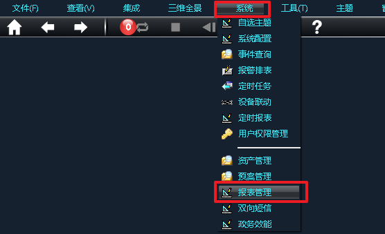

### 2. 创建报表

**2.1** 插件页面中点击 `新增报表`，在弹出窗口中填入报表名称及报表描述，选择报表的数据源，完成编辑后点击确定创建报表文件

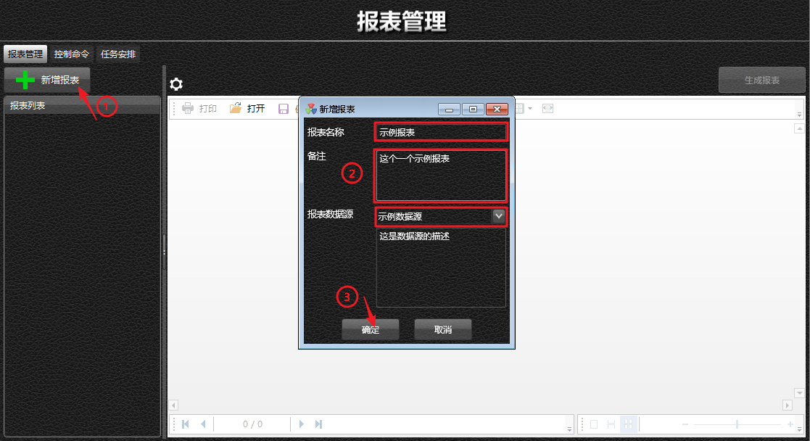

2.2 点击"编辑"按钮，打开报表编辑器

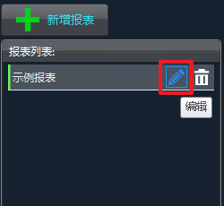

编辑器页面如下：

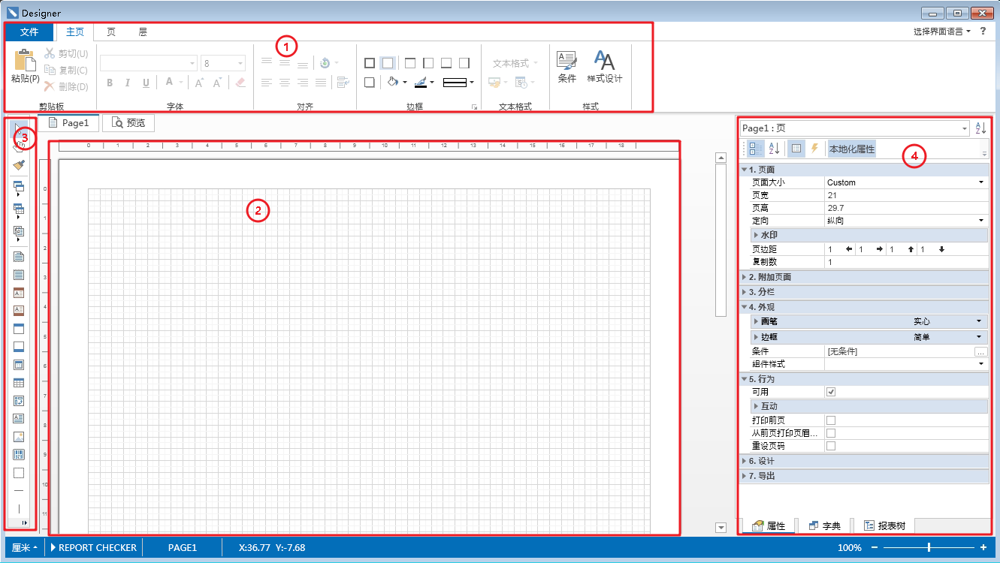

如图所示：
区域1.菜单栏
区域2.编辑区
区域3.工具栏
区域4.属性栏

2.3 在字典中，查看导入的数据源，并将字段拖到编辑区中

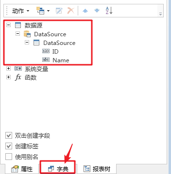

在弹出窗口中选择显示的内容及样式

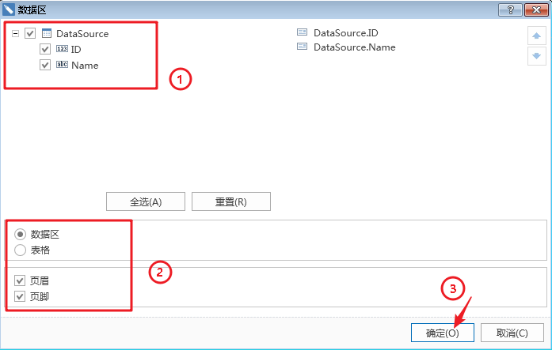

生成结果

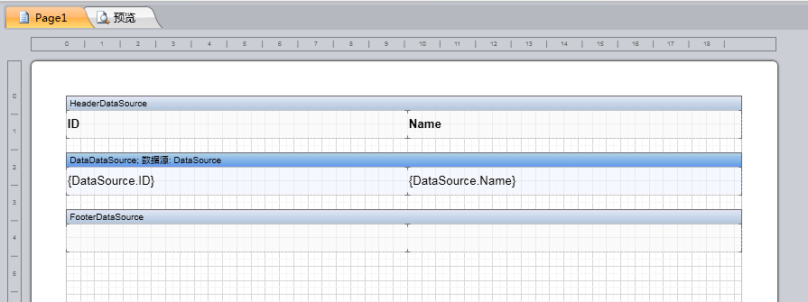

2.4 点击预览，查看报表显示效果，浏览显示的数据为 `GetTemplateData` 方法返回的数据

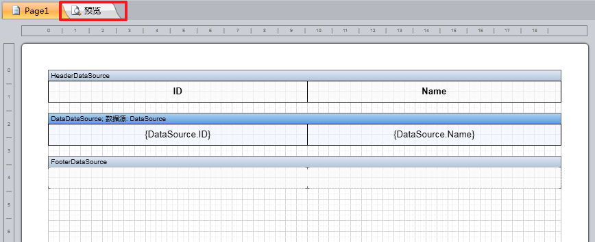

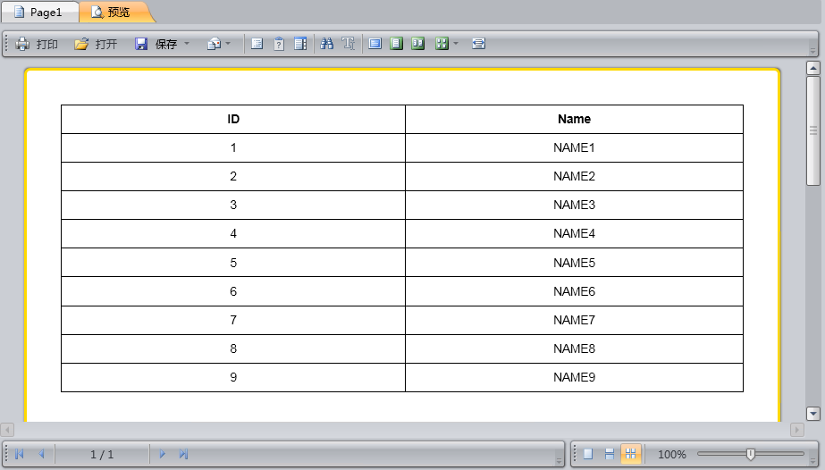

2.5 完成编辑后，保存并退出编辑器

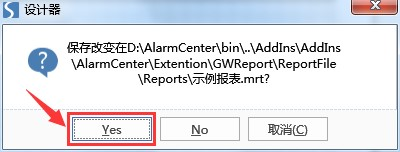

2.6 选择"示例报表"，点击"生成报表"，查看实际报表

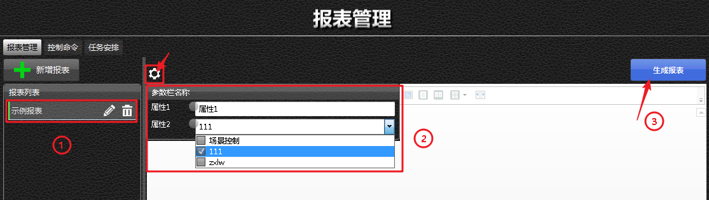

如图第一步选择需要生成的报表，若数据源定义附加参数则自动弹出参数栏，也可通过上方箭头指出按钮控制显示和隐藏，最后点击"生成报表"渲染报表

示例报表渲染效果如下图所示

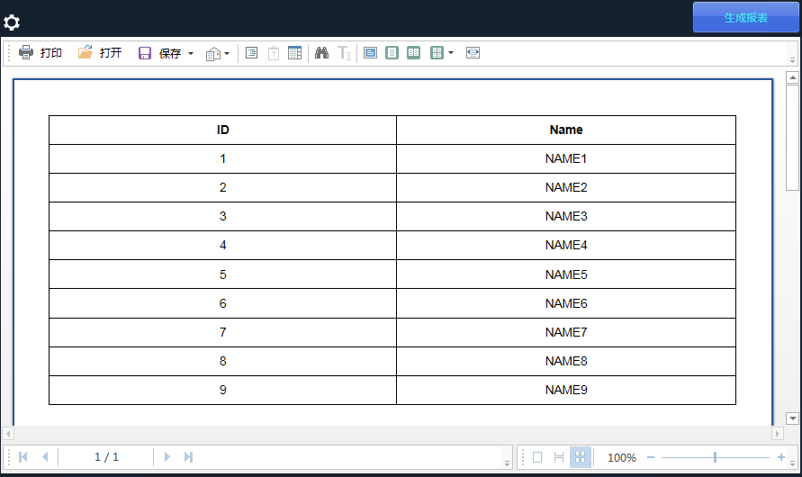

### 3. 注意事项

- 数据源名称即项目中 DataSource 特性定义的名称
- 新增加报表数据会保存到 GWReportInfo 数据库表中,表结构如下:

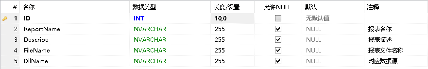

若数据库中没有相关表，可自行创建

- 报表文件保存在 GwReoprt 插件目录 `.ReportFileReports` 文件夹中
- 数据源名称为`{类库名称}_{数据源名称}`结构,例: `TestDataSource.dll_示例数据源`
- 修改编辑器的默认保存路径会造成找不到文件的错误