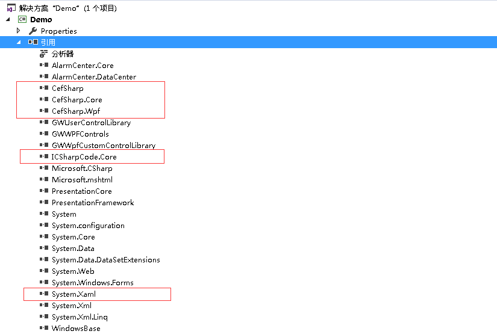
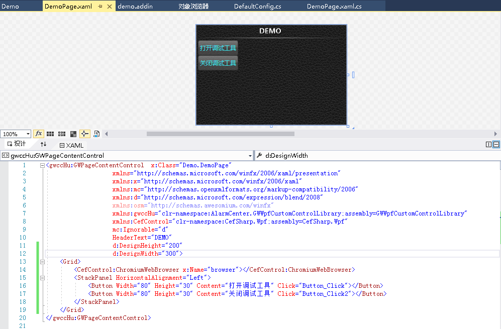
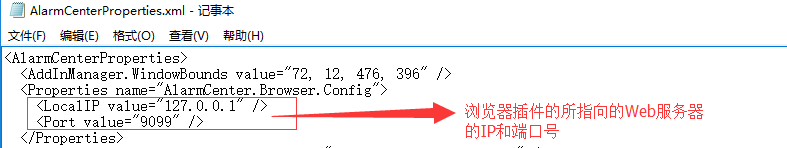
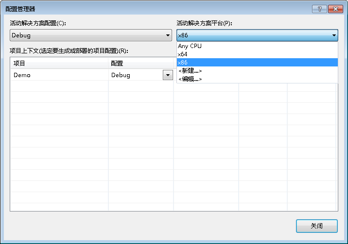
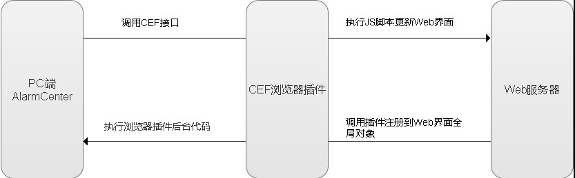
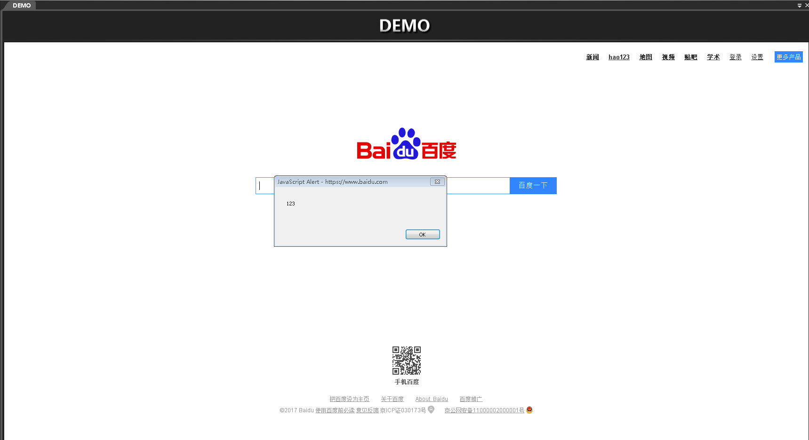
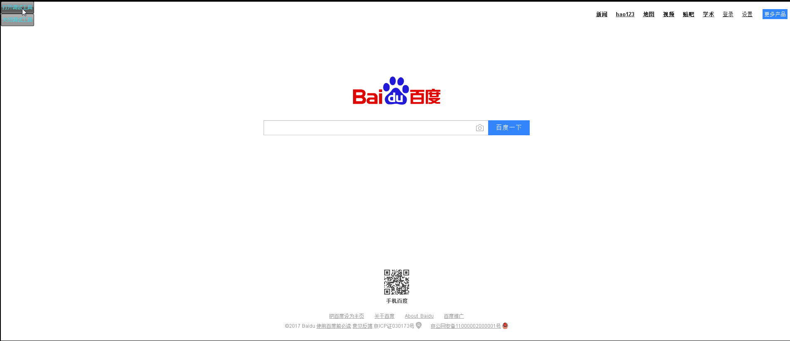
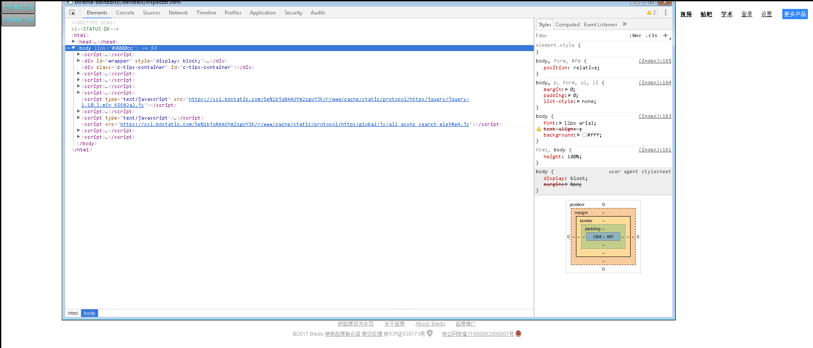

# 嵌入网页

## 简介

AlarmCenter 的插件以 WPF 为基础，更多的用来开发桌面端界面。随着 Web 技术的发展，现在的网页所展现的内容更为丰富和炫酷。为了丰富我们软件，本文将介绍如何嵌入网页到 AlarmCenter 中。

## 功能

- AlarmCenter 客户端中展示网页
- 建立网页与 AlarmCenter 之间相互交互的基础

## 所需技能

- .Net WPF
- Web

## CefSharp

CefSharp 是一款以Chromium为内核的开源的浏览器，提供了 WPF 和 WinForms Web 浏览器控件实现。

GitHub: [**https://github.com/cefsharp/CefSharp**](https://github.com/cefsharp/CefSharp)

## 开始

### .NET版本

.NET4.5.2 或以上

### 创建插件

新建一个页面插件（请学习 **创建一个页面插件**）

#### 引入CefSharp

**1. 引用 CefSharp**（AlarmCenter 软件 bin 目录下 ,如果没有可以在 [**下载**](http://ganweisoft.net:8092/views/web/down/) 中进行下载然后把解压后的文件放入bin目录下）
AlarmCenter 分为 32位 和 64位 的版本,根据 AlarmCenter 的版本不同，需要引入对应版本的 Cefsharp。
下载时请选择正确的版本进行下载。




**2. 添加浏览器控件**




**注：**旧版 CefSharp 对 VS设计器 支持的不好，所以在引用插件时会引起设计器的崩溃，但并不影响程序的运行，请忽略设计的报错。最新的 CefSharp 32 位版本已经添加了对设计器的支持。

**3. 初始化CefSharp**

```c#
using AlarmCenter.Core;
using CefSharp;
using System;
using System.Collections.Generic;
using System.Linq;
using System.Text;
using System.Xml;
using ICSharpCode.Core;
using System.Configuration;
using System.Web.Configuration;
using System.Windows;
using AlarmCenter.DataCenter;

namespace Demo
{
    public  class DefaultConfig
    {
        public static string GetLoacalIP(string PageName)
        {
            //获取配置文件中配置的IP和端口号
            //PageName为网页所在的路径
            Properties properties = PropertyService.Get("AlarmCenter.Browser.Config", new Properties());
            var ConfigPort = properties.Get("Port", "");
            var ConfigIp = properties.Get("LocalIP", "");
            return "http://" + ConfigIp + ":" + ConfigPort +"/Views/"+ PageName;
        }
          public static void CEFInit() //浏览器初始化函数
         {
             if (!Cef.IsInitialized)
             {
                 var settings = new CefSettings();
                 settings.CachePath = "Cache"; //设置缓存 设置为null时浏览器不会生成缓存目录
                 Cef.Initialize(settings);
                 Cef.EnableHighDPISupport();
             }
         }
     }
 }
```

配置文件目录：`D:\AlarmCenter\data\AlarmCenter\AlarmCenterProperties.xml`



**注：**这里只是方便有固定服务器和端口的网页，实际中可在下文中根据自己情况指定**uri**来指定网页的链接。

**4. 后台代码**

```c#
  using System;
  using System.Collections.Generic;
  using System.Linq;
  using System.Text;
  using System.Threading.Tasks;
  using System.Windows;
  using System.Windows.Controls;
  using System.Windows.Data;
  using System.Windows.Documents;
  using System.Windows.Input;
  using System.Windows.Media;
  using System.Windows.Media.Imaging;
  using System.Windows.Navigation;
  using System.Windows.Shapes;
  using AlarmCenter.Core;
  using AlarmCenter.GWWpfCustomControlLibrary;
  using CefSharp;
  using System.Windows.Interop;
  using AlarmCenter.DataCenter;
   namespace Demo
   {
       public partial class DemoPage
       {
           private string uri;
           public DemoPage()
           {
               DefaultConfig.CEFInit();
               InitializeComponent();
               browser.BrowserSettings = new BrowserSettings()
               {
                   OffScreenTransparentBackground = true
               };
               try
               {
                   uri = "http://www.baidu.com";//设置网页的路径
                   // uri = DefaultConfig.GetLoacalIP("Demo/src/xx.html");//自己网页的服务器地址
               }
               catch (Exception e)
               {
                   DataCenter.WriteLogFile(e.ToString());
               }
               LoadPage();

           }

           void browser_FrameLoadEnd(object sender, FrameLoadEndEventArgs e)
           {
               this.Dispatcher.Invoke(new Action(() =>
               {
                   browser.Visibility = System.Windows.Visibility.Visible;
               }));
           }

           private void LoadPage()
           {
               if (string.IsNullOrEmpty(uri))
                   return;
               browser.Address = uri;
           }
           public override void Dispose()
           {
               browser.Dispose();
           }

           public override void DoAttach(string plStr)
           {
               base.DoAttach(plStr);
           }
       }
      }
```

#### 生成插件及运行效果

**1. 生成插件（可参考 创建一个页面插件 中插件生成的步骤，注意下面的细节）**




注：根据引用的 CefSharp 的版本来选择解决方案（32位-->x86 64位-->x64)

**2. 运行结果**

![img]/5a161e6f17f11.png)

**浏览器与AlarmCenter之间的交互(重要)**

#### 交互的2种方式

**1.交互原理图**



注：在我们使用浏览器插件时，会涉及 AlarmCenter 与网页之间的交互。

**AlarmCenter 执行 JS 脚本更新网页**

```c#
public DemoPage()
 {
     DefaultConfig.CEFInit();
     InitializeComponent();
     browser.BrowserSettings = new BrowserSettings()
     {
         OffScreenTransparentBackground = true
     };
     browser.FrameLoadEnd += browser_FrameLoadEnd;//当页面加载完成后执行
     try
     {
         uri = "http://www.baidu.com";
     }
     catch (Exception e)
     {
         DataCenter.WriteLogFile(e.ToString());
     }
     LoadPage();

}

 void browser_FrameLoadEnd(object sender, FrameLoadEndEventArgs e)
    {
       this.Dispatcher.Invoke(new Action(() =>
       {
           browser.ExecuteScriptAsync("alert('123')");//执行JS代码
       }));
   }

 private void LoadPage()
   {
       if (string.IsNullOrEmpty(uri))
           return;
       browser.Address = uri;
   }
```

主要调用了 **browser.ExecuteScriptAsync("JS脚本")**

**运行效果:**



**网页控制 AlarmCenter 执行动作或者命令**

注册全局对象到当前打开的网页

```c#
public DemoPage()
{
    DefaultConfig.CEFInit();
    InitializeComponent();
    browser.BrowserSettings = new BrowserSettings()
    {
        OffScreenTransparentBackground = true
    };
    browser.RegisterJsObject("bindcmd", new Cmd() { }, new BindingOptions { CamelCaseJavascriptNames = false });//注册Web全局对象bindcmd
    browser.FrameLoadEnd += browser_FrameLoadEnd;
 try
 {
     uri = "http://www.baidu.com";
 }
 catch (Exception e)
 {
     DataCenter.WriteLogFile(e.ToString());
 }
   LoadPage();

 }

public class Cmd
{

 public string command { get; set; }

 public void CommandExecute(string command)
 {
     if (string.IsNullOrWhiteSpace(command))
         return;
     Application.Current.Dispatcher.Invoke(new Action(() =>
     {
         try
         {
           AlarmCenter.GWWPFControls.GWControlStatic.ExecuteClickCmd(command,false);
          }
         catch (Exception ee)
         {
           AlarmCenter.DataCenter.DataCenter.WriteLogFile(ee.ToString());
         }
    }));
 }
}
```

**注:** 在注册时，我们禁用了 `CamelCaseJavascriptNames = false` ，所以注册的全局对象一般用小写字母来命名。

在JS中调用注册的C#实例方法

上文代码中我们注册了全局对象 **bindcmd**,可以在 JS 代码中直接调用

```javascript
function CallCSharpInterface(){
bindcmd.CommandExecute("EP101");//执行一个页面跳转方法
}
```

**注:**注册的 JS 全局对象只有在 AlarmCenter 中打开的网页才是有效的，在外部的浏览器例如 Chrome 等是无法使用这个对象的。

### 嵌入浏览器的调试

#### 使用Cef自带的调试工具

**1. 开发阶段可以设置2个按钮来进行调试工具的打开和关闭**

```c#
 private void Button_Click(object sender, RoutedEventArgs e)
 {
     browser.ShowDevTools();
 }

 private void Button_Click2(object sender, RoutedEventArgs e)
 {
     browser.CloseDevTools();
 }
```

**2. 效果演示**




#### 使用Chrome 进行调试

**1. 初始化Cef时加入调试的端口**

```c#
public static void CEFInit()
{
   if (!Cef.IsInitialized)
   {
      var settings = new CefSettings();
      settings.RemoteDebuggingPort = 9011;// 使用一个未被占用的端口
      settings.CachePath = "Cache"; //设置缓存 设置为null时浏览器不会生成缓存目录
      Cef.Initialize(settings);
      Cef.EnableHighDPISupport();
   }
}
```

**2. 演示效果**


## 示例DEMO

[**CEF_DEMO.zip**](http://ganweisoft.net:8092/down/BrowserDemo/CEF_DEMO.zip)

## 注意事项

1.对于 Alarmcenter 下所有的嵌入的 Web 网页插件，共同使用 AlarmCenter bin 目录下的 Cef 类库，所以在生成浏览器插件时一定要保证引用库的版本和 bin 下的库一致。

2. Cefsharp 运行时对于 windows 运行环境有一定要求。遇到不能加载插件情形时，可以下载最新对应版本的[**windows运行库**](http://www.pc6.com/softview/SoftView_104246.html) 进行安装。