# 图表开发

## 简介

为了将数据以更加直观的方式展现出来，使数据更加客观、更具说服力，使用 GitHub 的开源控件 Live-Charts 进行可视化展示。Live-Charts 包含柱状图，折线图，饼图等十余种不同类型的图表。
进一步了解可访问 [Live-Charts官网](https://lvcharts.net/) 或 [GitHub](https://github.com/beto-rodriguez/Live-Charts)

------

## 控件安装

### 1. 从AlarmCenter的bin目录下安装 (推荐)

1.1 在项目中右键引用，点击 `添加引用`

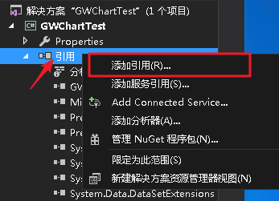

1.2 在弹出窗口中点击 "浏览"

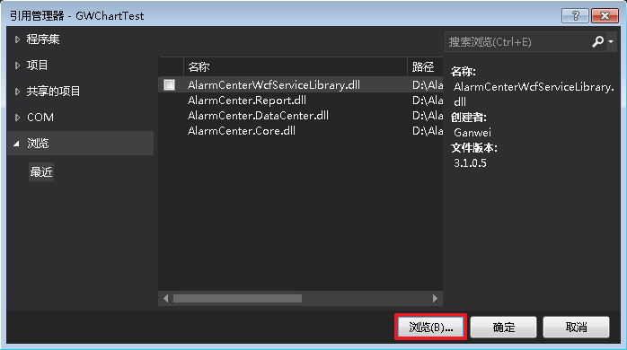

1.3 转到 `AlarmCenterbin`目录，并选择 `LiveCharts` 和 `LiveCharts.Wpf`

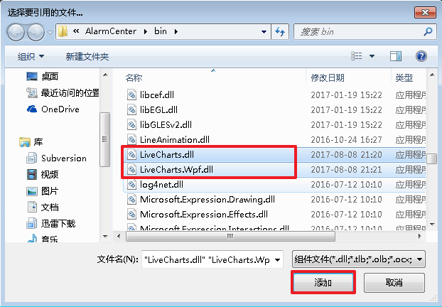

1.4 点击 `确定` 完成添加

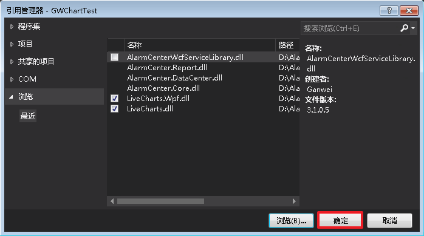

### 2. 通过 NuGet 管理器安装

2.1 在项目中右键引用，点击 `管理NuGet程序包`

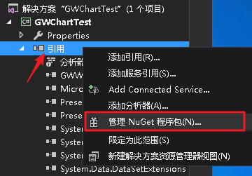

2.2 在弹出窗口中搜索 `livechart`,并安装 `LiveCharts.Wpf`

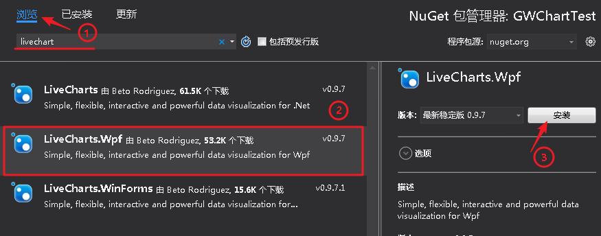

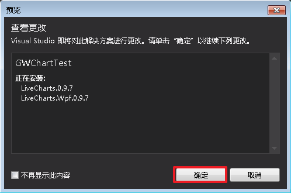

### 3. 通过程序包管理器(package manager)控制台安装

使用以下代码在管理器中安装 Live-Charts 相关控件

```powershell
PM> Install-Package LiveCharts.Wpf
```

控制台可在菜单栏中 `视图 -> 其它窗口 -> 程序包管理器控制台` 找到

安装过程如图

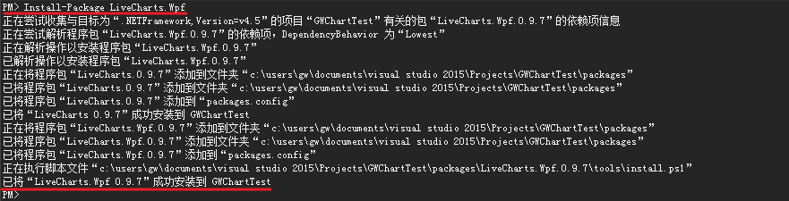

安装完成后可在 `引用`中查看类库

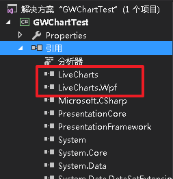

------

## 基础示例

### 基本属性

图片中标注出对应的属性


所有 livechart 组件都包含 Fill 和 Stroke 属性


可以通过 xaml 或后台代码改变填充的颜色，如果没有指定则自动分配颜色

```xml
<lvc:LineSeries Stroke="Red" Fill="Blue /">
mySeries.Stroke = System.Windows.Media.Brushes.Red;
mySeries.Fill = System.Windows.Media.Brushes.Blue;
```

### 标题

通过 Title 属性来为轴添加名称

```xml
myAxis.Title = "Population"
```

### x、y轴

和其它组件一样，用户可以在 livechart 中创建自定义的x、y轴，下图中标示了轴的常用属性

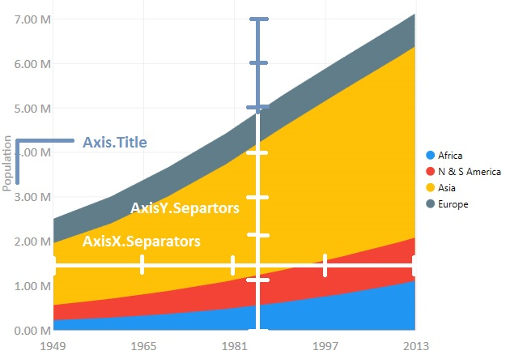

### 内嵌轴

当需要获取更大空间时，可以通过设置轴的 Axis.IsMerged 属性使文字嵌入图表中，如图展示 IsMerged 为true(左)和false(右)的效果

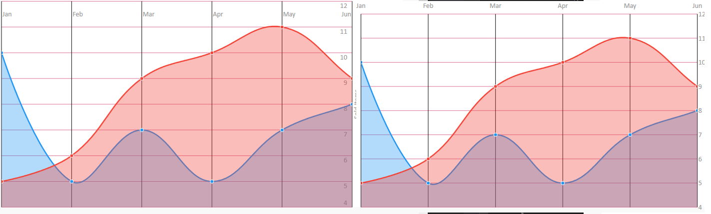

### 多轴

根据实际需要，用户最大可以添加10条同向的轴，以达到多种计量条件的效果，通过设置 Series 的 ScalesXAt 或ScalesYAt 属性将数据和对应的轴关联起来，ScalesXAt 和ScalesYAt 的默认值为0，示例如下

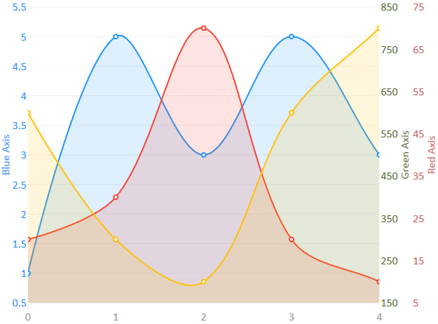

### 提示和图例

通过设置Chart.LegendPosition 属性， 可以将图例放置于图表的上、下、左、右,如：

```
myChart.LegendLocation = LegendLocation.Right;
```

也可以通过修改控件样式更改提示的效果

```xml
<lvc:CartesianChart>
    <lvc:CartesianChart.Resources>
        <Style TargetType="lvc:DefaultTooltip">
            <Setter Property="Background" Value="DarkOrange"></Setter>
            <Setter Property="Foreground" Value="White"></Setter>
            <Setter Property="ShowTitle" Value="False"></Setter>
            <Setter Property="ShowSeries" Value="False"></Setter>
            <Setter Property="FontSize" Value="16"></Setter>
            <Setter Property="FontWeight" Value="Bold"></Setter>
            <Setter Property="CornerRadius" Value="20"></Setter>
            <Setter Property="Width" Value="40"></Setter>
            <Setter Property="Height" Value="40"></Setter>
            <Setter Property="BorderThickness" Value="0"></Setter>
        </Style>
    </lvc:CartesianChart.Resources>
    <lvc:CartesianChart.Series>
        <lvc:LineSeries Values="4,2,6,4"></lvc:LineSeries>
    </lvc:CartesianChart.Series>
</lvc:CartesianChart>
```

效果如下：

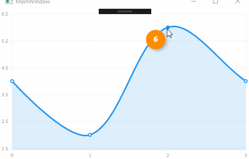

------

## 使用

如何创建项目可以查看 **如何创建页面插件**

1.创建一个插件项目，并引用 LiveChart 相关类库

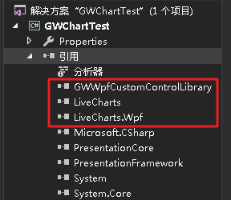

2.在 XAM L界面中添加 `LiveCharts.Wpf` 命名空间

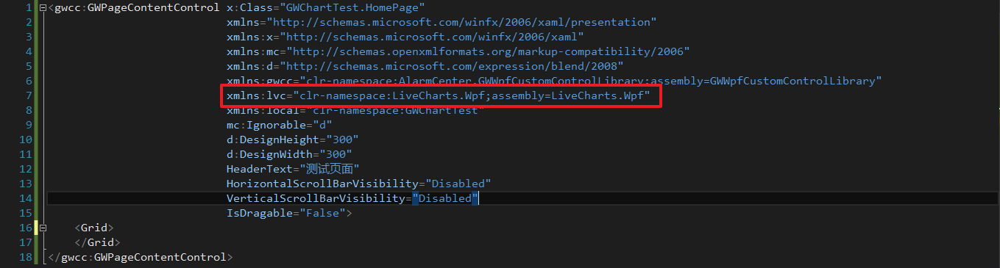

3.编写界面及后台处理代码

- XAML

```c#
<Grid>
    <lvc:CartesianChart Grid.Row="1" AnimationsSpeed="0:0:0.5" Zoom="X" Hoverable="False" DataTooltip="{x:Null}">
        <lvc:CartesianChart.Series>
            <lvc:LineSeries Values="{Binding ChartValues}" PointGeometry="{x:Null}" LineSmoothness="1" StrokeThickness="2" Fill="Transparent" Stroke="#FF607D8A" />
        </lvc:CartesianChart.Series>
        <lvc:CartesianChart.AxisX>
            <lvc:Axis LabelFormatter="{Binding DateTimeFormatter}" MaxValue="{Binding AxisMax}" MinValue="{Binding AxisMin}" Unit="{Binding AxisUnit}">
                <lvc:Axis.Separator>
                    <lvc:Separator Step="{Binding AxisStep}" Stroke="Gray" StrokeDashArray="3" StrokeThickness="1" />
                </lvc:Axis.Separator>
            </lvc:Axis>
        </lvc:CartesianChart.AxisX>
        <lvc:CartesianChart.AxisY>
            <lvc:Axis>
                <lvc:Axis.Separator>
                    <lvc:Separator StrokeDashArray="3" StrokeThickness="1" Stroke="Gray">
                    </lvc:Separator>
                </lvc:Axis.Separator>
            </lvc:Axis>
        </lvc:CartesianChart.AxisY>
    </lvc:CartesianChart>
</Grid>
```

- 后台

```c#
public partial class HomePage : INotifyPropertyChanged
{
    private double _axisMax;
    private double _axisMin;
    private double _trend;

    public HomePage()
    {
        InitializeComponent();
        Loaded += HomePage_Loaded;

        //将MeasureModel类映射到表格中
        var mapper = Mappers.Xy<MeasureModel>()
            .X(model => model.DateTime.Ticks)   //X为DateTime.Ticks
            .Y(model => model.Value);           //Y为Value
        Charting.For<MeasureModel>(mapper);

        ChartValues = new ChartValues<MeasureModel>();
        DateTimeFormatter = value => new DateTime((long)value).ToString("HH:mm:ss");//x轴格式化
        AxisStep = TimeSpan.FromHours(1).Ticks;
        AxisUnit = TimeSpan.TicksPerMinute;

        SetAxisLimits(DateTime.Now);

        DataContext = this;
    }

    private void HomePage_Loaded(object sender, RoutedEventArgs e)
    {
        Task.Factory.StartNew(Read);
    }

    public ChartValues<MeasureModel> ChartValues { get; set; }
    public Func<double, string> DateTimeFormatter { get; set; }
    public double AxisStep { get; set; }
    public double AxisUnit { get; set; }

    public double AxisMax
    {
        get { return _axisMax; }
        set
        {
            _axisMax = value;
            OnPropertyChanged("AxisMax");
        }
    }
    public double AxisMin
    {
        get { return _axisMin; }
        set
        {
            _axisMin = value;
            OnPropertyChanged("AxisMin");
        }
    }

    private void Read()
    {
        var r = new Random();
        var now = DateTime.Today;

        while (true)
        {
            Thread.Sleep(1000);

            _trend += r.Next(-8, 10);
            ChartValues.Add(new MeasureModel
            {
                DateTime = now,
                Value = _trend
            });

            SetAxisLimits(now);

            //保留最后500条记录
            if (ChartValues.Count > 500)
                ChartValues.RemoveAt(0);

            now += TimeSpan.FromMinutes(1);
        }
    }

    private void SetAxisLimits(DateTime now)
    {
        AxisMax = now.Ticks + TimeSpan.FromHours(1).Ticks; // x轴最大时间
        AxisMin = now.Ticks - TimeSpan.FromHours(8).Ticks; // x轴最小时间
    }

    #region INotifyPropertyChanged

    public event PropertyChangedEventHandler PropertyChanged;

    protected virtual void OnPropertyChanged(string propertyName = null)
    {
        if (PropertyChanged != null)
            PropertyChanged.Invoke(this, new PropertyChangedEventArgs(propertyName));
    }

    #endregion
}
public class MeasureModel
{
    public DateTime DateTime { get; set; }
    public double Value { get; set; }
}
```

4.生成项目

右键项目，点击生成生成项目

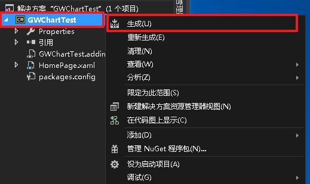

生成效果如下:

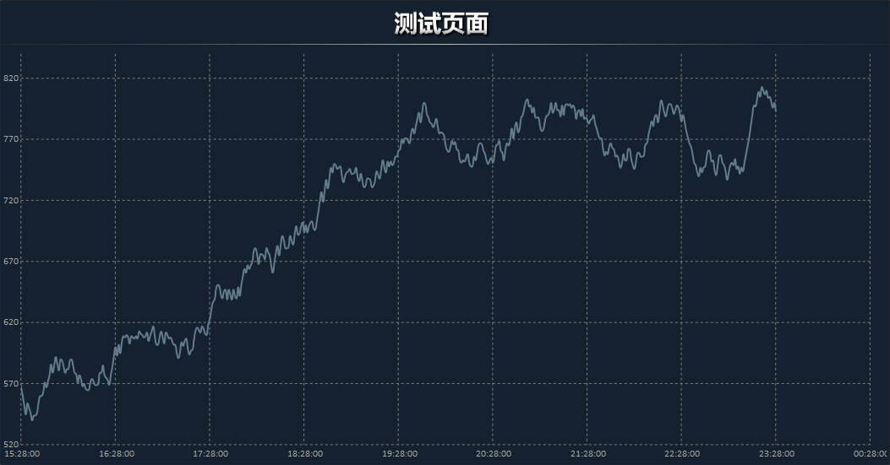

本节示例源码 [GWChartTest.7z](http://ganweisoft.net/down/LiveChartDemo/GWChartTest.7z)

### 注意事项

- AlarmCenterbin 目录下 LiveChart 版本和编译插件版本不相同，可能会造成部分功能不一致，建议使用 bin 目录下动态库，若使用新版动态库可将新库复制到 bin 目录下
- 若多个插件引用 LiveChart ，需保持版本一致，否则部分插件无法打开，建议使用同一版本动态库重新编译