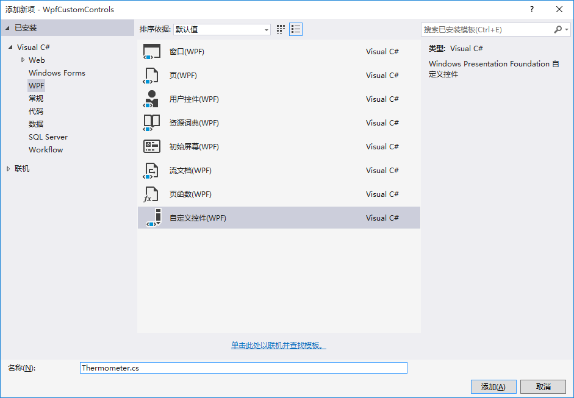
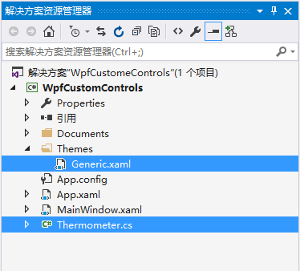
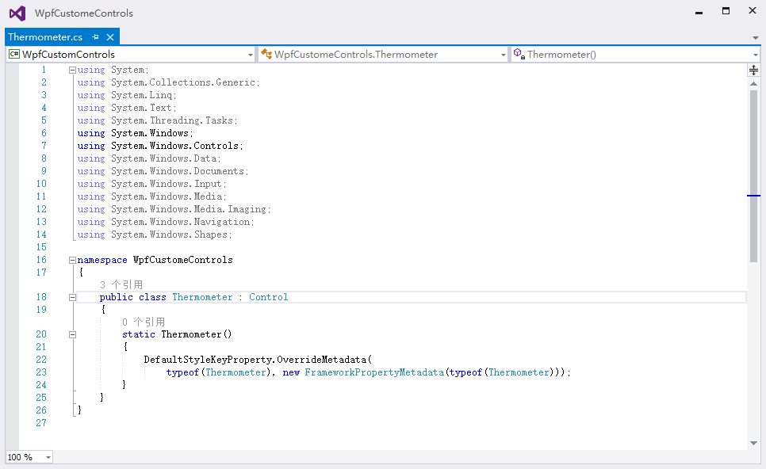
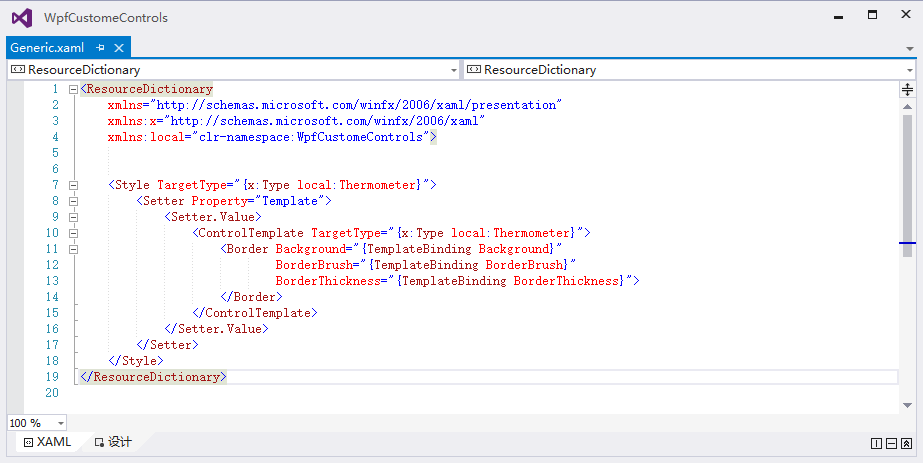
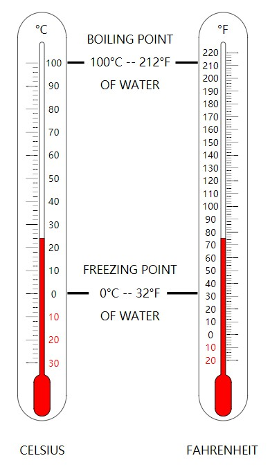
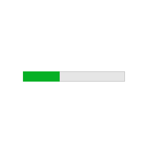
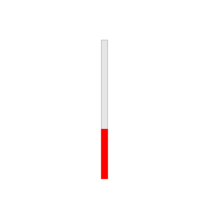
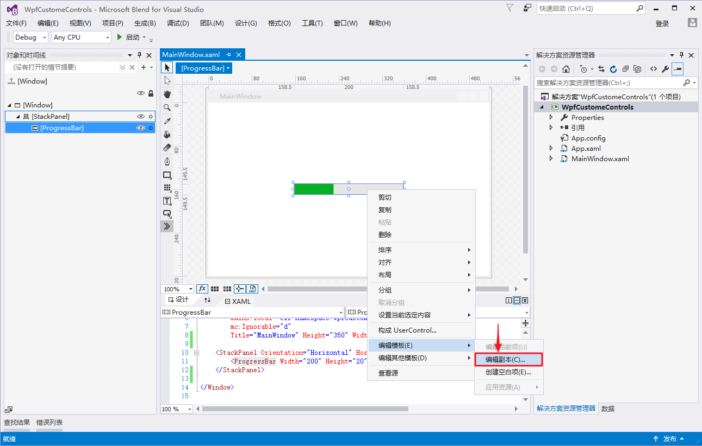
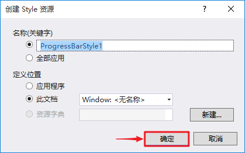
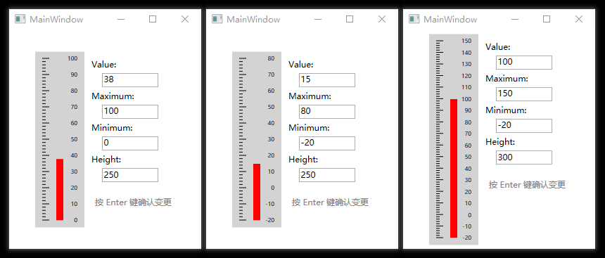

# 创建自定义控件

WPF 提供了大量不同的系统控件和简单样式，可供我们使用。但是，如果这些控件或样式不能满足我们的特定需要，则可以通过创建继承自某个现有的控件来创建自定义控件。

下面我们以一个温度计控件为例子，展示如何创建自定义控件。

## 添加自定义控件

在解决方案资源管理器视图中打开添加新项窗口，选择 `自定义控件(WPF)`.



自定义控件的名称为 `Thermometer`.



当我们点击添加后，解决方案资源管理器视图中自动添加了"**Thermometer.cs**"和"**Generic.xaml**"两个文件.

- Thermometer.cs -- 自定义控件的逻辑类
- Generic.xaml -- 自定义控件的UI

Thermometer.cs




Generic.xaml



## 选择合适的基类

从现有的控件中选择一个合适的来当作基类是非常重要的，这将会帮你节省大量的开发时间.

我们现在是制作一个温度计，通常温度计长什么样子呢?



看得出来，温度计的外表由红色的温度条和刻度标尺组成，那么我们完全可以使用 PrograssBar 来制作它。

PrograssBar 中文叫做进度条，当改变它的 Value 属性时它的进度条的进度也会相应的改变。

```
<ProgressBar Width="200" Height="20" Value="36"></ProgressBar>
```



我们可以为它设置一些样式：

```
<ProgressBar Height="200" Width="10" Value="36" Orientation="Vertical" Foreground="Red"></ProgressBar>
```



一个温度计的主体就出来了，其它只要在它边上画上一些刻度标尺就行了。

## 编写代码

因为选择从 ProgressBar 控件开始制作自定义控件，所以我们把自定义控件类(Thermometer)继承 ProgressBar 类。

Thermometer.cs

```c#
public class Thermometer : ProgressBar
{
    static Thermometer()
    {
        // 自动生成的代码.

        // 覆盖默认样式
        // 此处对应了 Generic.xaml 中的 <Style TargetType="{x:Type local:Thermometer}">.

        DefaultStyleKeyProperty.OverrideMetadata(
            typeof(Thermometer), new FrameworkPropertyMetadata(typeof(Thermometer)));
    }
}
```

接下来我们把温度计的 UI 用 xaml 写好，因为我们是在 ProgressBar 控件的基础上制作的，所以直接把 ProgressBar 的模板拿过来。

使用 Blend for Visual Studio 把 ProgressBar 的 UI 拿过来。在控件上鼠标右键**编辑模板**就可以获取到控件的模板代码了。





下面的 xaml 代码就是 ProgressBar 的原模板了。用里面的 Style 元素的内容替换 Generic.xaml 中的 Style 元素的内容。

```xaml
<Window.Resources>
    <SolidColorBrush x:Key="ProgressBar.Progress" Color="#FF06B025"/>
    <SolidColorBrush x:Key="ProgressBar.Background" Color="#FFE6E6E6"/>
    <SolidColorBrush x:Key="ProgressBar.Border" Color="#FFBCBCBC"/>
    <Style x:Key="ProgressBarStyle1" TargetType="{x:Type ProgressBar}">
        <Setter Property="Foreground" Value="{StaticResource ProgressBar.Progress}"/>
        <Setter Property="Background" Value="{StaticResource ProgressBar.Background}"/>
        <Setter Property="BorderBrush" Value="{StaticResource ProgressBar.Border}"/>
        <Setter Property="BorderThickness" Value="1"/>
        <Setter Property="Template">
            <Setter.Value>
                <ControlTemplate TargetType="{x:Type ProgressBar}">
                    <Grid x:Name="TemplateRoot">
                        <VisualStateManager.VisualStateGroups>
                            <VisualStateGroup x:Name="CommonStates">
                                <VisualState x:Name="Determinate"/>
                                <VisualState x:Name="Indeterminate">
                                    <Storyboard RepeatBehavior="Forever">
                                        <DoubleAnimationUsingKeyFrames Storyboard.TargetProperty="(UIElement.RenderTransform).(TransformGroup.Children)[0].(ScaleTransform.ScaleX)" Storyboard.TargetName="Animation">
                                            <EasingDoubleKeyFrame KeyTime="0" Value="0.25"/>
                                            <EasingDoubleKeyFrame KeyTime="0:0:1" Value="0.25"/>
                                            <EasingDoubleKeyFrame KeyTime="0:0:2" Value="0.25"/>
                                        </DoubleAnimationUsingKeyFrames>
                                        <PointAnimationUsingKeyFrames Storyboard.TargetProperty="(UIElement.RenderTransformOrigin)" Storyboard.TargetName="Animation">
                                            <EasingPointKeyFrame KeyTime="0" Value="-0.5,0.5"/>
                                            <EasingPointKeyFrame KeyTime="0:0:1" Value="0.5,0.5"/>
                                            <EasingPointKeyFrame KeyTime="0:0:2" Value="1.5,0.5"/>
                                        </PointAnimationUsingKeyFrames>
                                    </Storyboard>
                                </VisualState>
                            </VisualStateGroup>
                        </VisualStateManager.VisualStateGroups>
                        <Border BorderBrush="{TemplateBinding BorderBrush}" BorderThickness="{TemplateBinding BorderThickness}" Background="{TemplateBinding Background}"/>
                        <Rectangle x:Name="PART_Track"/>
                        <Grid x:Name="PART_Indicator" ClipToBounds="true" HorizontalAlignment="Left">
                            <Rectangle x:Name="Indicator" Fill="{TemplateBinding Foreground}"/>
                            <Rectangle x:Name="Animation" Fill="{TemplateBinding Foreground}" RenderTransformOrigin="0.5,0.5">
                                <Rectangle.RenderTransform>
                                    <TransformGroup>
                                        <ScaleTransform/>
                                        <SkewTransform/>
                                        <RotateTransform/>
                                        <TranslateTransform/>
                                    </TransformGroup>
                                </Rectangle.RenderTransform>
                            </Rectangle>
                        </Grid>
                    </Grid>
                    <ControlTemplate.Triggers>
                        <Trigger Property="Orientation" Value="Vertical">
                            <Setter Property="LayoutTransform" TargetName="TemplateRoot">
                                <Setter.Value>
                                    <RotateTransform Angle="-90"/>
                                </Setter.Value>
                            </Setter>
                        </Trigger>
                        <Trigger Property="IsIndeterminate" Value="true">
                            <Setter Property="Visibility" TargetName="Indicator" Value="Collapsed"/>
                        </Trigger>
                    </ControlTemplate.Triggers>
                </ControlTemplate>
            </Setter.Value>
        </Setter>
    </Style>
</Window.Resources>
```

再把其中不需要的代码清理一下，再加上我们的温度计的刻度尺。

```xaml
<Style TargetType="{x:Type local:Thermometer}">
    <Setter Property="Foreground" Value="Red"/>
    <Setter Property="Background" Value="LightGray"/>
    <!-- 设置ProgressBar的UI模板 -->
    <Setter Property="Template">
        <Setter.Value>
            <ControlTemplate TargetType="{x:Type ProgressBar}">
                <Grid Background="{TemplateBinding Background}">
                    <Grid x:Name="TemplateRoot" Margin="10">
                        <Grid.LayoutTransform>
                            <RotateTransform Angle="-90" />
                        </Grid.LayoutTransform>
                        <Grid Height="50">
                            <Grid.RowDefinitions>
                                <RowDefinition />
                                <RowDefinition Height="10" />
                                <RowDefinition />
                            </Grid.RowDefinitions>

                            <!-- 左边的刻度标尺 -->
                            <Canvas x:Name="CanvasScaleRuler" Grid.Row="0" RenderTransformOrigin="0.5,0.5">
                                <Canvas.LayoutTransform>
                                    <RotateTransform Angle="90" />
                                </Canvas.LayoutTransform>
                            </Canvas>

                            <!-- 右边的刻度值 -->
                            <Canvas x:Name="CanvasScaleValue" Grid.Row="2" RenderTransformOrigin="0.5,0.5">
                                <Canvas.LayoutTransform>
                                    <RotateTransform Angle="90" />
                                </Canvas.LayoutTransform>
                            </Canvas>

                            <!-- 中间的红条 -->
                            <Rectangle x:Name="PART_Track" Grid.Row="1" />
                            <Grid x:Name="PART_Indicator" Grid.Row="1" ClipToBounds="true" HorizontalAlignment="Left">
                                <Rectangle x:Name="Indicator" Fill="{TemplateBinding Foreground}"/>
                            </Grid>

                        </Grid>
                    </Grid>
                </Grid>
            </ControlTemplate>
        </Setter.Value>
    </Setter>
</Style>
```

在后台加上绘制温度计刻度尺的代码并把所有相关的事件重写：

```c#
public class Thermometer : ProgressBar
{
    static Thermometer()
    {
        DefaultStyleKeyProperty.OverrideMetadata(
            typeof(Thermometer), new FrameworkPropertyMetadata(typeof(Thermometer)));
    }


    Rectangle part_track;    // 温度计主体
    Canvas canvasScaleRuler; // 刻度尺画布
    Canvas canvasScaleValue; // 刻度值画布

    public override void OnApplyTemplate()
    {
        base.OnApplyTemplate();

        // 获取需要用到的 Template 中的控件

        if (part_track == null)
            part_track = GetTemplateChild("PART_Track") as Rectangle;
        if (canvasScaleRuler == null)
            canvasScaleRuler = GetTemplateChild("CanvasScaleRuler") as Canvas;
        if (canvasScaleValue == null)
            canvasScaleValue = GetTemplateChild("CanvasScaleValue") as Canvas;
    }

    protected override void OnRender(DrawingContext drawingContext)
    {
        base.OnRender(drawingContext);
        DrawScaleInCanvas();
    }

    protected override void OnMinimumChanged(double oldMinimum, double newMinimum)
    {
        base.OnMinimumChanged(oldMinimum, newMinimum);
        DrawScaleInCanvas();
    }

    protected override void OnMaximumChanged(double oldMaximum, double newMaximum)
    {
        base.OnMaximumChanged(oldMaximum, newMaximum);
        DrawScaleInCanvas();
    }

    private void DrawScaleInCanvas()
    {
        if (part_track == null || canvasScaleRuler == null || canvasScaleValue == null)
            return;


        double minimum = Minimum;
        double maximum = Maximum;
        double valueRange = maximum - minimum;
        double totalHeight = part_track.ActualWidth;
        double perScaleHeight = totalHeight / valueRange;

        canvasScaleRuler.Children.RemoveRange(0, canvasScaleRuler.Children.Count);
        canvasScaleValue.Children.RemoveRange(0, canvasScaleValue.Children.Count);

        double currentScaleValue = minimum;
        double currentScaleHeight = 0;

        while (currentScaleValue <= maximum)
        {
            bool isTen = currentScaleValue % 10 == 0;

            {
                var line = new Line { Stroke = Brushes.Black, X2 = (isTen ? 10 : 5) };
                Canvas.SetBottom(line, currentScaleHeight);
                canvasScaleRuler.Children.Add(line);
            }

            if (isTen)
            {
                var text = new TextBlock { Text = currentScaleValue.ToString(), FontSize = 8, Foreground = Brushes.Black };
                Canvas.SetBottom(text, currentScaleHeight - 5);
                Canvas.SetRight(text, 0);
                canvasScaleValue.Children.Add(text);
            }

            currentScaleValue += 2;
            currentScaleHeight += perScaleHeight * 2;
        }
    }
}
```

## 使用自定义控件

使用 TextBox 并绑定值到 Thermometer 的值，在改变 TextBox 值时 Thermometer 的值也会同时改变。

> *前台代码*

```xaml
<WrapPanel HorizontalAlignment="Center" VerticalAlignment="Center">
    <local:Thermometer x:Name="thermometer1" Value="38" Minimum="-20" Maximum="100" Height="300" />
    <StackPanel Margin="5" KeyUp="StackPanel_KeyUp">
        <Label>Value:</Label>
        <TextBox Height="20" Width="80" Text="{Binding Value,   ElementName=thermometer1}" />
        <Label>Maximum:</Label>
        <TextBox Height="20" Width="80" Text="{Binding Maximum, ElementName=thermometer1}" />
        <Label>Minimum:</Label>
        <TextBox Height="20" Width="80" Text="{Binding Minimum, ElementName=thermometer1}" />
        <Label>Height:</Label>
        <TextBox Height="20" Width="80" Text="{Binding Height,  ElementName=thermometer1}" />
        <TextBlock Foreground="Gray" Margin="10 20 0 0">按 Enter 键确认变更</TextBlock>
    </StackPanel>
</WrapPanel>
```

> *后台代码*

```c#
private void StackPanel_KeyUp(object sender, KeyEventArgs e)
{
    if (e.Key == Key.Enter && e.Source is TextBox tb)
    {
        tb.GetBindingExpression(TextBox.TextProperty).UpdateSource();
    }
}
```



------

完整代码下载：[Thermometer.zip](http://ganweisoft.net/down/LiveChartDemo/Thermometer.zip)