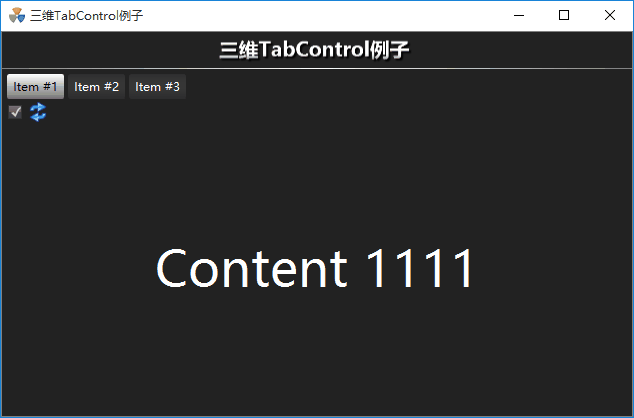

# 三维TabControl

## 介绍

TabTransitionControl 在 [TabControl](https://docs.microsoft.com/en-us/dotnet/framework/wpf/controls/tabcontrol) 的基础上增加了不同区域界面间过渡的动画。 
开发者通过设置过渡类型、过渡方向、过渡时间等多种常用属性，使得程序交互效果更加生动。

## 使用

```
命名空间：AlarmCenter.GWWpfCustomControlLibrary 
程序集：GWWpfCustomControlLibrary.dll
```

dll 文件通常存放在 `AlarmCenter\bin` 目录下面

在 XAML 根节点添加以下代码，引用 `AlarmCenter.GWWpfCustomControlLibrary` 命名空间到 gwuc。

```xaml
xmlns:gwuc="clr-namespace:AlarmCenter.GWWpfCustomControlLibrary;assembly=GWWpfCustomControlLibrary"
```

然后就可以通过 gwuc:TabTransitionControl 标签使用它。

```xaml
<gwuc:TabTransitionControl>
    <TabItem Header="Item #1">
        <TextBlock>Content 1111</TextBlock>
    </TabItem>
    <TabItem Header="Item #2">
        <TextBlock>Content 2222</TextBlock>
    </TabItem>
</gwuc:TabTransitionControl>
```

## 属性

| 属性名称              | 属性类型       | 默认值                | 说明                         |
| :-------------------- | :------------- | :-------------------- | :--------------------------- |
| TransitionType        | TransitionType | TransitionType.Cube   | 变换类型                     |
| TransitionDirection   | Direction      | Direction.TopToBottom | 变换方向                     |
| TransitionDuration    | double         | 1.0                   | 变换过渡时间                 |
| IsLooped              | bool           | false                 | 自动循环过渡                 |
| LoopRestSeconds       | double         | 5.0                   | 自动循环过渡间隔             |
| LoopSettingVisibility | Visibility     | Visibility.Collapsed  | Loop设置的可见性             |
| IsApplyTransition     | bool           | true                  | 切换标签项时是否应用过渡变换 |

## 示例



完整代码如下：

```xaml
<gwuc:GWPageContentControl x:Class="AlarmCenter.PageTest.TestPage"
                           xmlns="http://schemas.microsoft.com/winfx/2006/xaml/presentation"
                           xmlns:x="http://schemas.microsoft.com/winfx/2006/xaml"
                           xmlns:mc="http://schemas.openxmlformats.org/markup-compatibility/2006"
                           xmlns:d="http://schemas.microsoft.com/expression/blend/2008"
                           xmlns:local="clr-namespace:AlarmCenter.PageTest"
                           xmlns:gwuc="clr-namespace:AlarmCenter.GWWpfCustomControlLibrary;assembly=GWWpfCustomControlLibrary"
                           mc:Ignorable="d"
                           d:DesignHeight="400" d:DesignWidth="600"
                           HeaderText="三维TabControl例子">

    <Grid>
        <gwuc:TabTransitionControl
            TransitionType="Slide"
            TransitionDirection="LeftToRight"
            TransitionDuration="0.5"
            IsLooped="True"
            LoopRestSeconds="1.0"
            LoopSettingVisibility="Visible"
            IsApplyTransition="True">
            <gwuc:TabTransitionControl.Resources>
                <Style TargetType="TextBlock">
                    <Setter Property="TextAlignment" Value="Center" />
                    <Setter Property="VerticalAlignment" Value="Center" />
                    <Setter Property="Foreground" Value="White" />
                    <Setter Property="FontSize" Value="50" />
                </Style>
            </gwuc:TabTransitionControl.Resources>

            <TabItem Header="Item #1">
                <TextBlock>Content 1111</TextBlock>
            </TabItem>
            <TabItem Header="Item #2">
                <TextBlock>Content 2222</TextBlock>
            </TabItem>
            <TabItem Header="Item #3">
                <TextBlock>Content 3333</TextBlock>
            </TabItem>
        </gwuc:TabTransitionControl>
    </Grid>
</gwuc:GWPageContentControl>
```