# Unity3D

## 创建Unity3D项目

#### 1.搭建环境

- 适用人群：Unity3D初学者，有C#编程基础。

- Unity3D 目前最新正式版本是 Unity 2017.2.1，此项目使用稳定版本 Unity 5.6。[**下载安装Unity3D 5.6**](https://unity3d.com/cn/get-unity/download)，建议使用最新版本Unity3D。

- 下载安装 [**Visual Studio 2017**](https://www.visualstudio.com/zh-hans/downloads/)，建议下载企业版（[**Visual Studio Enterprise 2017**](https://www.visualstudio.com/thank-you-downloading-visual-studio/?sku=Enterprise&rel=15)），在默认勾选的基础上，还要勾选"**使用Unity的游戏开发**"。（由于我已经安装过了，我是点击修改的，所以界面与直接安装有些许不同，但大体相同）

  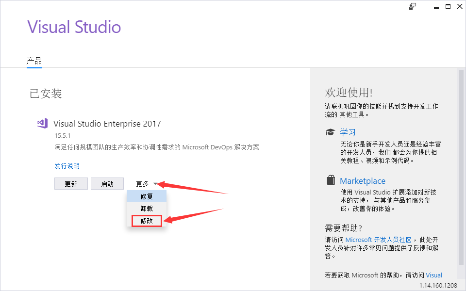


- Unity3D 可以使用C# 和JavaScript，建议使用C#来编写脚本。
- 如果是初学者，推荐学习资料：
- 1. 官方教程 [**Unity - Learn - Modules**](https://unity3d.com/cn/learn/tutorials)
  2. [**Unity User Manual (2017.2)**](https://docs.unity3d.com/Manual/index.html)
  3. [**Unity - Scripting API(官方API)**](https://docs.unity3d.com/ScriptReference/index.html)
  4. [**游戏蛮牛论坛**](http://www.manew.com/forum.php)
  5. [**了解Unity3D的基本概念及操作**](http://www.cnblogs.com/lunarfire/articles/Unity3D_Introduction_1.html#3810883)

#### 2.创建一个简单的工程

- 打开Unity3D 5.6 创建一个工程

​       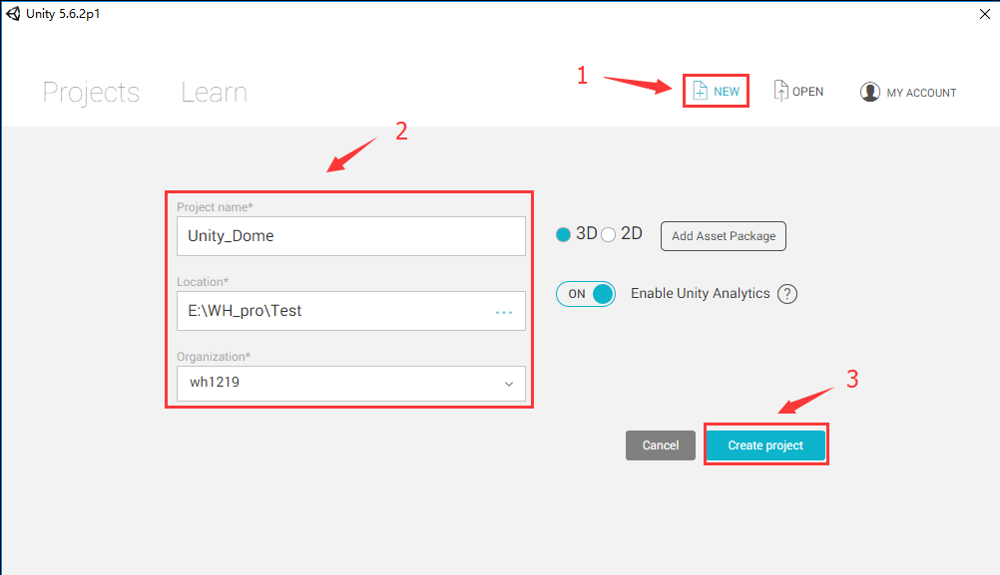

- 导入此工程需要的工具包 （此包有主场景，UI界面逻辑，与WPF客户端通信等脚本） ，打开菜单栏 **Assets->ImportPackage->CustomPackage** 选择 [**Unity_Tools_Template.unitypackage**](http://ganweisoft.net/ueditor/php/upload/file/20171222/1513910716111516.rar)，勾选 All开始Import。

  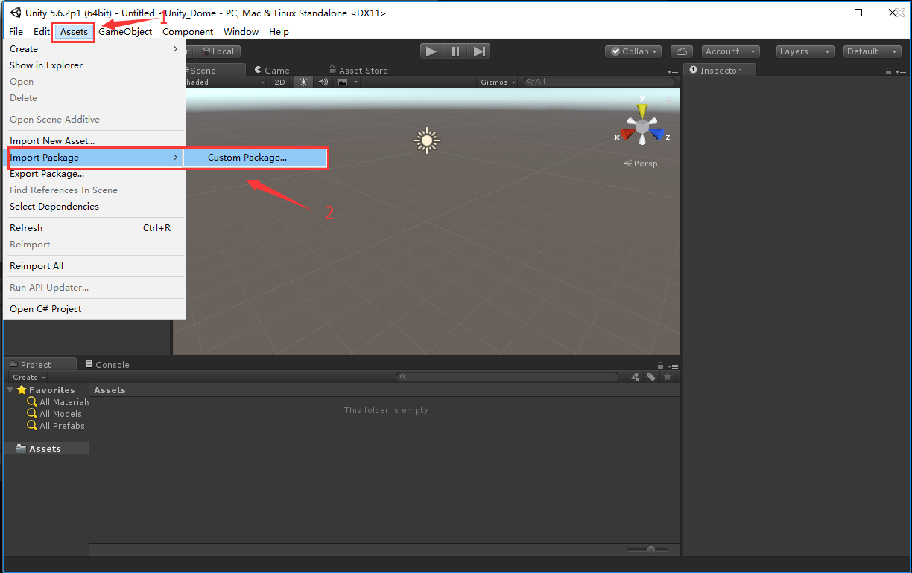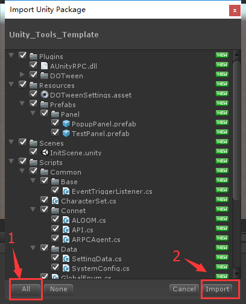

- 导入完成后工程结构如下图。打开 **Project->Assets->Scenes** 文件夹目录 打开InitScene场景，此场景做为该项目的主场景。下图关于工程结构的简介。

  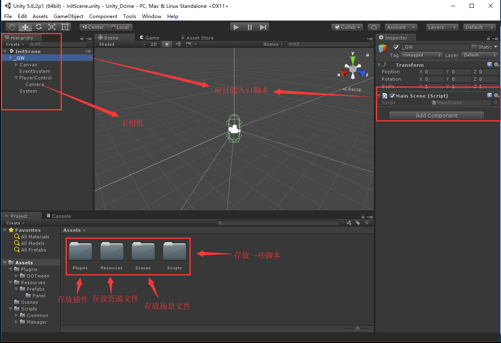

#### 3.导入模型到工程

- [**Unity3D 支持的3D模型类型很多**](http://blog.csdn.net/ami121/article/details/19287867/)。该工程使用的是3DMAX 导出的FBX 格式的模型（模型文件由美工提供）。
- 在Assets下创建文件夹Models用 来存放模型文件，直接把模型文件拖入项目文件夹中。

​       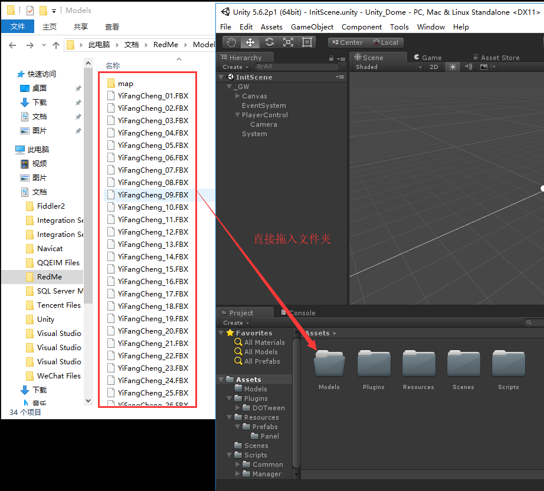

- 把导入的模型显示在场景中。在**Hierarchy**标签页下 空白的地方右键选择**Create Empty**创建一个空的游戏物体，更名为 BuildingObj ，并重置坐标零点，选中Models下的模型文件 拖入刚创建的BuildingObj中。即可在**Scene**标签页下查看到此模型。

  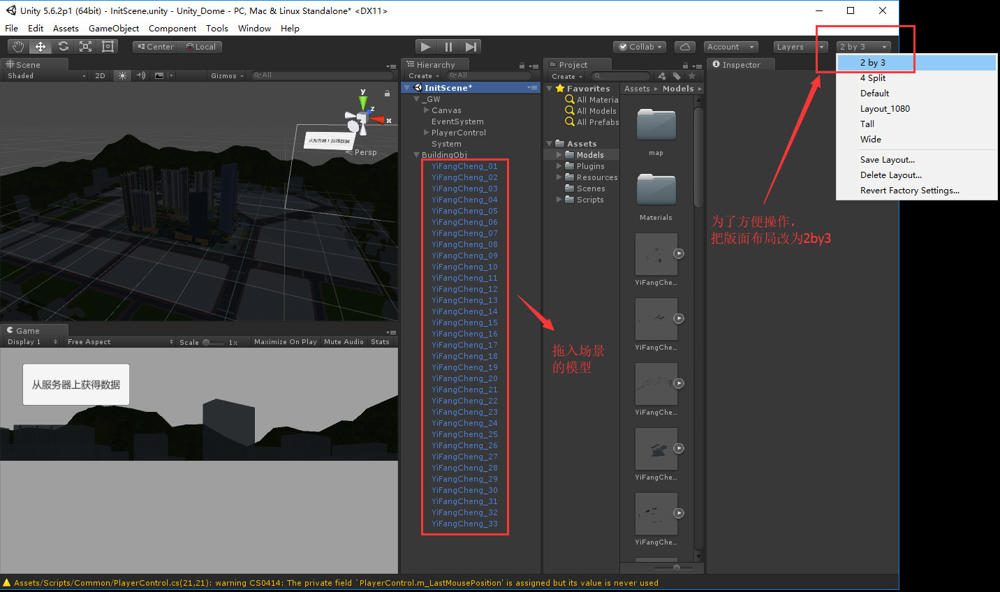

- 这时你会发现场景模型很暗，因为场景中缺少灯光。可以在**Hierarchy**标签页下 空白的地方右键创建平行光源 **Light->Directional light** 照亮场景。关于各种光源可以了解官方 [Types of Light](https://docs.unity3d.com/Manual/Lighting.html)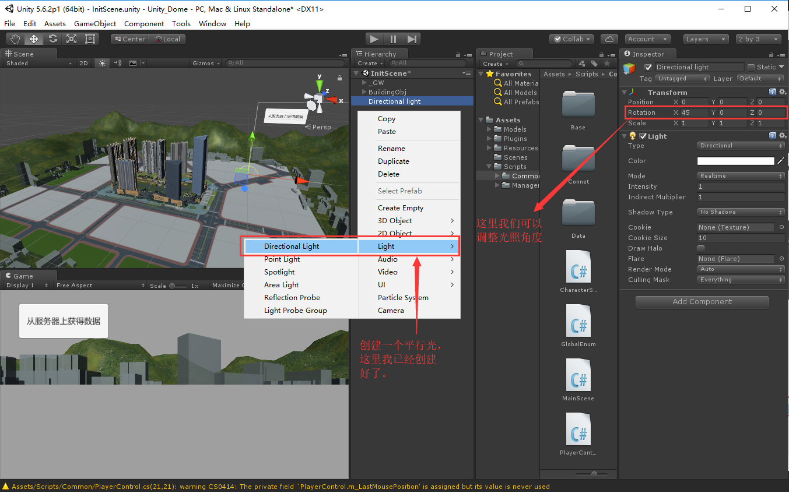

  

- 如果想在主界面展示3D最佳的视角，可以调整摄像机，找到组件 **_GW->PlayerControl** ，修改PlayerControl 的Transform的属性，如下图，在Scene标签页下把摄像机调整到最佳方位。
  

  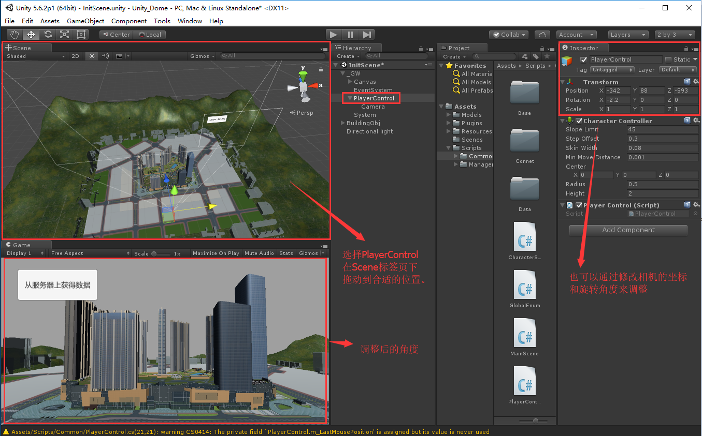

- 如果想让场景更加生动，我们可以给模型添加一个脚本，让模型动起来！打开文件夹**Assets->Scripts**，在文件夹内右键 **Create->C# Spripts** ,更改名称为ToRotation 并双击打开，可以添加一段代码让模型自转。如下：
  

  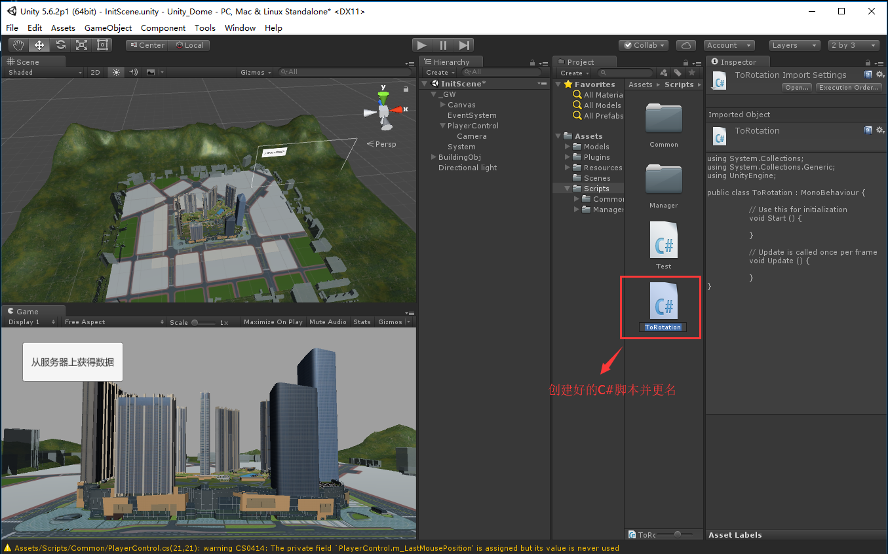

```c#
  using System.Collections;
  using System.Collections.Generic;
  using UnityEngine;
  
  public class ToRotation : MonoBehaviour {
  
      // Use this for initialization
      public float _RotationSpeed = 0.1f; //定义自转的速度
  
    
  	void Start () {
  
  		
  	}
  	
  	// Update is called once per frame
  	void Update ()
      {
          transform.Rotate(Vector3.down * _RotationSpeed, Space.World); //物体自转
      }
  }
```


- 然后把写好的脚本挂载到模型上，选中游戏物体 BuildingObj 在 Inspector 标签下点击 Add Component 搜索 ToiRotation 。然后点击 `Play`,就可以看到模型转动的效果了。这样一个简单的 Unity 项目就算完成了。
  

  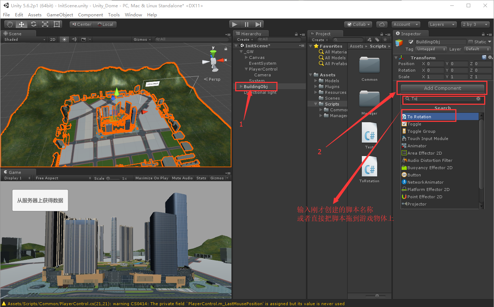

  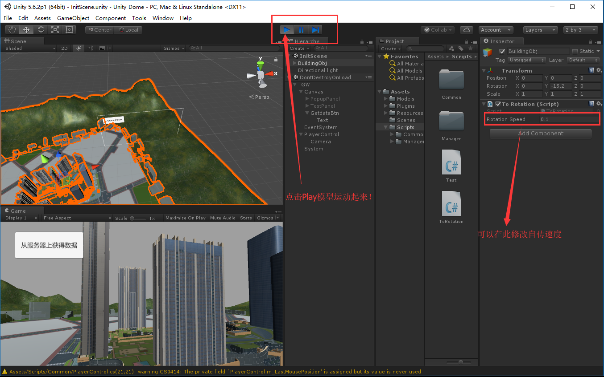

#### 4.打包成PC端的exe 可执行程序

- 从菜单栏打开播放器设置，选择 **Edit->Project Settings->Player** ，需要注意的几个设置，**Resolution and Presentation**,标签下： Default Is Full Screen 勾去掉，Run In Background 勾选上，Display Resolution Dialog 选择 Hidden By Default。**Other Settings** 标签下 ：Api Compatibility Level 选择 .Net 2.0。对照下图设置。

  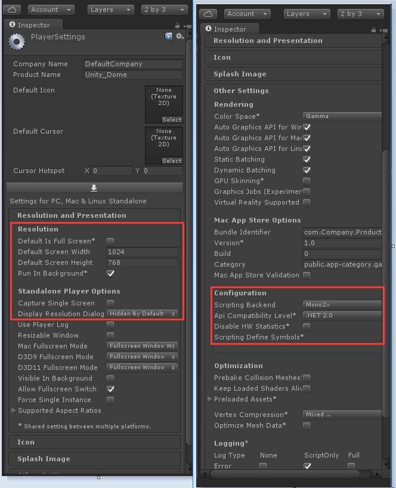

- 打包设置 ，打开**File->Build Settings** 点击Add Open Scenes 添加当前场景 InitScene 。Architecture 选择需要编译的平台为X86_64，开始Build。

  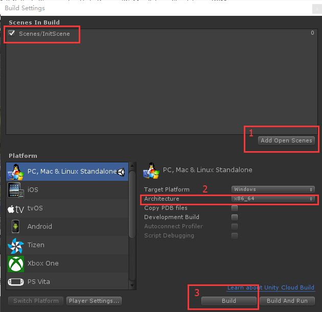

- - 导出来有一个exe程序，一个文件夹，当你要展示的时候直接点击exe程序就行，注意：没有文件夹里面的东西，它是运行不了的。

    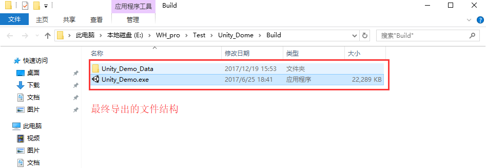

  - 下面就是U3D的示例(下载完成后放在一起解压)

  - [Unity_Dome.part3.rar](http://ganweisoft.net/ueditor/php/upload/file/20171222/1513915718104098.rar)

  - [Unity_Dome.part1.rar](http://ganweisoft.net/ueditor/php/upload/file/20171222/1513915726594354.rar)

  - [Unity_Dome.part2.rar](http://ganweisoft.net/ueditor/php/upload/file/20171222/1513915728420549.rar)

#### 5.AlarmCenter平台嵌入Unity3D

- 将Unity嵌入桌面程序最好的方式是嵌入Unity生成的exe程序，WPF程序和unity之间通过socket进行通讯，AlarmCenter平台做为服务端，Unity程序做为客户端用来接收AlarmCenter平台发送的数据。这样，WPF就能加载多个Unity程序。

- AlarmCenter平台嵌入Unity3D

- - 先创建一个WPF插件用来加载Unity生成的exe文件，具体的创建流程也可参照 [**创建一个页面插件**](http://ganweisoft.net:8092/views/client/guide/?uid_118)。

    **1.**打开Vs2017 **文件->新建->项目** 名称修改为 AlarmCenter.GW3D.UnityDemo ,Unity3D 使用统一的前缀 AlarmCenter.GW3D。

    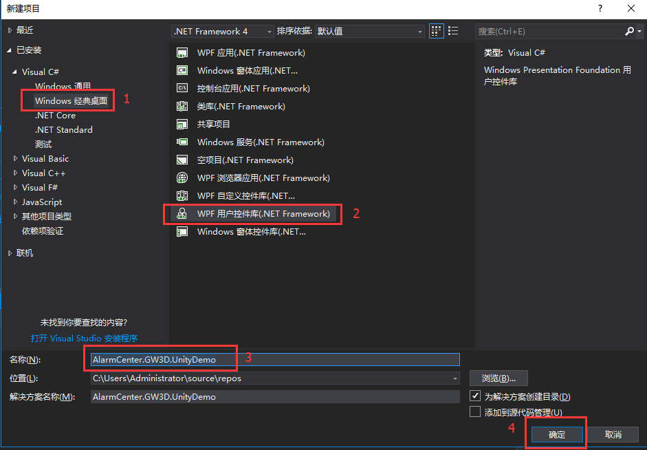

    **2.**为项目添加引用 ，框架自带的引用勾选System.Windows.Forms，WindowsFormsIntegration等（与创建一个标准的插件所引用的类库一致），添加与Unity3D 相关的类库 **Unity3dForAlarmCenter(为Unity提供数据服务)**，**AlarmCenter.Unity3D.Core(Unity 相关的数据模型)**，**AUnityRPC(负责与Unity通信)**。

    **3.**新建一个类，命名：U3dUtlis.cs（打开Unity exe 文件，向Unity发送指令数据，如语音控制Unity 需要调用 DoAttach()方法）

    ```c#
    namespace AlarmCenter.GW3D.UnityDemo
    {
        using Unity3dForAlarmCenter.Controls;
        public class U3dUtlis
        {
            string _3dExePath = System.IO.Path.GetDirectoryName(System.Reflection.Assembly.GetExecutingAssembly().Location) + "\\";//U3D EXE 文件路径
            Unity3dPlayer unity;
            public U3dUtlis(Unity3dPlayer unity)
            {
                this.unity = unity;
            }
    
            public void Open(string unityFileName) //打开Unity exe
            {
                unity.Open(_3dExePath + unityFileName);
            }
    
            public void Dispose()
            {
                if (this.unity != null)
                {
                    unity.Dispose();
                    this.unity = null;
                }
            }
    
            public void DoAttach(string plStr)//AlarmCenter平台主动给Unity3D 发送指令数据
            {
                if (string.IsNullOrWhiteSpace(plStr))//指令格式 @+指令名称,指令参数 PS: @GoHome,1
                    return;
    
                string p = plStr.Substring(1);
                string[] strs = p.Split(',');
                if (strs.Length == 6)
                {
                   // this.SetCameraPosition(p);
                }
                else if (strs.Length == 2)//有参数
                {
                    switch (strs[0])
                    {
                        case "LoadLevel":
                           // LoadLevel(strs[1]);
                            break;
                        default:
                            break;
                    }
                }
                else if (strs.Length == 1)//无参数
                {
                    switch (strs[0])
                    {
                        case "GoHome":
                            GoHome();
                            break;
                        default:
                            break;
                    }
                }
            }
            public void GoHome()
            {
                unity.SendMessageWithObjectPath("_GW/System/GWAPI.GoHome");
            }
        }
    }
    ```

    

    **4.**然后创建一个新的用户控件命名为：IDCPage3D.xaml ，并修改xaml(修改命名空间为gwccHu:GWPage3D,添加引用)和cs文件内容。

    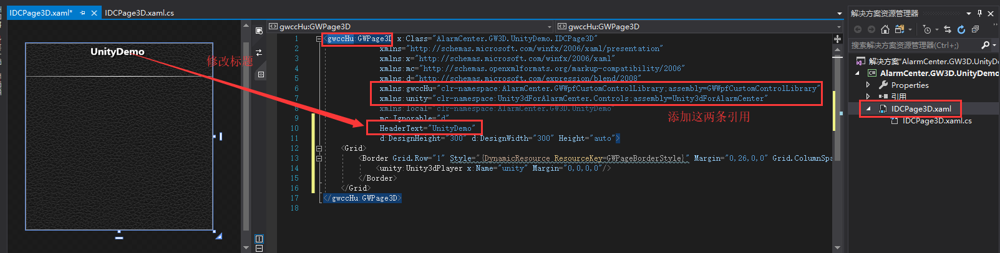

    ```c#
    namespace AlarmCenter.GW3D.UnityDemo
    {
        /// <summary>
        /// IDCPage3D.xaml 的交互逻辑
        /// </summary>
        public partial class IDCPage3D : AlarmCenter.GWWpfCustomControlLibrary.GWPage3D
        {
            U3dUtlis u3dUtlis;
            #region IGWPage
            public override void Dispose()
            {
                //
                u3dUtlis.Dispose();
            }
            /// <summary>
            /// AlarmCenter平台向U3D 发生的指令接口
            /// </summary>
            /// <param name="plStr"></param>
            public override void DoAttach(string plStr)
            {
                u3dUtlis.DoAttach(plStr);
            }
    
            #endregion IGWPage
            public IDCPage3D()
            {
                InitializeComponent();
    
                u3dUtlis = new U3dUtlis(this.unity);
                u3dUtlis.Open(@"Unity_Demo.exe"); //加载Unity生成的exe
            }
        }
    }
    ```

    **5.**添加一个文本文件，并将拓展名改为Addin (用于AlarmCenter平台读取该插件的信息并显示在3D标签页下) ，属性，复制本地设置为 ：如果较新则复制。

    ```
    <AddIn name        = "AlarmCenter.GW3D.UnityDemo"
           author      = "AlarmCenter"
           copyright   = "prj:///doc/copyright.txt"
           url         = ""
           description = "Display AlarmCenter.GW3D.UnityDemo">
    
      <Manifest>
        <Identity name = "AlarmCenter.GW3D.UnityDemo"/>
      </Manifest>
    
      <Runtime>
        <Import assembly="AlarmCenter.GW3D.UnityDemo.dll"/>
      </Runtime>
      <Path name = "/SharpDevelop/Workbench/MainMenu/GW3D">
    
        <MenuItem id = "UnityDemo"
    					icon  = "Icons.16x16.SharpQuery.View"
          	  label = "UnityDemo"
    				  class =  "PageMenuCommand(AlarmCenter.GW3D.UnityDemo.IDCPage3D)"/>
      </Path>
    </AddIn>
    ```

    **6.**最后就可以生成插件了(Addin 和Dll 文件是我们需要的)

    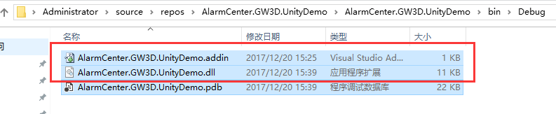

  - 在AlarmCenter平台菜单栏创建主标签页。在目录 **D:\AlarmCenter\AddIns\AddIns\AlarmCenter\Extention\GW3D Scenes**（如果路径不存在可以自己创建）下创建TXT文本文件并修改拓展名为.Addin 修改文本内容为：

    

- ```
  <AddIn name        = "ShowGW3D"
         author      = "Shendong"
         copyright   = "prj:///doc/copyright.txt"
         url         = ""
         description = "ShowGW3D">
    <Manifest>
      <Identity name = "AlarmCenter.ShowGW3D"/>
    </Manifest>
    <Path name = "/SharpDevelop/Workbench/MainMenu">
      <MenuItem id = "GW3D" label = "${res:XML.MainMenu.GW3D}"
  		insertbefore="System"
  		type="Menu"/>
    </Path>
  </AddIn>
  ```

- 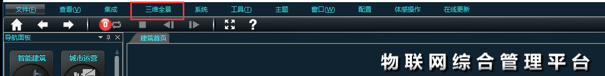

- 

- - 在目录 **D:\AlarmCenter\AddIns\AddIns\AlarmCenter\Extention\GW3D Scenes**下创建文件夹AlarmCenter.GW3D.UnityDemo 将exe文件与插件放在一起，然后打开AlarmCenter平台 在**三维全景**标签页就可以打开查看了

    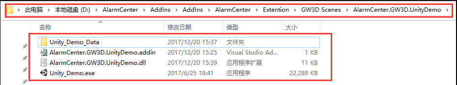

  - 插件示例 [AlarmCenter.GW3D.UnityDemo.rar](http://ganweisoft.net/ueditor/php/upload/file/20171222/1513916049597883.rar)

#### 6.AlarmCenter平台与Unity3D通信并进行数据交互

- 在AlarmCenter平台服务端定义所需数据接口，然后在Unity 3D 中主动去读取这些数据。我们需要修改**Unity3dForAlarmCenter**类库（示例：如下），用VS2017 打开 Unity3dForAlarmCenter找到AlarmCenterService.cs（Unity3D数据表可在数据库里创建然后该类中定义并读取） 示例：定义一个读取 表GW_UNITY_SCENE 的方法 如下： **注意！修改完成后要重新生成到D:\AlarmCenter\bin目录下**。

- [Unity3dForAlarmCenter.rar](http://ganweisoft.net/ueditor/php/upload/file/20171222/1513916258124284.rar)

  [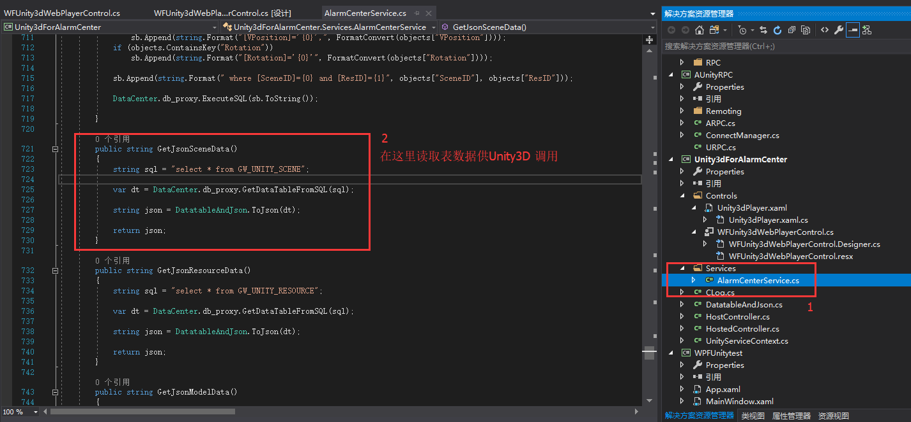](http://ganweisoft.net/ueditor/php/upload/file/20171222/1513916258124284.rar)

- ```
  /// <summary>
  /// 获取表 GW_UNITY_SCENE 数据
  /// </summary>
  /// <returns></returns>
          public string GetJsonSceneData()
          {
              string sql = "select * from GW_UNITY_SCENE";
  
              var dt = DataCenter.db_proxy.GetDataTableFromSQL(sql);
  
              string json = DatatableAndJson.ToJson(dt);
  
              return json;
          }
  ```

- 打开Unity 3D 编辑脚本API加入以下内容，读取上面创建的方法。然后打包成exe 。

  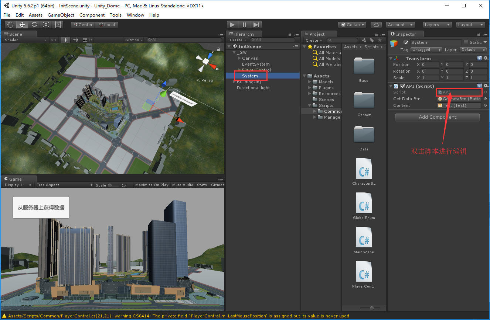

在Start 方法中加入

```
        //检查是否与AlarmCenter 建立连接
        if (ARPCAgent.GetInstance().ISOK)
        {
            GetDataBtn.onClick.AddListener(() => {
                //读取数据表 GetJsonSceneData 并显示在按钮上
                var s = ARPCAgent.Call("GetJsonSceneData"); 
                if (s != null)
                {
                    content.text = s.ToString();
                }
                else
                {
                    content.text = "获取数据失败！";
                }
            });
        }
```

  

最后打包成exe 放入AlarmCenter平台中，目录：**D:\AlarmCenter\AddIns\AddIns\AlarmCenter\Extention\GW3D Scenes\AlarmCenter.GW3D.UnityDemo**，然后 打开.UnityDemo 点击按钮 如下图：

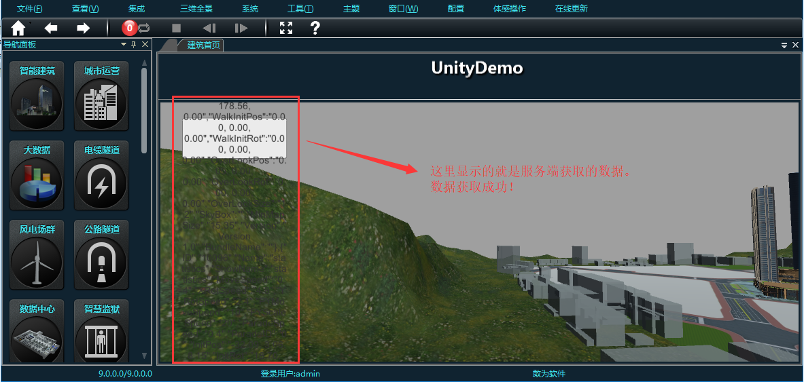