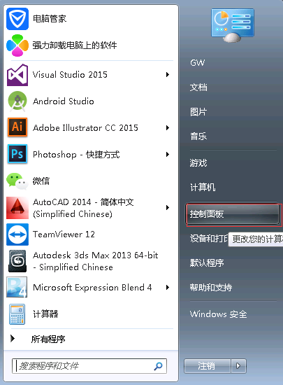
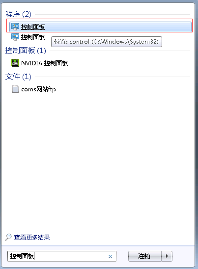
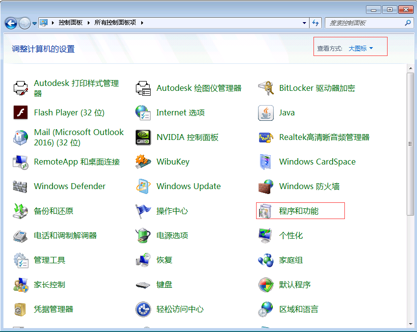
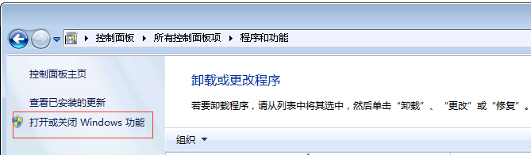
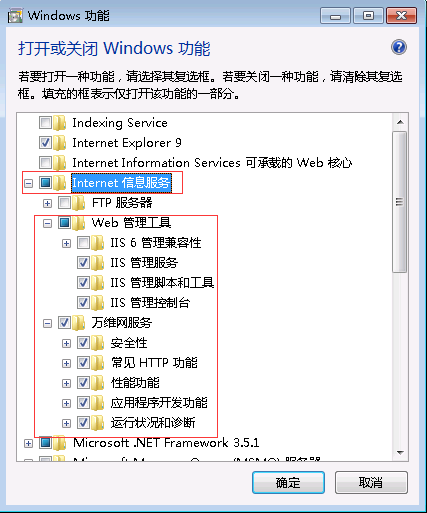
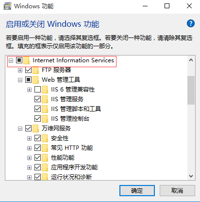

#### 1、安装IIS

IIS，全称Internet Information Services，意为互联网信息服务，作为承载Web端的服务器

1、打开“控制面板”

2、打开“程序和功能”

3、选择“打开或关闭Windows功能”

4、选择“Internet信息服务”，“Web管理工具”和“万维网服务”（点击父节点的勾选框时，是无法全部勾选下面的子项，请认真勾选每一项）

 

win10下的IIS

5、点击“确定”开始安装

#### 2、安装.net framework 4.5

IoTCenterWeb基于.net framework 4.5开发，需要安装此组件才能正常运行，[百度下载地址](http://sw.bos.baidu.com/sw-search-sp/software/0d77bbc614630/donetRepair4.5.exe)，[微软下载地址](http://www.microsoft.com/zh-cn/download/details.aspx?id=30653)，[.net framework安装教程](https://jingyan.baidu.com/article/925f8cb8f0f024c0dce05640.html)