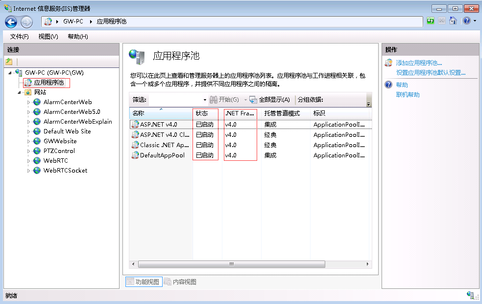

#### 安装IoTCenterWeb

1、打开“控制面板” - “管理工具” - “Internet 信息服务(IIS)管理器”

或者直接搜索IIS

2、点击根目录，选择“ISAPI 和 CGI限制”，将所有扩展的限制有设置为“允许”

3、在根目录下选择“应用程序池”，将其所有状态设置为“已启动”（注意：版本为v4.0以上，若不是则需要IIS重新注册.Net4.0）

IIS注册.Net4.0

1.使用管理员权限运行cmd命令

2.输入 cd C:WindowsMicrosoft.NETFrameworkv4.0.30319

3.输入 aspnet_regiis.exe -i

4、在根目录下“网站”，右键选择“添加网站”

5、弹出“添加网站”对话框，在“网站名称”输入“AlarmCenterWeb”；点击“选择”按钮，打开“应用程序池”，选择.Net4.0版本以上的应用程序池，管道模式为“集成”

6、在“物理路径”栏里输入项目工作目录地址，选择“类型”为http或者https，输入指定“端口”

