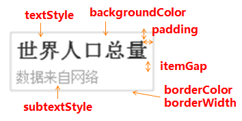
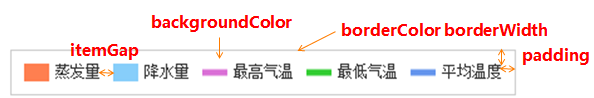
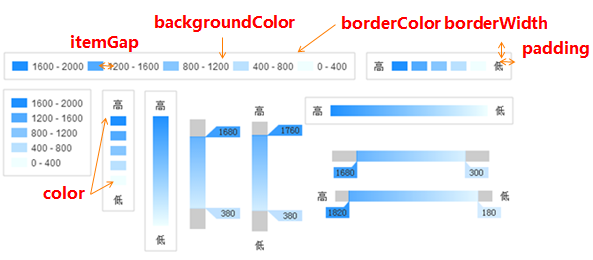

## Echarts 简介

为了让用户更清晰、高效率的处理繁琐的数据，平台使用由百度[EFE](http://efe.baidu.com/)数据可视化团队开发的[ECharts](http://echarts.baidu.com/)图表进行数据可视化展示， ECharts是一个纯 Javascript 的开源图表库，其可以流畅的运行在 PC 和移动设备上，兼容当前绝大部分浏览器（IE8+，Chrome，Firefox，Safari等），提供了大量直观，生动，可交互，可高度个性化定制的数据可视化图表。

## Echarts 入门

### Echarts 下载

获取Echarts有以下几种方式，选其一即可：
（1）从[ECharts官网下载界面](http://echarts.baidu.com/download.html)选择你需要的版本下载，根据开发者功能和体积上的需求，ECharts 提供了不同打包的下载，如果你在体积上没有要求，可以直接下载[完整版本](http://echarts.baidu.com/dist/echarts.min.js)。开发环境建议下载[源代码版本](http://echarts.baidu.com/dist/echarts.js)，包含了常见的错误提示和警告。

（2）在 ECharts 的 [GitHub](https://github.com/ecomfe/echarts) 上下载最新的 release 版本，解压出来的文件夹里的 dist 目录里可以找到最新版本的 echarts 库。

（3）通过 npm 获取 Echarts，命令：npm install echarts --save，详情可参考 Echarts 官网介绍的“[在 webpack 中使用 echarts](http://echarts.baidu.com/tutorial.html#%E5%9C%A8%20webpack%20%E4%B8%AD%E4%BD%BF%E7%94%A8%20ECharts)”

（4）cdn 引入，你可以在 [cdnjs](https://cdnjs.com/libraries/echarts)，[npmcdn](https://unpkg.com/echarts@3.8.5/dist/) 或者国内的 [bootcdn](http://www.bootcdn.cn/echarts/) 上找到 ECharts 的最新版本。

### Echarts 绘制一个图表

接下来将开始使用Echarts绘制一个简单的柱状图

#### 第一步 引入ECharts

```
<!DOCTYPE html>
<html>
    <head>
        <meta charset="UTF-8">
        <title>Echarts Demo</title>
        <!-- 引入echarts.js文件 -->
        <script type="text/javascript" src="js/echarts.js"></script>
    </head>
    <body>
    </body>
</html>
```

Echarts文件有几个版本，我们可以根据实际需要引用/下载需要的版本，[下载链接](http://echarts.baidu.com/download.html)

#### 第二步 创建一个DOM容器

```
<!-- 为ECharts准备一个具有一定大小（宽高）的Dom元素 -->
<div id="main" style="width: 500px;height: 400px;"></div>
```

预先准备好具有一定宽和高的网页元素作为容器，我们将用它来绘制Echarts图表

#### 第三步 调用echarts.init()方法，进行初始化操作

```
//基于准备好的dom元素，初始化echarts实例
var myChart = echarts.init(document.getElementById("main"));
```

通过 echarts.init()方法可以初始化一个 echarts 实例。拥有此实例后，我们就可以据此进行一系列的图表参数配置

#### 第四步 设置图表参数

```
//设置图表的配置项和数据
var option = {
    title: {//图表标题
        text: "ECharts Demo"//图表标题内容
    },
    legend: {//图例组件，可以通过点击图例控制图表相应内容的显示
        data: ['销量']//图例内容数组
    },
    xAxis: {//直角坐标系中横轴数组
        data: ["衬衫","羊毛衫","雪纺衫","裤子","高跟鞋","袜子"]
    },
    yAxis: {},//直角坐标系中纵轴数组
    series: [{//数据内容数组
        name: ["销量"],//图表数据名称
        type: "bar",//图表类型
        data: [5, 20, 36, 10, 10, 20]//图表数据
    }]
};
//使用option中的配置项和数据显示图表。
myChart.setOption(option);
```

在option中，我们可以根据项目需求自定义配置图表坐标轴、数据及其他配置项内容。配置完成后，即可通过setOption()方法将option相应配置渲染成图表

经过以上四步即可实现一个简单的柱状图，图表参数详见： [官网API开发文档](http://echarts.baidu.com/option.html)


上面我们通过配置一些图表参数，成功使用Echarts渲染出一个简单柱状图，接下来将继续配置折线图以及饼状图两类常用图表

折线图配置与柱状图类似，只需要在上文option中把series里的type 值修改为"line"，即图表类型更改为折线图。配置如下：

```
var option = {
    title: {
        text: "ECharts Demo"
    },
    tooltip: {},
    legend: {
        data: ['销量']
    },
    xAxis: {
        data: ["衬衫","羊毛衫","雪纺衫","裤子","高跟鞋","袜子"]
    },
    yAxis: {},
    series: [{
        name: ["销量"],
        type: "line",//type：图表类型 line（折线图）
        data: [5, 20, 36, 10, 10, 20]
    }]
};

myChart.setOption(option);
```


饼状图和折线图、柱状图有一点区别，主要在参数和数据绑定上，饼图没有X轴和Y轴的坐标，数据绑定上也是采用value和name一一对应的形式。相应配置如下：

```
var option = {
    title: {
        text: 'ECharts Demo'
    },
    tooltip: {},
    legend: {
        data:['销量']
    },
    series: [{
        name: '销量',
        type: 'pie',
        radius:'60%',
        data: [
            {name:"衬衫",value:5},
            {name:"羊毛衫",value:20},
            {name:"雪纺衫",value:36},
            {name:"裤子",value:10},
            {name:"高跟鞋",value:10},
            {name:"袜子",value:20}
        ]
    }]
};

myChart.setOption(option);
```


经过以上配置，即可成功的渲染出折线图和饼状图，若未成功，详见本章末位“注意事项”
接下来将介绍在图表开发中常用到的一些方法/技巧。

## Echarts 进阶

### 异步加载

 在项目开发中，庞大、复杂的图表数据无法实时读取，使用正常配置会阻止浏览器的后续处理，此时就可使用异步加载获取数据的方式。ECharts中实现异步数据的载入/更新方式较为简单，在图表初始化后，不管任何时候只要通过jQuery等工具异步获取数据后通过setOption()填入数据和配置项即可，如下：

方案一

```
var myChart = echarts.init(document.getElementById('main'));//初始化echarts实例

$.get('data.json').done(function(data) {//异步获取数据
    myChart.setOption({//设置配置项
        title: {
            text: '异步数据加载示例'
        },
        tooltip: {},
        legend: {
            data: ['销量']
        },
        xAxis: {
            data: ["衬衫", "羊毛衫", "雪纺衫", "裤子", "高跟鞋", "袜子"]
        },
        yAxis: {},
        series: [{
            name: '销量',
            type: 'bar',
            data: [5, 20, 36, 10, 10, 20]
        }]
    });
});
```

方案二

```
var myChart = echarts.init(document.getElementById('main'));//初始化echarts实例
// 先进行部分配置，显示标题，图例和空的坐标轴
myChart.setOption({
    title: {
        text: '异步数据加载示例'
    },
    tooltip: {},
    legend: {
        data: ['销量']
    },
    xAxis: {
        data: []
    },
    yAxis: {},
    series: [{
        name: '销量',
        type: 'bar',
        data: []
    }]
});

// 异步加载数据
$.get('data.json').done(function(data) {
    // 填入数据
    myChart.setOption({
        xAxis: {
            data: data.categories
        },
        series: [{
            // 根据名字对应到相应的系列
            name: '销量',
            data: data.data
        }]
    });
});
```

目前异步加载共有两种开发方式，在项目开发中任选其一即可。

### loadding 加载动画

ECharts 默认提供了一个简单的加载动画，只需要调用showLoading()方法即可显示。数据加载完成后再调用 hideLoading()方法就可隐藏加载动画，如下。

```
var myChart = echarts.init(document.getElementById('main'));//初始化echarts实例
myChart.showLoading();//调用showLoading方法显示动画
$.get('data.json').done(function(data) {
    myChart.hideLoading();//数据加载完毕后，调用hideLoading 方法隐藏动画
    myChart.setOption(...);
});
```

示例如下


加载动画一般常用于绘制大数据图表时使用。

### 选择使用渲染器

目前，ECharts 从一开始便使用 Canvas 绘制图表，但随着 ECharts 在移动端中的开发越来越多，为了减少内存占用量，提升用户体验。 [ECharts v3.8](https://github.com/ecomfe/echarts/releases) 发布了 SVG 渲染器（beta 版），这是一种全新的渲染方式，其在移动端小型数据中的体验远胜Canvas 。

`Canvas渲染器：`更适合绘制图形元素数量非常大的图表（如热力图、地理坐标系或平行坐标系上的大规模线图或散点图等），也利于实现一些视觉特效。故在数据量很大、较多交互时，建议选用Canvas渲染器。

`SVG渲染器：`它的内容占用更低，渲染性能略高，且使用浏览器内置的缩放功能时不会模糊，故而若图表运行在移动端、图表数据量较少、存在大量ECharts实例易引起浏览器崩溃的情况下建议优先使用SVG渲染器。

使用方式：在初始化一个图表实例时，设置 renderer 参数 为 'canvas' 或 'svg' 即可指定渲染器，配置如下：

```
// 使用 Canvas 渲染器（默认）
var chart = echarts.init(containerDom, null, {renderer: 'canvas'});
// 等价于：
var chart = echarts.init( );

// 使用 SVG 渲染器
var chart = echarts.init(containerDom, null, {renderer: 'svg'});
```

性能对比图


*注：目前的SVG beta版中，富文本、阴影、材质功能尚未实现*。

接下来为大家介绍的是在开发中一些常用的图表配置项含义及使用注释。

### 常用配置参数

#### **title** 标题组件，包含主标题和副标题

常用属性

```
title: {
     x: 'left', // 水平安放位置，默认为左对齐，可选为： 'center' ¦ 'left' ¦ 'right' ¦ {number}（x坐标，单位px）
     y: 'top', // 垂直安放位置，默认为全图顶端，可选为： 'top' ¦ 'bottom' ¦ 'center' ¦ {number}（y坐标，单位px）
     //textAlign: null          // 水平对齐方式，默认根据x设置自动调整
     backgroundColor: 'rgba(0,0,0,0)',
     borderColor: '#ccc', // 标题边框颜色
     borderWidth: 0, // 标题边框线宽，单位px，默认为0（无边框）
     padding: 5, // 标题内边距，单位px，默认各方向内边距为5， 接受数组分别设定上右下左边距，同css
     itemGap: 10, // 主副标题纵向间隔，单位px，默认为10，
     textStyle: {
         fontSize: 18,
         fontWeight: 'bolder',
         color: '#333' // 主标题文字颜色
     },
     subtextStyle: {
         color: '#aaa' // 副标题文字颜色
     }
}
```

示例如下



------

#### **legend** 图例组件

常用属性

```
legend: {
     orient: 'horizontal', // 布局方式，默认为水平布局，可选为： 'horizontal' ¦ 'vertical'
     x: 'center', // 水平安放位置，默认为全图居中，可选为： 'center' ¦ 'left' ¦ 'right' ¦ {number}（x坐标，单位px）
     y: 'top', // 垂直安放位置，默认为全图顶端，可选为： 'top' ¦ 'bottom' ¦ 'center' ¦ {number}（y坐标，单位px）
     backgroundColor: 'rgba(0,0,0,0)',
     borderColor: '#ccc', // 图例边框颜色
     borderWidth: 0, // 图例边框线宽，单位px，默认为0（无边框）
     padding: 5, // 图例内边距，单位px，默认各方向内边距为5，接受数组分别设定上右下左边距，同css
     itemGap: 10, // 各个item之间的间隔，单位px，默认为10，横向布局时为水平间隔，纵向布局时为纵向间隔
     itemWidth: 20, // 图例图形宽度
     itemHeight: 14, // 图例图形高度
     textStyle: {
         color: '#333' // 图例文字颜色
 }
```

示例如下



------

#### **dataRange** 值域

常用属性

```
dataRange: {
     orient: 'vertical', // 布局方式，默认为垂直布局，可选为： 'horizontal' ¦ 'vertical'
     x: 'left', // 水平安放位置，默认为全图左对齐，可选为： 'center' ¦ 'left' ¦ 'right' ¦ {number}（x坐标，单位px）
     y: 'bottom', // 垂直安放位置，默认为全图底部，可选为： 'top' ¦ 'bottom' ¦ 'center' ¦ {number}（y坐标，单位px）
     backgroundColor: 'rgba(0,0,0,0)',
     borderColor: '#ccc', // 值域边框颜色
     borderWidth: 0, // 值域边框线宽，单位px，默认为0（无边框）
     padding: 5, // 值域内边距，单位px，默认各方向内边距为5， 接受数组分别设定上右下左边距，同css
     itemGap: 10, // 各个item之间的间隔，单位px，默认为10， 横向布局时为水平间隔，纵向布局时为纵向间隔
     itemWidth: 20, // 值域图形宽度，线性渐变水平布局宽度为该值 * 10
     itemHeight: 14, // 值域图形高度，线性渐变垂直布局高度为该值 * 10
     splitNumber: 5, // 分割段数，默认为5，为0时为线性渐变
     color: ['#1e90ff', '#f0ffff'], //颜色 
     //text:['高','低'],         // 文本，默认为数值文本
     textStyle: {
         color: '#333' // 值域文字颜色
     }
 }
```

示例如下



#### **toolbox** 工具栏，内置'导出图片'，'数据视图'，'动态类型切换'，'数据区域缩放'，'重置'五个工具。

常用属性

```
toolbox: {
     orient: 'horizontal', // 布局方式，默认为水平布局，可选为： 'horizontal' ¦ 'vertical'
     x: 'right', // 水平安放位置，默认为全图右对齐，可选为： 'center' ¦ 'left' ¦ 'right' ¦ {number}（x坐标，单位px）
     y: 'top', // 垂直安放位置，默认为全图顶端，可选为： 'top' ¦ 'bottom' ¦ 'center' ¦ {number}（y坐标，单位px）
     color: ['#1e90ff', '#22bb22', '#4b0082', '#d2691e'],
     backgroundColor: 'rgba(0,0,0,0)', // 工具箱背景颜色
     borderColor: '#ccc', // 工具箱边框颜色
     borderWidth: 0, // 工具箱边框线宽，单位px，默认为0（无边框）
     padding: 5, // 工具箱内边距，单位px，默认各方向内边距为5， 接受数组分别设定上右下左边距，同css
     itemGap: 10, // 各个item之间的间隔，单位px，默认为10， 横向布局时为水平间隔，纵向布局时为纵向间隔
     itemSize: 16, // 工具箱图形宽度
     featureImageIcon: {}, // 自定义图片icon
     featureTitle: {
         mark: '辅助线开关',
         markUndo: '删除辅助线',
         markClear: '清空辅助线',
         dataZoom: '区域缩放',
         dataZoomReset: '区域缩放后退',
         dataView: '数据视图',
         lineChart: '折线图切换',
         barChart: '柱形图切换',
         restore: '还原',
         saveAsImage: '保存为图片'
     }
}
```

示例如下


#### **tooltip** 提示框组件

常用属性

```
tooltip: {
     trigger: 'item', // 触发类型，默认数据触发，见下图，可选为：'item' ¦ 'axis'
     showDelay: 20, // 显示延迟，添加显示延迟可以避免频繁切换，单位ms
     hideDelay: 100, // 隐藏延迟，单位ms
     transitionDuration: 0.4, // 动画变换时间，单位s
     backgroundColor: 'rgba(0,0,0,0.7)', // 提示背景颜色，默认为透明度为0.7的黑色
     borderColor: '#333', // 提示边框颜色
     borderRadius: 4, // 提示边框圆角，单位px，默认为4
     borderWidth: 0, // 提示边框线宽，单位px，默认为0（无边框）
     padding: 5, // 提示内边距，单位px，默认各方向内边距为5， 接受数组分别设定上右下左边距，同css
     axisPointer: { // 坐标轴指示器，坐标轴触发有效
         type: 'line', // 默认为直线，可选为：'line' | 'shadow'
         lineStyle: { // 直线指示器样式设置
             color: '#48b',
             width: 2,
             type: 'solid'
         },
         shadowStyle: { // 阴影指示器样式设置
             width: 'auto', // 阴影大小
             color: 'rgba(150,150,150,0.3)' // 阴影颜色
         }
     },
     textStyle: {
         color: '#fff'
     }
}
```

示例如下


#### **dataZoom** 区域缩放控制器，类似滚动条

常用属性

```
dataZoom: {
    orient: 'horizontal', // 布局方式，默认为水平布局，可选为： 'horizontal' ¦ 'vertical'
    x: {number},            // 水平安放位置，默认为根据grid参数适配，可选为： {number}（x坐标，单位px）
    y: {number},            // 垂直安放位置，默认为根据grid参数适配，可选为： {number}（y坐标，单位px）
    width: {number},        // 指定宽度，横向布局时默认为根据grid参数适配
    height: {number},       // 指定高度，纵向布局时默认为根据grid参数适配
    backgroundColor: 'rgba(0,0,0,0)', // 背景颜色
    dataBackgroundColor: '#eee', // 数据背景颜色
    fillerColor: 'rgba(144,197,237,0.2)', // 填充颜色
    handleColor: 'rgba(70,130,180,0.8)' // 手柄颜色
}
```

示例如下


#### **grid** 网格

常用属性

```
grid: {
    x: 80,
    y: 60,
    x2: 80,
    y2: 60,
    width: {totalWidth} - x - x2,
    height: {totalHeight} - y - y2,
    backgroundColor: 'rgba(0,0,0,0)',
    borderWidth: 1,
    borderColor: '#ccc'
}
```

示例如下


#### xAxis,yAxis 直角坐标系中的x，y轴

常用属性

```
// 数值型坐标轴默认参数 xAxis yAxis
xAxis/yAxis: {
    position: 'left', // 位置
    nameLocation: 'end', // 坐标轴名字位置，支持'start' | 'end'
    nameTextStyle: {}, // 坐标轴文字样式，默认取全局样式
    boundaryGap: [0, 0], // 数值起始和结束两端空白策略
    splitNumber: 5, // 分割段数，默认为5
    axisLine: { // 坐标轴线
        show: true, // 默认显示，属性show控制显示与否
        lineStyle: { // 属性lineStyle控制线条样式
            color: '#48b',
            width: 2,
            type: 'solid'
        }
    },
    axisTick: { // 坐标轴小标记
        show: false, // 属性show控制显示与否，默认不显示
        inside: false, // 控制小标记是否在grid里 
        length: 5, // 属性length控制线长
        lineStyle: { // 属性lineStyle控制线条样式
            color: '#333',
            width: 1
        }
    },
    axisLabel: { // 坐标轴刻度标签
        show: true,
        rotate: 0,//刻度标签旋转的角度
        nameLocation: 'start',//坐标轴名称显示位置 
        margin: 8,
        // formatter: null,
        textStyle: { // 其余属性默认使用全局文本样式，详见TEXTSTYLE
            color: '#333'
        }
    },
    splitLine: { // 分隔线
        show: true, // 默认显示，属性show控制显示与否
        lineStyle: { // 属性lineStyle（详见lineStyle）控制线条样式
            color: ['#ccc'],
            width: 1,
            type: 'solid'
        }
    },
    splitArea: { // 分隔区域
        show: false, // 默认不显示，属性show控制显示与否
        areaStyle: { // 属性areaStyle（详见areaStyle）控制区域样式
            color: ['rgba(250,250,250,0.3)', 'rgba(200,200,200,0.3)']
        }
    }
}
```

### 注意事项

（1）在图表实例化之前请确保相关的js文件已经引入且路径正确
（2）dom元素务必指定其大小（高宽），关于元素的大小可以通过css进行设置，亦可采用javascript代码动态设置
（3）dom是一个页面容器元素的对象，在执行图表对象渲染方法init(dom)的时候，需确保这个元素对象是存在的，否则执行了init(dom)方法时会报出尚未定义的错误
（4）务必记得最后需加上myChart.setOption(option)，如此图表实例才能正确获取配置项，进行下一步的渲染工作