# 地图开发

## 简介

> 随着GPS等定位的智能设备出现，用户对于GIS上的需求也越来越高，这里我们将介绍现在国内较流行的2种可进行第三方开发的地图:
>
>  
>
> 百度地图
>
>  
>
> 和
>
>  
>
> 高德地图
>
> 。
>
> 
>
> 地图开发需要一定的Web开发技术。

## 百度地图

> 百度地图在国内拥有较多用户，其开发者平台上免费提供了很丰富的API供开发者调用。
>
> 
>
> 开发者平台: [**百度地图开放平台**](http://lbsyun.baidu.com/)

### 开发指南

#### 熟悉开发平台

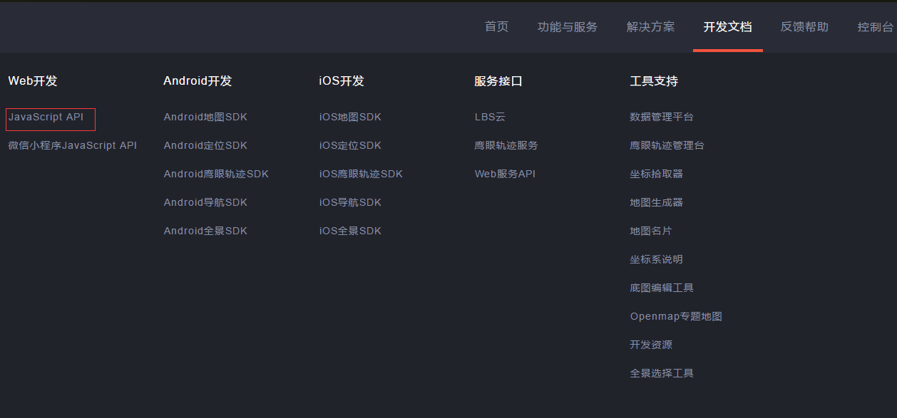

**注**:百度开发者平台提供Web、Android、iOS 三种开发开发接口，本文只涉及Web开发。

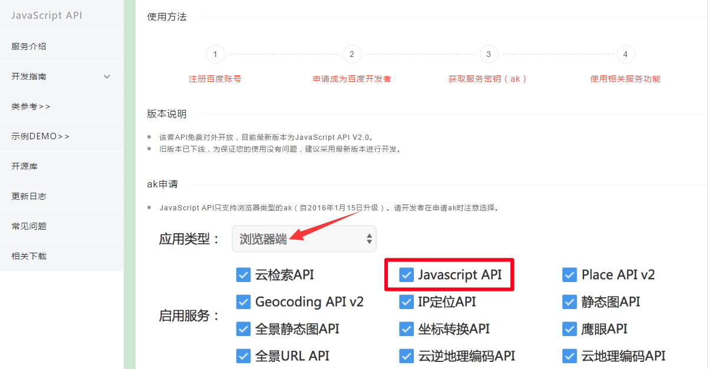

请先阅读开发平台上的开发指南并申请开发使用的AK(下文有申请步骤的详细介绍)，这里为避免使用混乱，一般针对于不同的项目申请不同的AK密钥。

#### AK密钥生成步骤

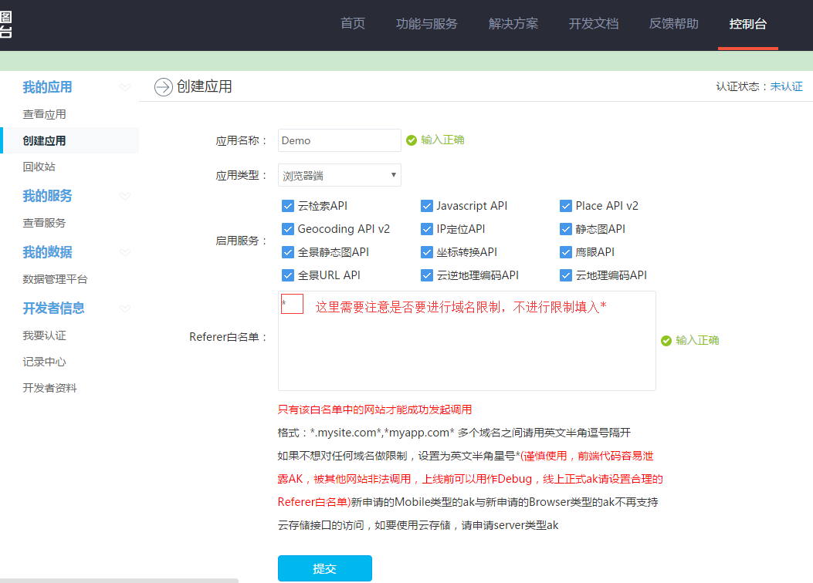

**注:**在控制台中进行应用的创建和管理。

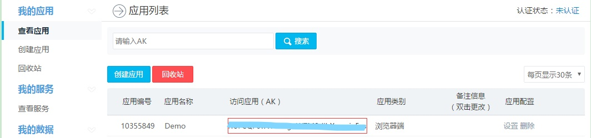

最终生成我们所需的AK密钥,网页中引用百度地图api中替换自己申请的AK。

```
  <script type="text/javascript" src="http://api.map.baidu.com/apiv=2.0&ak=获取的AK"></script>
```

#### 开发技巧

1. [**示例DEMO**](http://lbsyun.baidu.com/jsdemo.htm#a1_2) 和 [**类参考**](http://lbsyun.baidu.com/cms/jsapi/reference/jsapi_reference.html) 对应着学习，熟悉百度地图开发的基本知识。
2. 应该多了解GIS方面的基础知识，例如经纬度、地图层级、地图坐标系 等知识。
3. 如果发现示例中不能实现所需功能，可以查询下 [**开源库**](http://lbsyun.baidu.com/index.php?title=jspopular/openlibrary)中是否有解决方案，开源库中有很多针对地图开发做的扩展功能要认真学习下。
4. 如碰见疑问和百度地图功能需求方面的问题，可在[**开发者论坛**](http://bbs.lbsyun.baidu.com/forum.php)中查询或者提问。

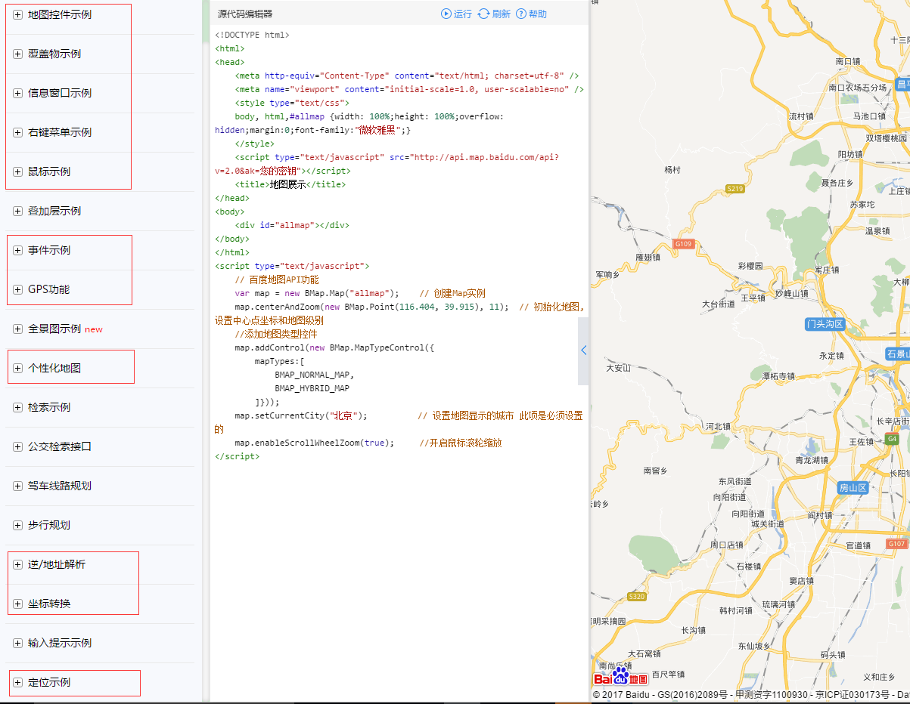

**注:** 初进行地图开发的人员可以优先学习红框标出的Demo示例，以及其中用的类库。

#### 集成百度地图到AlarmCenter

1. 嵌入百度地图到AlarmCenter(请先学习

    

   **嵌入网页**

   )

   

   针对于Web版地图的开发，通过 **嵌入网页** 方式来进行访问。应该灵活应用 **浏览器插件** 的功能来处理地图和AlarmCenter之间的交互。

2. 地图上数据的获取

   

   地图上Marker等覆盖物，针对于AlarmCenter可以通过调用AlarmCenterWeb 开发中的数据库操作的接口获取数据。(需要数据库方面知识)。

#### 示例Demo

[**BaiDuMapDemo.rar**](http://ganweisoft.net:8092/Down/MapDemo/BaiDuMapDemo.rar)

## 高德地图

> 高德地图是阿里旗下的地图服务 ，其稳定的服务和丰富的开发接口，也赢得了很多开发者的加入。
>
> 
>
> 开发者平台: [**高德地图开放平台**](http://lbs.amap.com/)

### 开发指南

#### 熟悉开放平台

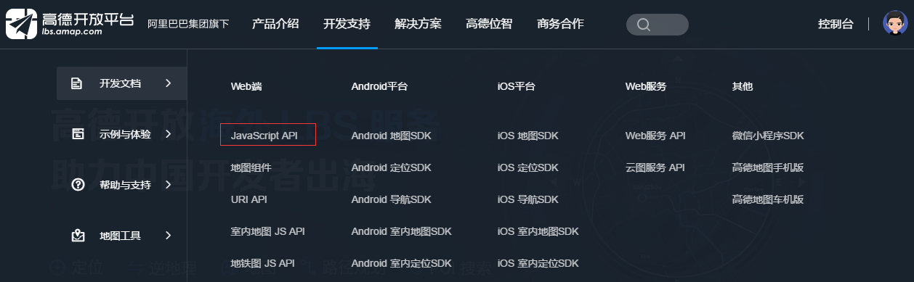

**注:** 类似百度地图。

#### 申请高德地图的开发者账号创建应用Key(类似百度AK)

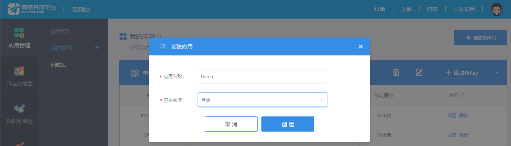


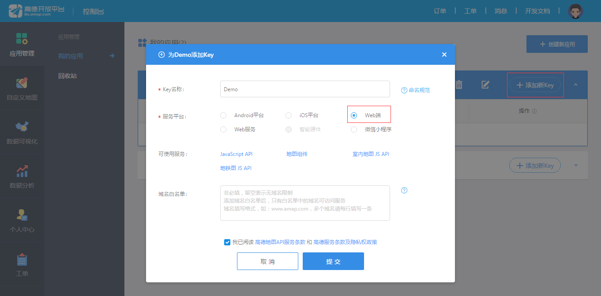


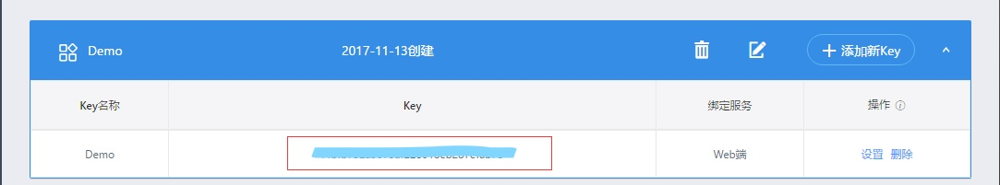

网页中引入Key:

```
 <script type="text/javascript" 
src='//webapi.amap.com/maps?v=1.4.0&key=获取的Key'></script>
```

#### 开发技巧和嵌入AlarmCenter

请参考百度地图开发

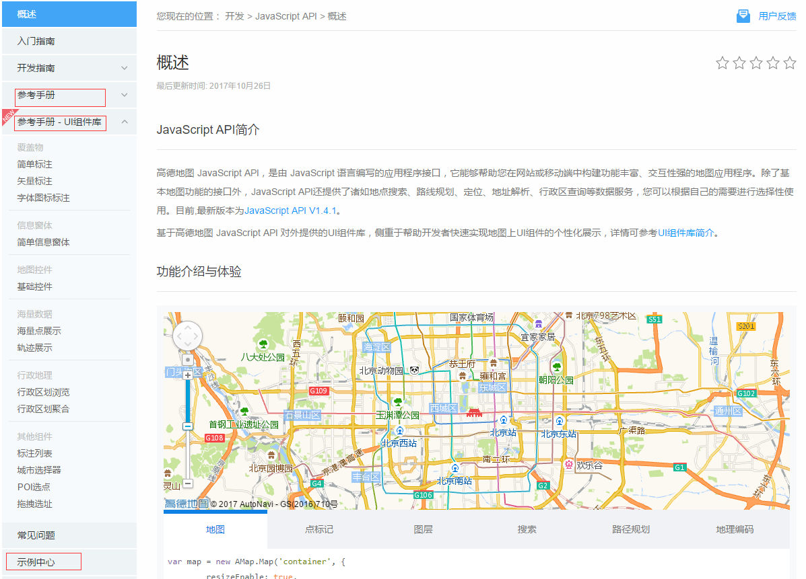

**注**: 高德地图在地图基本的开发上扩展了很多UI组件，这些功能可以帮助很轻易的实现较为炫酷的地图功能，请认真学习。

开发者论坛 : [**http://lbsbbs.amap.com/portal.php**](http://lbsbbs.amap.com/portal.php)


#### 示例DEMO

[**GaoDeMapDemo.rar**](http://ganweisoft.net:8092/Down/MapDemo/GaoDeMapDemo.rar)


## 应用实例

### 实例

这里介绍个经常使用的一个场景，结合AlarmCenter数据在高德地图上添加标注点并展示标注点的信息。

### 开发准备

1.Web服务器的搭建，网站的搭建（[Web开发指南系列](http://ganweisoft.net:8092/views/web/guide/?uid_2))

2.熟悉AlarmCenterWeb下API

| API     | 功能                                |
| :------ | :---------------------------------- |
| getkey  | 获取key                             |
| get_mte | 获取单位信息（自定义API下文有介绍） |

3.根据上文申请百度的AK或者高德的Key

### 开发实战

#### 1.Cef插件(参考 [**嵌入网页**](http://ganweisoft.net:8092/views/client/guide/?uid_131))

相比嵌入网页中的插件本插件 多注册了一个UserInfo的类，用于获取登录用户的信息，在网页中调用getkey接口时使用。

```
browser.RegisterJsObject("userinfo", new UserInfo() { }, new BindingOptions { CamelCaseJavascriptNames = false });
 public class UserInfo
    {
           //获取用户名
        public string UserName
        {
            get
            {
                return DataCenter.LoginUser.UserName;
            }
        }
        //获取密码
        public string Password
        {
            get
            {
                return DataCenter.LoginUser.UserPWD;
            }
        }
    }
```

#### 2.新建一个WebApi用来获取地图上标注点信息（参考 [如何新建一个API](http://ganweisoft.net:8092/views/web/guide/?uid_212)）

```
 public class DemoController : ApiController
    {
        /// <summary>
        /// 获取标注数据
        /// </summary>
        /// <param name="jb"></param>
        /// <returns></returns>
        [HttpGet]
        public object get_mte()
        {
            DataResult dr = new DataResult();
            string sql = "select * from GWElevatorMaintain";
            dr = ServerLib.GetDataTableSQL(sql);
            return dr;
        }
    }
```

#### 3.新建一个Web工程(这里介绍开发时所用的一些框架，详细请参考本节最后的示例Demo)

请把示例Demo中的Demo文件夹拷贝到开发准备时已建好的AlarmCenterWeb站点下的Views目录

```
    <template id="Maintain">
          <div class="elevator_main">
              <p class="actDynPopupTitle">{{Name}}</p>
              <div class="actDynPopupContent">
                  <div class="Content">
                      <p>单位代码：</p>
                      <p>{{Code}}</p>
                  </div>
                  <div class="Content">
                      <p>资格证书号：</p>
                      <p>{{Certificate}}</p>
                  </div>
                  <div class="Content">
                      <p>地址：</p>
                      <p>{{Address}}</p>
                  </div>
                  <div class="Content">
                      <p>联系人电话：</p>
                      <p>{{Phone}}</p>
                  </div>
              </div>
          </div>
      </template>

    <script src="../JS/vue.js"></script>
```

**注:** 高德地图自带的信息窗体样式单一，有时需要自定义信息窗体，高德的示例Demo中有相关示例。这里引入了[**Vue**](https://cn.vuejs.org/)框架为了减少Dom的操作，当然你也可以根据示例中创建Dom方式进行自定义信息窗体。

```
(function GetKey() {
    $.ajax({
        type: "POST",
        url: "/api/server/getkey",
        timeout: 5000,
        data: {
            username: userinfo.UserName, //步骤1中注册的全局对象userinfo
            userpwd:  userinfo.Password
        },
        success: function (dt) {
            if (dt.HttpData.code == 200) {
                window.localStorage.ac_appkey = dt.HttpData.data.appkey;
                window.localStorage.ac_infokey = dt.HttpData.data.infokey;
                GetMaintain();
            }
        }
    })
})()
```

#### 4.AlarmCenter使用的 数据库中添加表

表名：GWElevatorMaintain（对应上文步骤2中使用的表）

| 字段             | 类型          | 注释                         |
| :--------------- | :------------ | :--------------------------- |
| ID               | int           | 自增标识                     |
| MaintainName     | nvarchar(255) | 单位名称                     |
| MaintainPosition | nvarchar(255) | 经纬度（经度在前，纬度在后） |
| MaintainCode     | nvarchar(255) | 单位编号                     |
| Address          | nvarchar(255) | 单位地址                     |
| Certificate      | nvarchar(255) | 证书编号                     |

表内容示例：

| ID   | MaintainName | MaintainPosition     | MaintainCode | Address | Certificate |
| :--- | :----------- | :------------------- | :----------- | :------ | :---------- |
| 1    | 深圳市xx公司 | 113.916203,22.481197 | xxxxxxxxx    | xxxx    | xxxx        |

### 示例DEMO

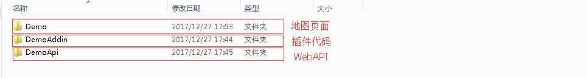

[**MapDemo.rar**](http://ganweisoft.net:8092/Down/MapDemo/MapDemo.rar)

## 开发注意事项

#### 地图坐标系

1. GPS: 标准的GPS设备采集的坐标使用的是 WGS-84坐标系。
2. 百度地图: 使用的是BD-09坐标系, 是在国测局规定的GCJ-02坐标系的基础上，又对坐标进行了一次加密。所以通常的谷歌地图、高德地图、GPS设备获取的坐标不能直接使用,需要进行转换才能进行精确定位。在百度示例Demo中提供了这些经纬度的转换。
3. 高德地图: 使用的是国测局规定的GCJ-02坐标系。高德同样提供了这些经纬度的转换。

#### 地图性能

1. 如果加载地图影响网页的加载速度，可以使用异步加载。(示例中心有示例)
2. 地图数据过多导致地图绘制缓慢，可以使用 聚合点 、海量点来进行处理。

#### 开发工具

百度: [**坐标拾取工具**](http://api.map.baidu.com/lbsapi/getpoint/index.html)、[**个性化地图工具**](http://lbsyun.baidu.com/img-editor.html)

高德: [**坐标拾取工具**](http://lbs.amap.com/console/show/picker)、[**自定义地图**](http://lbs.amap.com/dev/mapstyle/index)