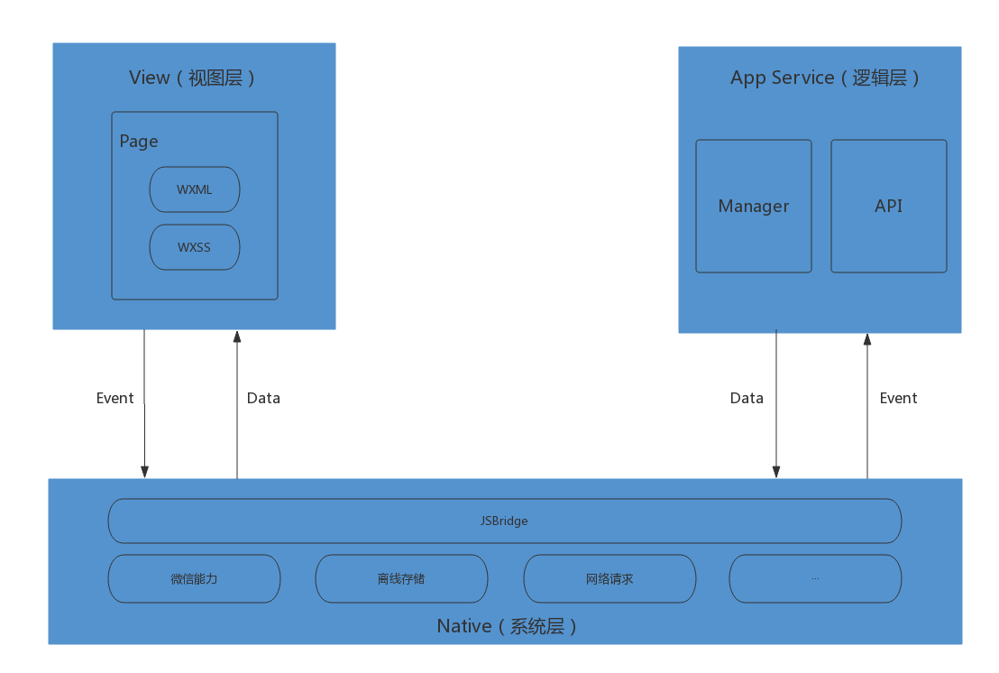
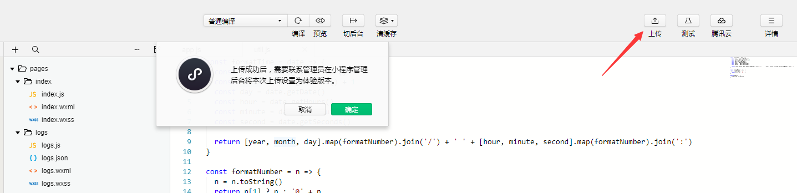

## 小程序·简介

微信小程序是一种全新的连接用户与服务的方式，它可以在微信内被便捷地获取和传播，同时具有出色的使用体验，小程序不需要下载安装即可使用，它实现了应用“触手可及”的梦想，用户扫一扫或者搜一下即可打开应用，也体现了“用完即走”的理念。

小程序天生跨平台，具备完善的文档，即用即走、媲美原生体验，具有以下五大特点：

- 类WEB 不是HTML5
- 即用即走，随手可得
- 拥有离线能力
- 基于微信跨平台
- 媲美原生操作体验

对于开发者而言，小程序开发门槛相对较低，难度不及APP，能够满足简单的基础应用。

## 小程序·架构

微信小程序包含View视图层、App Service逻辑层，View层用于渲染页面结构，AppService层用于逻辑处理、数据请求、接口调用，它们在两个线程里运行。

视图层使用WebView进行渲染，逻辑层使用JSCore运行。

视图层和逻辑层通过系统层的JSBridage进行通信，逻辑层把数据变化通知到视图层，触发视图层页面更新，视图层把触发的事件通知到逻辑层进行业务处理。



## 小程序·注册获取AppID

首先登陆[官网](https://mp.weixin.qq.com/)进行账号注册，类型选择小程序，根据指引填写相关信息和提交相应资料进行注册。完成注册后，即可拥有自己的小程序账号。

使用成功注册的小程序账号登录后，就可以在网站的“设置”-“开发者设置”中，查看到微信小程序的 AppID 了，AppID是后续开发中不可缺少的一环，*注：不可直接使用服务号或订阅号的 AppID*


AppID可以分为两个字：APP 和id，APP是手机应用程序软件的意思，ID是编号、证件号码的意思，两者放在一起就是：手机应用程序软件编号！小程序的AppID相当于小程序平台的身份证，有了AppID我们才可以进行后续的开发工作。

## 小程序·环境搭建

若要开发小程序，我们还需要一个专业的开发工具：微信web开发者工具。
返回官网首页，我们可以点击“[开发者工具](https://mp.weixin.qq.com/debug/wxadoc/dev/devtools/download.html?t=20171116)”进入下载界面选择相应版本下载，如下：


下载界面


## 小程序·创建项目

打开小程序开发者工具，使用微信扫码登录，选择小程序项目，填入上文获取到的 AppID ，设置一个本地项目的名称，比如“HelloWorld”，并选择一个空的本地文件夹作为代码存储的目录。

开发者工具默认选择“建立普通快速启动模板”（*注：需选择一个空目录才会有这个选项*）。此功能是开发者工具会帮助我们在开发目录里生成一个简单的 demo，有助于我们了解项目的结构和组成。如下：


项目目录：初次创建项目建议填写一个空目录，以便创建快速启动模板；

AppID：填写你个人的AppID，可在网站的“设置”-“开发者设置”中，查看 AppID

## 小程序·开发工具介绍

开发者工具主界面，从上到下，从左到右，分别为：菜单栏、工具栏、模拟器、编辑器、调试器 五大部分。常用的设置如下：


1、模拟器按钮：点击可控制手机模拟器的显示/隐藏

2、编辑器按钮：点击可控制代码编辑区的显示/隐藏

3、调试器按钮：点击可控制代码调试区的显示/隐藏

4、编译按钮：即根据最新代码重新编译/运行小程序

5、预览按钮：可点击生成当前小程序二维码，以方便在真机上查看效果

6、清缓存按钮：可清除包括数据、文件、授权、网络、登陆状态等缓存数据

7、上传按钮：可点击上传当前小程序项目代码，更新服务器代码

8、模拟器区域：模拟器模拟微信小程序在客户端真实的逻辑表现，对于绝大部分的 API 均能够在模拟器上呈现出正确的状态。

9、目录区域：显示小程序目录结构

10、编辑区域：编辑区可以对当前项目进行代码编写和文件的添加、删除以及重命名等基本操作。

11、调试区域：小程序的错误输出，会显示在此处；开发者可以在此输入和调试代码，功能与浏览器的调试工具类似

12、选择机型：开发者可以选择不同的设备，也可以添加自定义设备来调试小程序在不同尺寸机型上的适配问题。

13、模拟器大小：可设置模拟器大小

14、选择wifi：可以模拟选择手机网络，以查看小程序在不同网络下的运行状态

## 小程序·项目结构

在开发者工具中，我们可以看到刚刚创建的demo项目，已经初始化并包含了一些简单的代码文件。思维导图如下：


### 1. pages目录

主要用于存放小程序的页面文件，其中每个文件夹为一个页面，每个页面包含四个文件。

（1）`.js后缀`的文件是页面的脚本代码。通过`Page()`函数来注册一个页面，接受一个Object参数，其指定页面的初始数据、生命周期函数、事件处理函数等。

（2）`.json后缀`的文件是配置文件，主要是json数据格式存放，用于设置程序的配置效果。该配置文件只能配置本级目录下的页面配置文件，并且只能对导航栏的相关文件进行配置修改，如用于修改导航栏显示样式，如导航的文字，背景颜色，文字颜色等，其语法跟json语法相同。如下所示：

（3）`.wxml后缀`的文件是界面文件，是页面结构文件，用于构建页面，在页面上增加控件。全称是weixin markup lanuage的缩写，微信标记语言。跟其他一般标记语言一样，标签成对， 标签名小写。可以通过引用class来控制外观，也可以通过绑定事件来进行逻辑的处理，通过渲染来完成我们需要的列表等。是连接用户操作和后端逻辑的纽带桥梁。

（4）`.wxss后缀`的文件是样式表文件，类似于前端中的css，是为.wxml文件和page文件进行美化的文件，让界面显示的更加美观，例如对文字的大小，颜色，图片的宽高，设置.wxml中各个组件的位置，间距等

##### 注意事项

*（1）小程序每个页面必须有.wxml和.js文件，其他两种类型的文件可以不需要*

*（2）文件名称必须与页面的文件夹名称相同，如index文件夹，文件只能是index.wxml、index.wxss、index.js和index.json*

### 2. utils目录

 该文件主要用于存放全局的js文件，公用的事件处理代码文件可以放到该文件夹下，通过module.exports声明后用于全局调用。


 对于允许外部调用的方法，可在其他js文件中用require引入使用


### 3. app.js、app.json、app.wxss文件

在小程序项目中，最关键也必不可少的是app.js、app.json、app.wxss这三个文件。其中，.js后缀的是脚本文件，.json后缀的文件是配置文件，.wxss后缀的是样式表文件，分别起到**整个程序**的逻辑设置、全局配置及样式控制的作用。下面将简单介绍这三个文件的功能。

 **app.js**：系统的方法处理全局文件，也就是说文件中规定的函数和数据，每个小程序都会有一个app.js文件，有且只有一个，位于项目的根目录！app.js的作用就是告诉小程序，注册一个小程序实例使用app（object）的形式注册，实现小程序在不同阶段需要实现的事件功能，如onLoad，onshow等，全局的on事件只有如下三个，要比页面的on事件要少。

 在整个小程序中，每一个框架页面和文件都可以通过`var app = getApp()`获取其实例，并调用其定义的方法和变量，但不要调用生命周期的方法，在App()的外面还可以另外定义 function 和变量，但只能在本文件内使用。我们可以在这个文件中监听并处理小程序的生命周期函数、声明全局变量。调用框架提供的丰富的 API，如本例的同步存储及同步读取本地数据。想了解更多可用 API，可参考 [官方API文档](https://mp.weixin.qq.com/debug/wxadoc/dev/api/)


 **app.json**：系统全局配置文件，具有设置页面路径、默认页面的窗口表现、网络超时时间、是否开启调试模式及底部tab设置等功能，具体页面的配置在页面的json文件中可单独修改，任何一个页面都需要在app.json中注册，如果不在json中注册添加，页面是无法打开的，框架中的json优先级高于全局的json优先级，*注：该文件不可添加任何注释*。更多可配置项可参考[官方配置详解](https://mp.weixin.qq.com/debug/wxadoc/dev/framework/config.html)

（1）`pages` 用于描述当前小程序所有页面路径，指定了小程序的组成页面，第一个代表小程序的初始页面。
（2）`window` 用于设置小程序的状态栏、导航条、标题、窗口背景色。
（3）`tabBar` 用于配置客户端窗口的底部或顶部 tab 栏的样式以及 tab 切换时显示的对应页


 **app.wxss**：整个小程序的公共样式表，可以配置一些通用的样式。其优先级没有框架中的wxss的优先级高，具有 CSS 大部分特性，并进行了特性扩展。我们可以在页面组件的 class 属性上直接使用 app.wxss 中声明的样式规则


## 小程序·数据绑定

WXML 中的动态数据均来自对应 Page 的 data。数据绑定使用双大括号将变量包起来，可以作用于内容、组件属性(需要在双引号之内)、控制属性(需要在双引号之内)、关键字(需要在双引号之内)。

```
Page({
    data: {
        message: "Hello",
        id: 0,
        condition: true
    }
})
<view> {{message}} </view>
<view id="item-{{id}}"> </view>
<view wx:if="{{condition}}"> </view>
<checkbox checked="{{condition}}"> </checkbox>
```

还可以在 {{}} 内进行简单的运算，如：

```
Page({
  data: {
    flag: true,
    a: 1, 
    b: 2,
    c: 3
    length: 6,
    name: 'MINA',
    object: {
      key: 'Hello '
    },
    array: ['MINA']
  }
})
<view hidden="{{flag ? true : false}}"> Hidden </view>
<view> {{a + b}} + {{c}} + d </view> // 结果为3 + 3 + d
<view wx:if="{{length > 5}}"> </view>
<view>{{"hello" + name}}</view>
<view>{{object.key}} {{array[0]}}</view>
```

## 小程序·条件渲染

在框架中，我们用 wx:if="{{condition}}" 来判断是否需要渲染该代码块

```
<view wx:if="{{condition}}"> True </view>
```

也可以用 wx:elif 和 wx:else 来添加一个 else 块

```
<view wx:if="{{length > 5}}"> 1 </view>
<view wx:elif="{{length > 2}}"> 2 </view>
<view wx:else> 3 </view>
```

因为 wx:if 是一个控制属性，需要将它添加到一个标签上。如果我们想一次性判断多个组件标签，我们可以使用一个 `<block/>` 标签将多个组件包装起来，并在上边使用 wx:if 控制属性。

```
<block wx:if="{{true}}">
  <view> view1 </view>
  <view> view2 </view>
</block>
```

注意： <block/> 并不是一个组件，它仅仅是一个包装元素，不会在页面中做任何渲染，只接受控制属性。

一般来说，wx:if 有更高的切换消耗而 hidden 有更高的初始渲染消耗。因此，如果需要频繁切换的情景下，用 hidden 更好，如果在运行时条件不大可能改变则 wx:if 较好。

## 小程序·列表渲染

在组件上使用wx:for控制属性绑定一个数组，即可使用数组中各项的数据重复渲染该组件。
默认数组的当前项的下标变量名默认为index，数组当前项的变量名默认为item

```
<view wx:for="{{array}}">
  {{index}}: {{item.message}}
</view>

Page({
  data: {
    array: [{
      message: 'foo',
    }, {
      message: 'bar'
    }]
  }
})
```

使用 wx:for-item 可以指定数组当前元素的变量名，使用 wx:for-index 可以指定数组当前下标的变量名：

```
<view wx:for="{{array}}" wx:for-index="idx" wx:for-item="itemName">
  {{idx}}: {{itemName.message}}
</view>
wx:for也可以嵌套，下边是一个九九乘法表

<view wx:for="{{[1, 2, 3, 4, 5, 6, 7, 8, 9]}}" wx:for-item="i">
  <view wx:for="{{[1, 2, 3, 4, 5, 6, 7, 8, 9]}}" wx:for-item="j">
    <view wx:if="{{i <= j}}">
      {{i}} * {{j}} = {{i * j}}
    </view>
  </view>
</view>
```

类似block wx:if，也可以将wx:for用在<block/>标签上，以渲染一个包含多节点的结构块。例如：

```
<block wx:for="{{[1, 2, 3]}}">
  <view> {{index}}: </view>
  <view> {{item}} </view>
</block>
```

如果列表中项目的位置会动态改变或者有新的项目添加到列表中，并且希望列表中的项目保持自己的特征和状态（如 <input/> 中的输入内容，<switch/> 的选中状态），需要使用 wx:key 来指定列表中项目的唯一的标识符。wx:key 的值以两种形式提供：

1. 字符串，代表在 for 循环的 array 中 item 的某个 property，该 property 的值需要是列表中唯一的字符串或数字，且不能动态改变。
2. 保留关键字 *this 代表在 for 循环中的 item 本身，这种表示需要 item 本身是一个唯一的字符串或者数字。

```
Page({
  data: {
    objectArray: [
      {id: 0, unique: 'unique_0'},
      {id: 1, unique: 'unique_1'},
      {id: 2, unique: 'unique_2'},
    ],
    numberArray: [1, 2, 3, 4]
  }
})
<switch wx:for="{{objectArray}}" wx:key="unique" style="display: block;"> {{item.id}} </switch>
<switch wx:for="{{numberArray}}" wx:key="*this" style="display: block;"> {{item}} </switch>
```

## 小程序·手机预览

代码编辑完成后，可在开发者工具导航栏中点击“预览”按钮，手机微信扫码后即可在微信客户端中体验。


## 小程序·项目发布

点击“上传”按钮，



填写版本号及项目备注，就可自动上传到服务器。


上传完之后，下一步就是提交审核。

- 补充小程序的基本信息，如名称、图标、描述等。
- 如果发布者不是管理员，则必须要在这里添加开发者，进行代码上传和发布。
- 配置服务器域名，如果你的小程序用到了网络请求，那么这里要先在“设置”-“开发设置”里添加域名。
- 提交审核

小程序的基础信息，如名称、图标等是这个账号全局的信息。logo图标一个月内可申请修改5次。而名称一旦设置，就不能再修改了，而且不得与公众平台已有的订阅号、服务号名重复。

提交审核后，会弹出一张二维码。扫码进行功能页面配置，这些功能页面，主要是为了方便用户快速搜索到你的应用。可以添加多个功能页面，增加被搜索到的概率。

审核通过之后，管理员的微信中会收到小程序通过审核的通知，此时登录 小程序管理后台 - 开发管理 - 审核版本中可以看到通过审核的版本。点击发布，既可发布小程序。