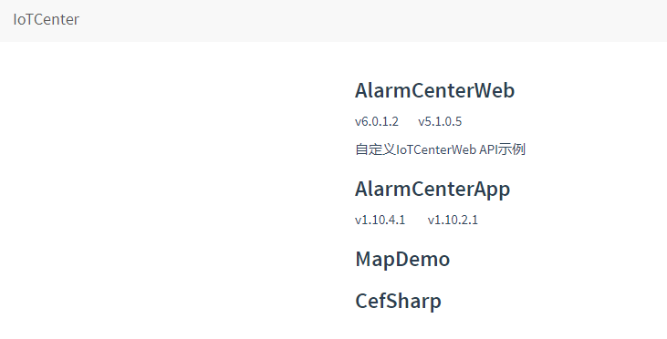
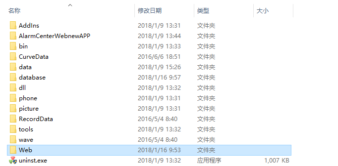

# 简介

基于HTML5+CSS3构建的一款混合APP。


## APP预览配置

首先从[http://ganweisoft.net/views/web/down/](http://ganweisoft.net:8092/)下载最新APP文件，如图所示




然后在敢为软件AlarmCenter（D:\AlarmCenter）目录下创建一个web文件夹，把下载下来的APP文件压缩在此文件夹下，如图所示 

最后按照下面步骤配置APP预览:

1、配置IIS，具体配置请参考 [web开发指南](http://ganweisoft.net/views/web/guide/?uid_2)。

2、配置IIS完成后，通过控制面板---管理工具---IIS管理器打开，如图所示


3、在网站目录下，右键选择添加网站选项。然后配置物理路径、应用池程序（.NET v4.0及以上）、网站名称、端口（大于1024端口）、类型（默认HTTP），如图所示

 

4、任务管理器开启服务AlarmCenterService,如图所示

 

5、D:\AlarmCenter\web目录下修改 配置文件Web.config中<add key="Ipaddress" value="" />的value值为本机IP（默认为空则自动搜索）;相应的修改 <add key="port" value="" />的value值为服务器端口号(空则为默认808)。示例如下

```
 <add key="Ipaddress" value="192.168.0.141" />
  <add key="port" value="" />
```


6、IIS 浏览网页 ，在打开网页后按F12键调成手机模拟浏览。如图所示


7、网页登陆。账户密码都为admin，随即登陆APP，如图（登陆失败，则先登录AlarmCenter.exe-账号密码都为admin,再登陆APP）

 

8、APP登陆。登陆设置如图(连接WIFi)

  

9、数据库配置连接路径（D:/AlarmCenter/data/AlarmCenter/AlarmCenterProperties.xml）,有ACCESS、M-SQL等可选择。示例

```
  <SQLServer.IP value="192.168.0.222" />
  <SQLServer.PWD value="123456" />
  <SQLServer.Select value="False" />  //是否启用
  <SQLServer.UID value="sa" />
```

10、APP打开成功

 

------