## 页面开发示例

用VScode编辑器打开D:\AlarmCenter\web文件，呈现目录如下

 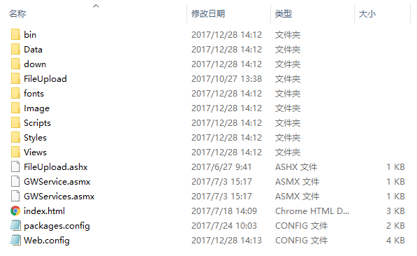

## Image、fonts、Scripts、Styles、Views文件夹

如果希望通过删除APP不相关文件，从而缩小APP体积，一定要在了解每个文件夹含义的基础上删除。以下几个文件夹是通过初始化实例的一些精简以及说明。示例如下

1、image文件夹中除了login文件夹全部删除。如果你要删除login，那么你则需要更改登陆动画。如图所示

 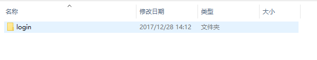

2、清空fonts文件夹。

3、Scripts文件夹中留下login.js、plug文件夹以及子项文件、mobileAll.js(可精简里面内容)，其它删除。因为它们是登陆相关脚本文件以及插件资源（可根据需要删除），如图所示

 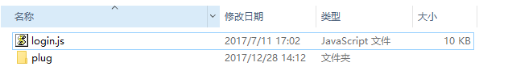

4、Styles文件夹中除了login.css和Plugin及子项之外文件删除。因为这2项是登陆页面CSS，除非你想更改登陆UI，如图所示

 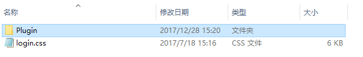

5、Views文件夹，ConfigPage 为配置文件、Home为网页端文件、Mobile为移动端文件、plug为系统配置和页面定制、Test为测试文件、login.html为登陆文件。如图所示

 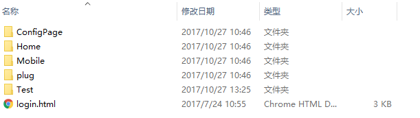

​    清空Mobile文件夹下文件，删除Home文件

 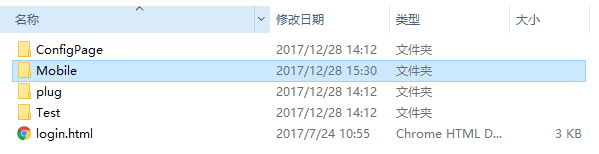

## 添加字体样式

- 添加字体图标，在打开网站<http://iconfont.cn/plus>,登陆后创建项目，然后上传你需要的SVG图标，如图所示

  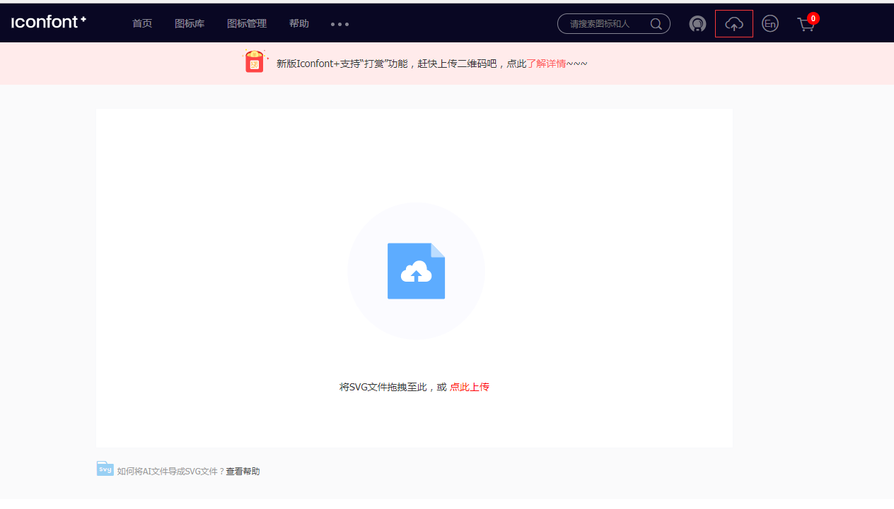

- 然后到对应该项目下修改你上传图标的 unicode和font class，如图所示   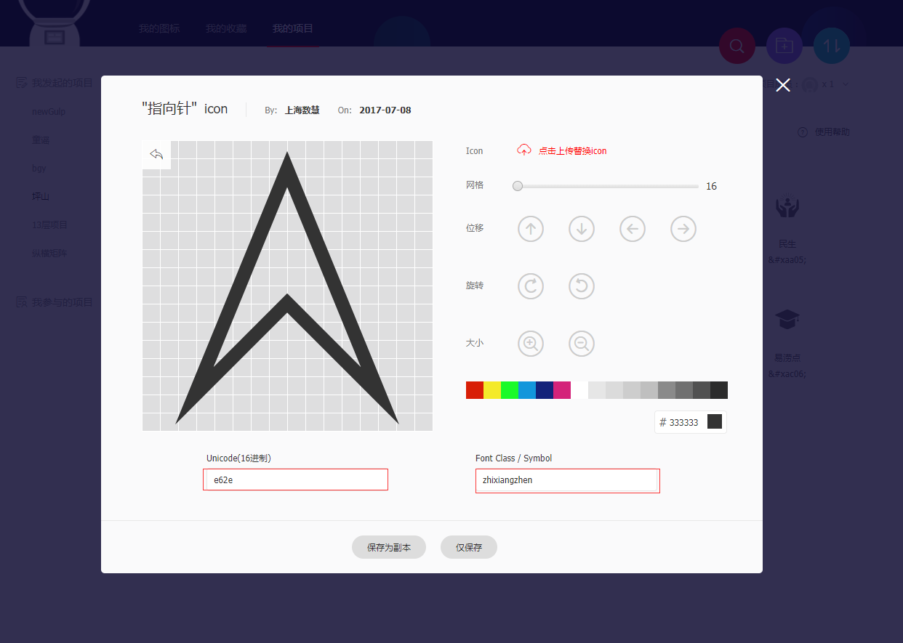

- 下载文件至本地，压缩文件并把如图所示几个文件拷贝到APP的fonts目录下。

 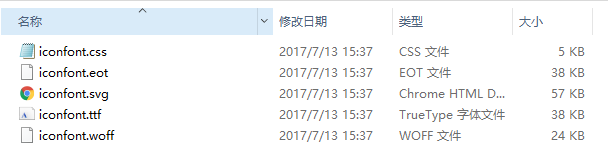

- 在APP首页中应用iconfont.css文件即可

## 创建首页

- 创建一个HTML5页面，添加对应meta和已有css/js资源链接。并且新建一个app.css、app.js空文件。继续在app.js中天加onHomePage、onResizeCustomized2个函数，这2个函数在移动端入口文件中均有调用，分别是首页初始化函数和窗口大小变化函数，具体参考原有Mobile/home.js。至此APP初始化工作已经完成，如下代码所示

  ```
  <!DOCTYPE html>
  <html>
  <head>
      <meta charset="UTF-8">
      <meta name="viewport" content="width=device-width, initial-scale=1, maximum-scale=1, minimum-scale=1, user-scalable=no, minimal-ui">
      <meta http-equiv="X-UA-Compatible" content="ie=edge">
      <!-- meta的作用就是删除默认的苹果工具栏和菜单栏。 -->
      <meta name="apple-mobile-web-app-capable" content="yes">
      <!-- 控制状态栏显示样式 -->
      <meta name="apple-mobile-web-app-status-bar-style" content="black">
      <!-- 网页到期时间 -->
      <meta http-equiv="Expires" content="0">
      <!-- 禁止浏览器从本地机的缓存中调阅页面内容 -->
      <meta http-equiv="Pragma" content="no-cache">
      <!-- 不让页面缓存 -->
      <meta http-equiv="Cache-control" content="no-cache">
      <meta http-equiv="Cache" content="no-cache">
      <title>AlarmCenter | 首页</title>
      <!-- 顶端图标 -->
      <link rel="icon" href="/Image/logo.png" type="image/x-icon">
      <!--框架样式-->
      <link rel="stylesheet" href="/Scripts/plug/1.5.0/framework7.ios.min.css">
      <link rel="stylesheet" href="/Scripts/plug/1.5.0/framework7.ios.colors.min.css">
      <!--图标字体样式-->
      <link rel="stylesheet" type="text/css" href="/fonts/iconfont.css" />
      <!--本页样式-->
      <link rel="stylesheet" href="/Styles/Mobile/app.css">
  </head>
  <body>
      
  
       <!-- 框架js-->
      <script src="/Scripts/plug/jquery-1.10.1.min.js"></script>
      <script type="text/javascript" src="/Scripts/plug/1.5.0/framework7.js"></script>
      <script type="text/javascript" src="/Scripts/plug/html2canvas.min.js"></script>
      <!-- 首页js-->
      <script type="text/javascript" src="/Scripts/mobile/app.js"></script>
      <!-- 移动端入口js-->
      <script type="text/javascript" src="/Scripts/mobileAll.js"></script>
  </body>
  </html>
  ```

-  利用framework7添加标题栏、内容块、底端工具栏,示例代码如下

  ```
  <div class="views">    
    <div class="view view-main">
  //标题栏
    <div class="navbar">
        <div class="navbar-inner">
            <div class="left"></div>
            <!-- 标题 -->
            <div class="center sliding">我是页眉标题</div>
            <div class="right"> </div>
        </div>
    </div>
    
    //内容块
    <div class="pages navbar-through toolbar-through">
        <div data-page="home" class="page" id="home">
         <!-- 界面内容 -->
         <div class="page-content" id="homeContents" >
                           我是内容区域
          </div>
        </div>
    </div>
    
  
    <!-- 底部工具栏-->
    <div class="toolbar tabbar tabbar-labels">
       <div class="toolbar-inner">
         <a href="home.html" class="link active no-animation" id="homeTool">
           <i></i>
           <span class="tabbar-label">我是首页</span>
         </a>
        <a href="#" class="link no-animation" id="MessageTool">
          <i></i>
          <span class="tabbar-label">我是第二页</span>
        </a>
        <a href="#" class="link no-animation" id="RealTimeTool">
          <i></i>
          <span class="tabbar-label">我是第三页</span>
        </a>
   </div>
   </div>
   
   </div>
  </div>
  ```

- 然后把对应片段添加到新建THML5页面中，并且调用已调用的字体图标，调用方法  class="iconfont icon-logout"，其中logout为创建下载SVG之前修改的font class名称。运行结果如图所示

​        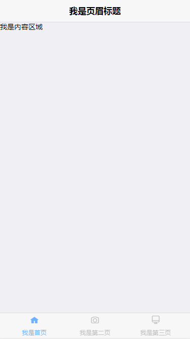

## 创建子页面

- 新建一个HTML子页面child，添加为底端工具栏“我是第二页"按钮的href，并且在路径Script/mobile文件夹下创建child.js作为子页面脚本.其页面全部代码如下

  ```
  <!-- 顶部导航条-->
  <div class="navbar">
      <div class="navbar-inner">
      	<div class="left"></div>
          <!-- 标题 -->
          <div class="center sliding">我是子页眉标题</div>
          <div class="right"> </div>
      </div>
  </div>
  
  <!-- 页面-->
  <div class="pages navbar-through toolbar-through">
      <div data-page="child" class="page" id="child">
          <!-- 界面内容 -->
          <div class="page-content" id="homeContents" >
               我是子内容区域
          </div>
      </div>
  </div>
  ```

- 在mobileAll中添加如下代码,这段代码作用是动态加载子页面脚本。

  ```
  $$(document).on("pageBeforeInit", ".page[data-page='child']", function (e) {
      if ($(this).hasClass("page-on-left")) {
          var ids = $(this).next().attr("id");
          if (ids == "home") {
              toolbarActive('homeTool');
          }
          else {
              initPageJS(ids, '');
          }
      }
      else {
          initPageJS('child', '');
      }
  });
  ```

- child.js内容如下（其路径: Scripts/mobile/child.js）

  ```
  //自动调用初始化函数，封装在mobileAll.js中
  function child() {
  //切换底部菜单选中状态封装函数，在mobileAll.js中
   toolbarActive('MessageTool');
  
  }
  ```

- 运行项目，执行结果如下

​        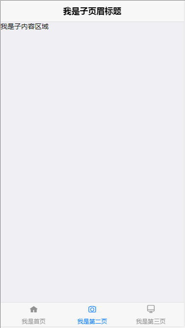

## 扩展

- 每创建一个子页面，其<div data-page="child" id="child"> 中的data-page、id、脚本名称、脚本内部初始化函数名称，这几项命名相同，因为mobileAll.js已根据同名封装，除非你更改其中的封装函数。 

- 动态加载脚本运行在内存中，当切换第三个页面时，虽然第一个页面DOM已被删除，但是脚本依然存在内存中，所以需要注意脚本之间函数不能同名，否则会相互干扰。

- 每个事件，在用bind绑定时，都应该先用unbind将其解除绑定，否则会出现重复事件。示例

  ```
  $(".active").unbind(); $(".active").bind("click",activeFunction);
  ```

- 关于gulp工程工具使用，视个人开发而定，使用gulp工程搭建达到的效果有以下几点:

​      1、解放F5刷新浏览器，无论HTML、JS、CSS都能修改后自动刷新浏览器，CSS更具注入内存

​       2、结合browserSync 插件，用代理方式解放手机端APP刷新，在手机安装APP不需要退出，不需要   清理缓存，能直接查看修改结果

​      3、多屏刷新，当你用浏览器分页打开APP时，在工程中修改文件能达到同时刷新

​      4、文件压缩编译，按任务处理事件